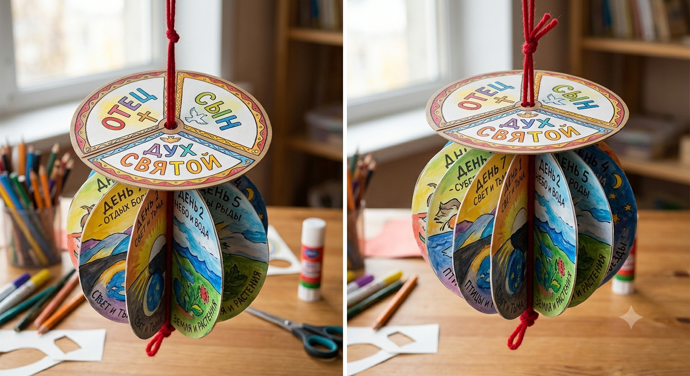

# Урок 1. Триединый Бог, Христос и сотворение мира

**Тема:** Триединый Бог, Христос и сотворение мира.
**Основная мысль:** В сотворении участвовали Бог Отец, Бог Сын и Бог Дух Святой. Они равны в силе и славе. Мир сотворён через Христа.
**Цель:** Показать детям Троицу и Христа в сотворении мира.
**Фрагмент из Библии:** Бытие 1 гл., 2:1–2.

## Молитва в начале урока

Попросите детей положить руку на сердце, сделать один глубокий вдох и выдох, чтобы они успокоились. Затем сложите руки перед собой.

> Дорогой Небесный Отец!
>
> Спасибо, что мы — Твоя семья.
> Помоги нам прямо сейчас открыть наши сердца и «внутренние ушки» для Тебя.
> Пусть Твои слова из Библии, как добрые семена, прорастают в нас, делая нас мудрее.
> Спасибо, что Ты любишь нас просто так, потому что мы Твои дети.
> Во имя Иисуса Христа, нашего Спасителя.
>
> Аминь!

## Урок

Учитель спросит: «Ребята, как вы думаете, где лучше всего начать читать книгу — с середины, с конца, чтобы узнать, как всё закончится, или с начала?» Дождитесь ответа детей.

Конечно, книгу нужно начинать читать с начала. Откройте Библию.

В начале Библии говорится о начале нашего мира. Мы будем изучать Библию с начала. Первая книга Библии называется **Бытие**. Само название книги Бытие можно перевести как «В начале». Эту книгу написал Моисей под водительством Святого Духа. Сегодня мы узнаем, что же было в начале. А самое главное: вся Библия с самой первой страницы рассказывает об Иисусе Христе (Ин. 5:39) — будем искать Его!

## Знакомимся с фрагментом

Выберите один способ подачи материала: прочитайте отрывок из Библии, покажите презентацию или расскажите о сотворении через игру, где первым появляется Христос и Словом творит всё.

Рассказывая историю, обратите внимание детей на то, где в ней Иисус:

- Бог творил Словом, а Слово — это Иисус: «Всё чрез Него начало быть» (Ин. 1:1–3).
- Свет появился раньше солнца, потому что истинный Свет — Христос (Ин. 8:12).
- Бог вдунул в человека дыхание жизни — ни одно другое творение не было сотворено таким образом. Мы — дети Божьи, сотворённые по образу Христа.

## Поделка

Для закрепления материала можно использовать поделку «Дни творения».

### Сборка верхней части

1. Вырежьте круг и разделите его на три равных сектора. В каждом секторе напишите имя Лица Бога: Отец, Сын, Дух Святой.
2. Проделайте отверстие в центре.
3. Круг можно красиво раскрасить.

### Сборка нижней части

1. Распечатайте шаблон земного шара на белом картоне.
2. Раскрасьте каждый день творения.
3. Вырежьте каждый круг.
4. Сложите каждый круг пополам по вертикали и согните.
5. Начиная с титульного круга, сложите его пополам. Нанесите клей на обратную сторону круга с заголовком и приклейте его к левой половине дня 1.
6. Повторите этот шаг: сложите день 1, нанесите клей на его обратную сторону и приклейте к нему левую половину дня 2.
7. После того как все круги будут склеены, между 7-м днём и титульным кругом должно остаться отверстие. Нанесите клей на заднюю часть обеих половинок, поместите посередине кусочек красной пряжи и прижмите половинки, чтобы прикрепить день 7 к титульному листу.
8. Привяжите петлю к верхней части пряжи для подвешивания и узел внизу, чтобы убедиться, что она надёжна.
9. Проденьте отверстие в круге Триединого Бога через петельку рисунком вверх. Круг должен накрывать шарик как крышка.

## Домашнее задание

Дома вместе с родителями перечитайте Бытие 1 и найдите, где в этой истории действует Триединый Бог и, в частности, Иисус Христос.

## Где в сотворении виден Триединый Бог

### Дух Святой

- «Дух Божий носился над водою» (Быт. 1:2).
- Господь при сотворении человека вдунул в его лицо дыхание жизни.

### Отец

- «И сказал Бог» — Бог Отец.
- Бог Отец всё чудно придумал.

### Слово — Христос

- Всё сотворено Словом (Ин. 1).
- В Евангелии от Иоанна написано: «Слово стало плотию…» — это Иисус.
- Через Него сотворены и века; видимое и невидимое сотворено через Него.

## Молитва в конце урока

Объясните детям, что молитва Богу — это также общение с Ним: «Молитесь Отцу во имя Моё». Тот, Кто сотворил тебя, всегда рядом. Ему можно рассказать всё — и радость, и обиду. Он тебя не оставит.

> Спасибо, Бог, за то, что Ты сотворил весь мир. Спасибо за то, что я сотворён(а) по Твоему образу и подобию через Иисуса Христа.
