# Когда появился Иисус?

## Слайд 1. Когда появился Иисус?

> «В начале было Слово, и Слово было у Бога, и Слово было Бог. Оно было в начале у Бога» (Ин. 1:1–2).

Иисус не начал существовать в Вифлееме. Ещё до Рождества Он был Божьим Словом — был с Богом и был Богом.

- Что значит «в начале» — только перед Рождеством или ещё раньше?
- Кого Иоанн называет Словом?
- Где был Иисус до Вифлеема?

## Слайд 2. Бог сотворил небо и землю

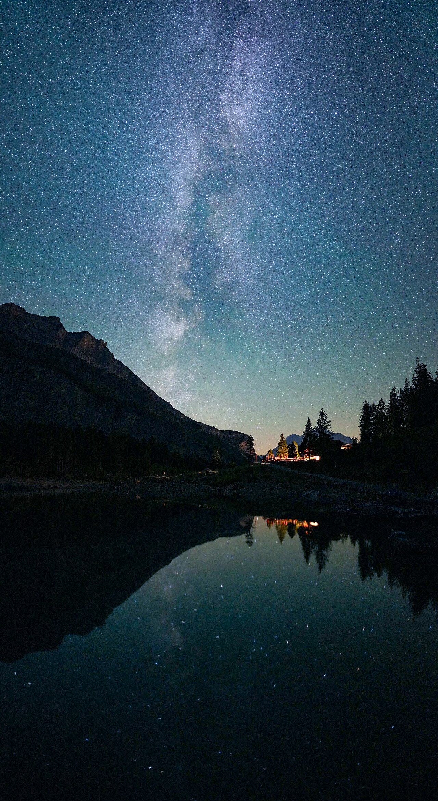

> «В начале сотворил Бог небо и землю» (Быт. 1:1).

В этом коротком стихе спрятано первое действие Бога.

- Что делал Бог в этом стихе?
- Что появилось благодаря Ему?

## Слайд 3. Первое действие Бога

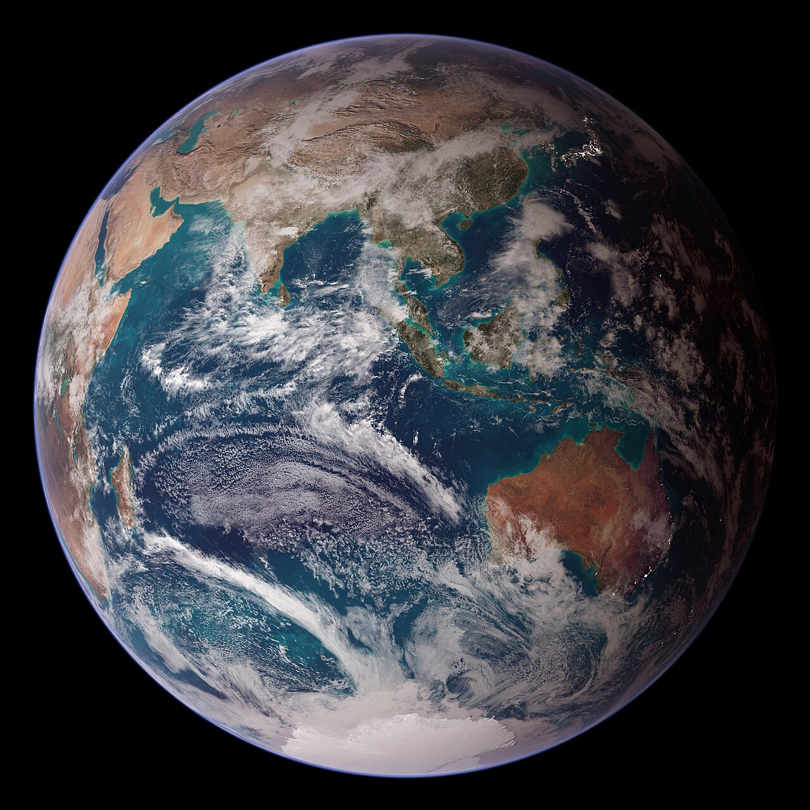

> «В начале **сотворил Бог** небо и землю» (Быт. 1:1).

Бог — Творец. Он был раньше неба и земли и дал им начало.

- Какие слова подсказали нам ответ?
- Кто был раньше: Бог или небо и земля?

## Слайд 4. Дух Божий над водой

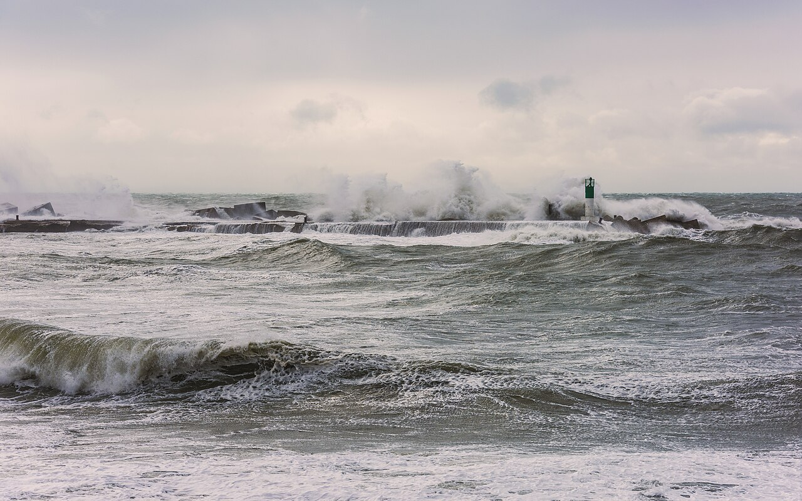

> «И Дух Божий носился над водою» (Быт. 1:2).

Посмотрим, кто действует в самом начале истории.

- Кого мы заметили в этом стихе?
- Где был Дух Божий?

## Слайд 5. Бог и Дух Божий действуют

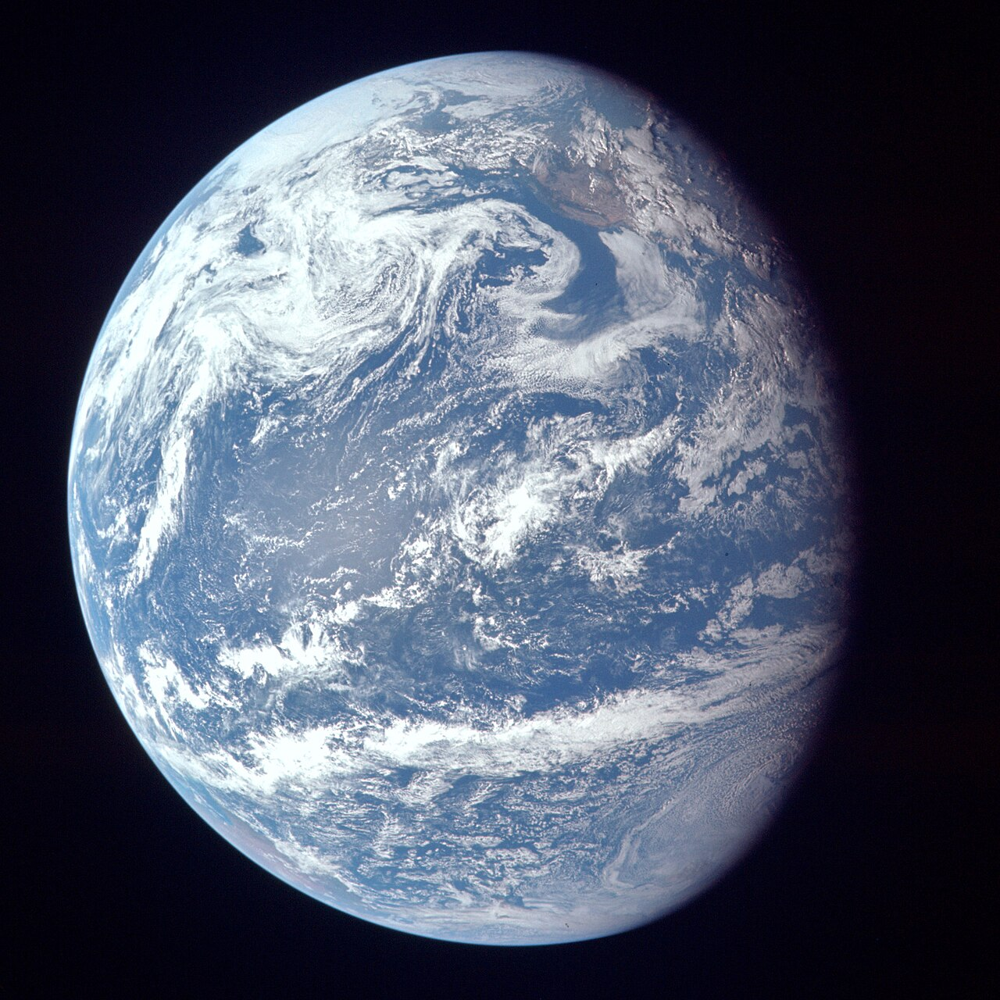

> «И **Дух Божий** носился над водою» (Быт. 1:2).

Библия говорит не о новом боге, а об одном Боге, Который действует. Дух Божий уже участвует в начале творения.

- Мы нашли ещё одного бога или услышали об одном Боге?
- Что мы узнали о Духе Божьем?

## Слайд 6. Бог сказал — и появился свет

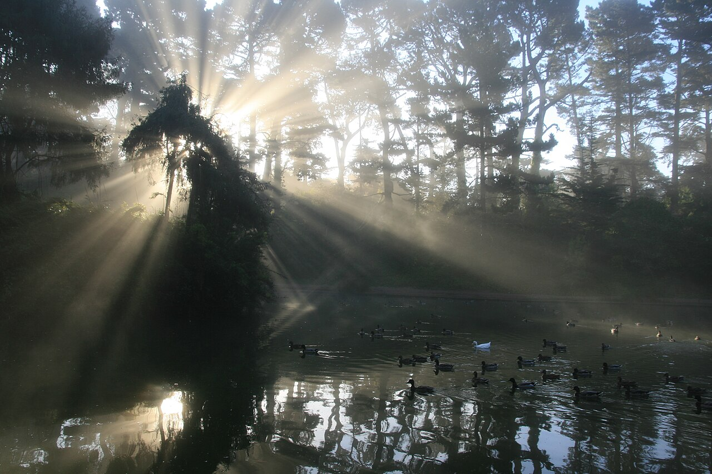

> «И сказал Бог: да будет свет. И стал свет» (Быт. 1:3).

Прислушаемся: что произошло после Божьих слов?

- Что сделал Бог?
- Что произошло после Его слова?
- Какую карточку прикрепим к нашей табличке?

## Слайд 7. Три подсказки о Боге

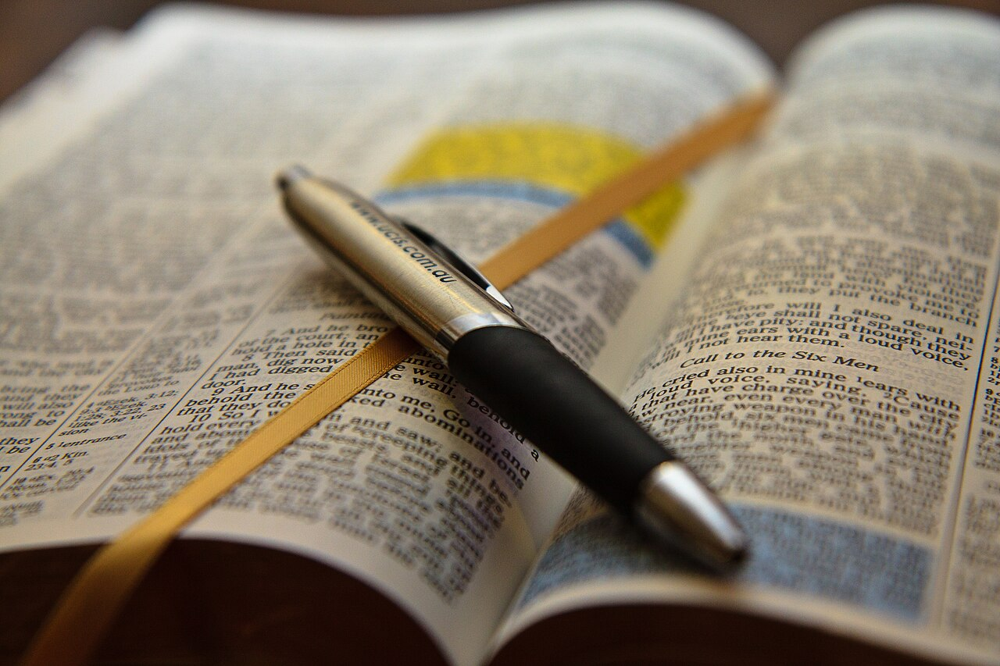

В первых стихах мы заметили три подсказки:

- Бог сотворил небо и землю;
- Дух Божий был над водой;
- Бог сказал — и стал свет.

- Это три бога или один Бог?
- Что может означать «Слово» Бога?

## Слайд 8. Один Бог: Отец, Сын и Дух

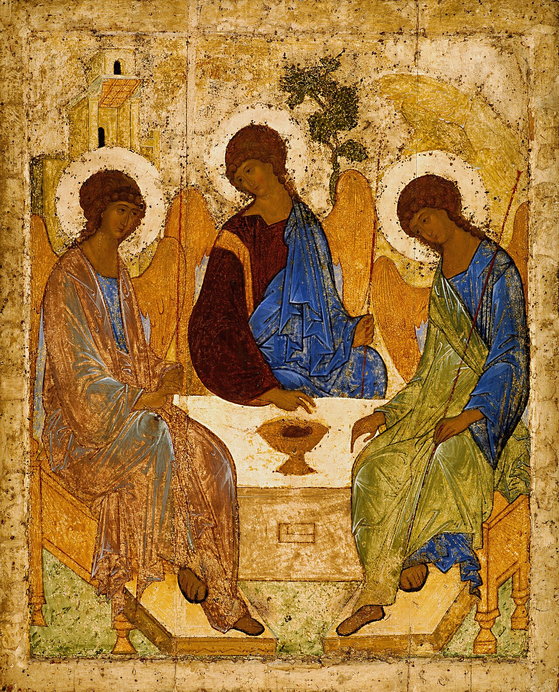

Библия открывает нам одного Бога: Отца, Сына и Духа Святого. Это не три бога и не три отдельные части Бога.

Иисус — Божье Слово. Он был с Отцом и Сам был Богом ещё до сотворения мира.

- Сколько Богов мы слышим в этих стихах?
- Какие три подсказки заметили?
- Кто такой Иисус — Божье Слово?

## Слайд 9. Мир сотворён через Слово

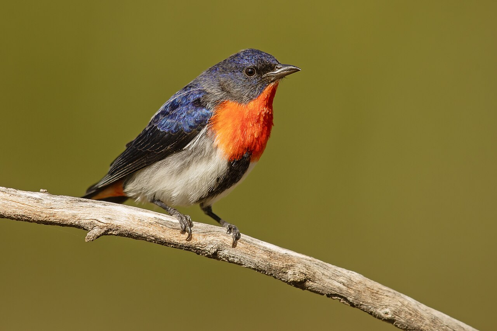

> «Всё чрез Него начало быть, и без Него ничто не начало быть, что начало быть» (Ин. 1:3).

Всё начало быть через Слово — через Иисуса Христа.

- Что начало быть через Него?
- Есть ли хоть одна сотворённая вещь, появившаяся без Него?
- Иисус — Творец или творение?

## Слайд 10. Имя одного Бога

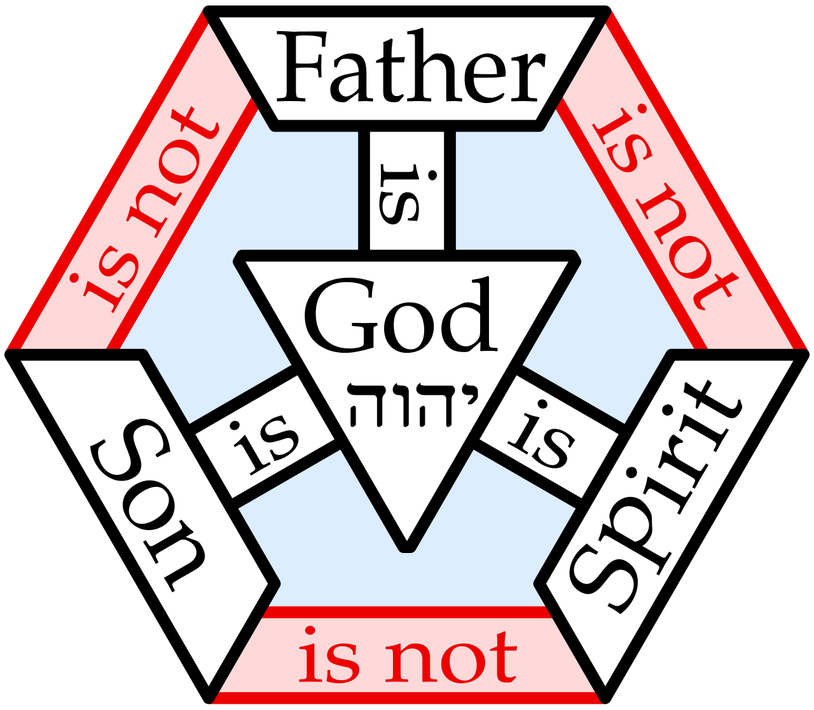

> «…крестя их во имя Отца и Сына и Святаго Духа» (Мф. 28:19).

Иисус говорит об одном имени и называет Отца, Сына и Духа Святого. Так Библия показывает нам Триединого Бога.

- Сколько раз слово «имя» звучит в стихе?
- Кого перечисляет Иисус?
- Какая карточка получила имя Сына?

## Слайд 11. Слово стало человеком

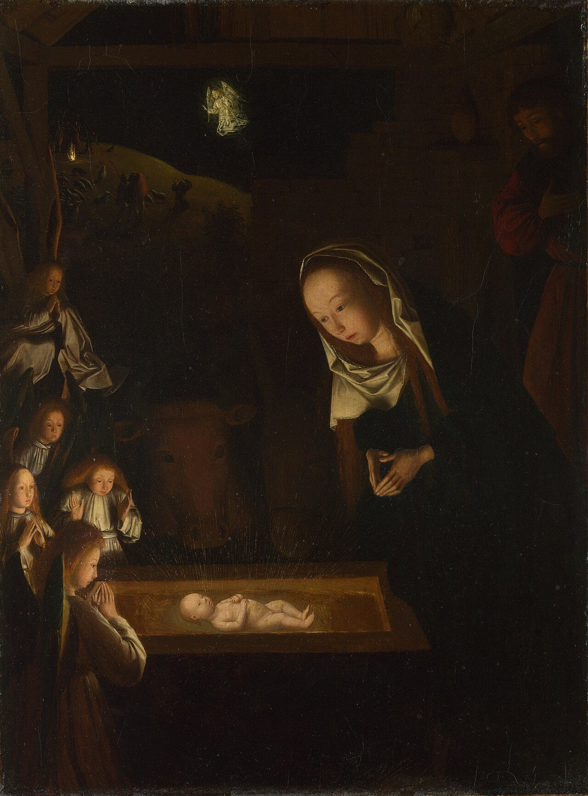

> «И Слово стало плотию и обитало с нами» (Ин. 1:14).

В Вифлееме вечный Божий Сын стал настоящим человеком. Иисус пришёл в мир, чтобы спасти нас.

- Что произошло с Божьим Словом?
- Кем Иисус был прежде Рождества?
- Зачем Он пришёл в мир?

## Слайд 12. Иисус — Творец и Спаситель

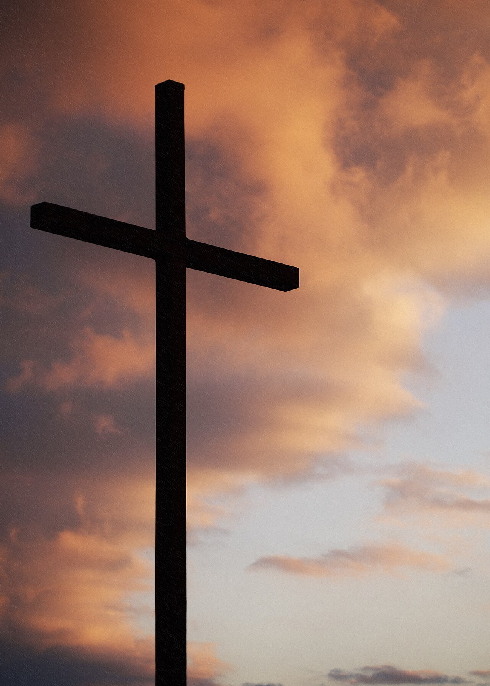

> «Ибо Им создано всё, что на небесах и что на земле, видимое и невидимое… всё Им и для Него создано» (Кол. 1:16).

Иисус был до Рождества. Через Него создано всё. Он стал человеком и пришёл спасти нас.

- Когда появился Иисус: в Вифлееме или раньше?
- Творился ли через Него мир?
- Кто Он такой?

**Иисус Христос — вечный Божий Сын, Божье Слово, Творец и Спаситель.**
