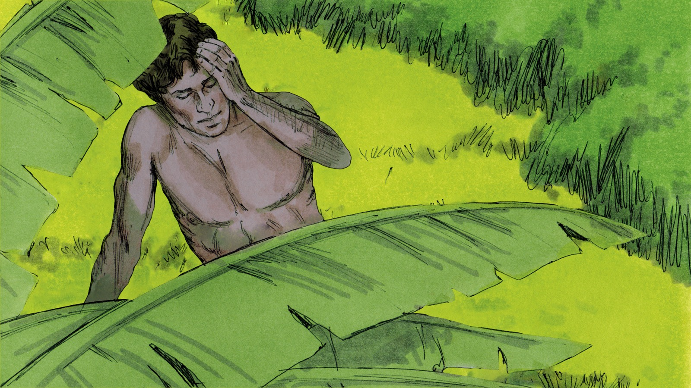
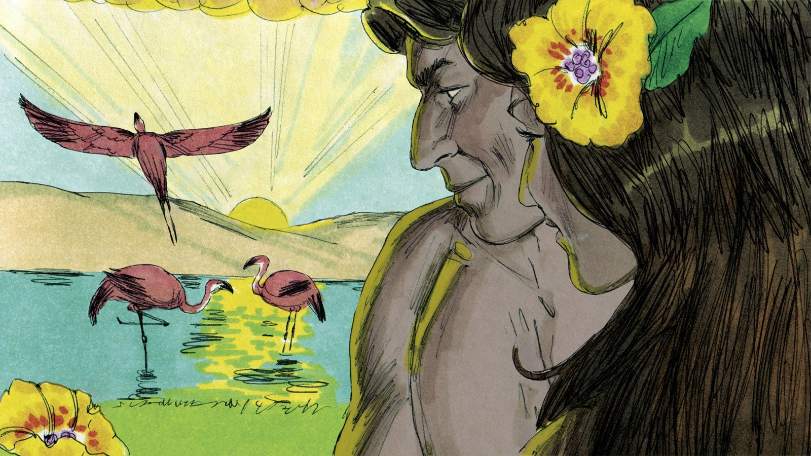
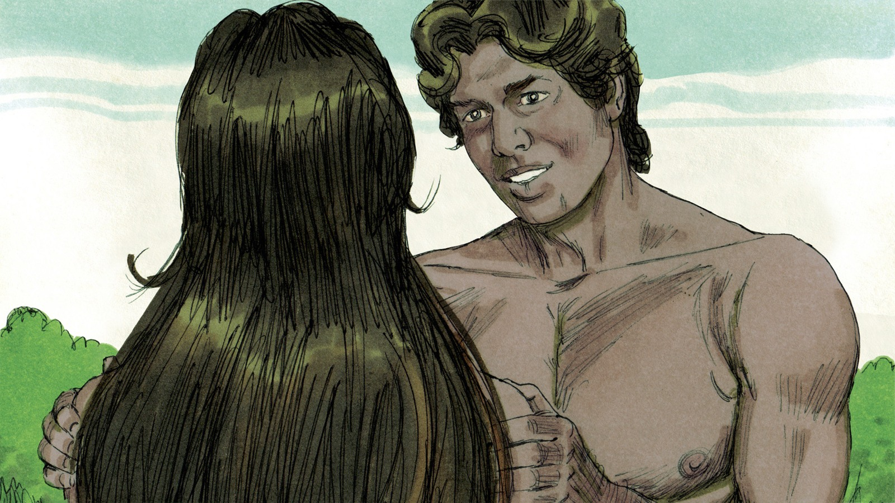
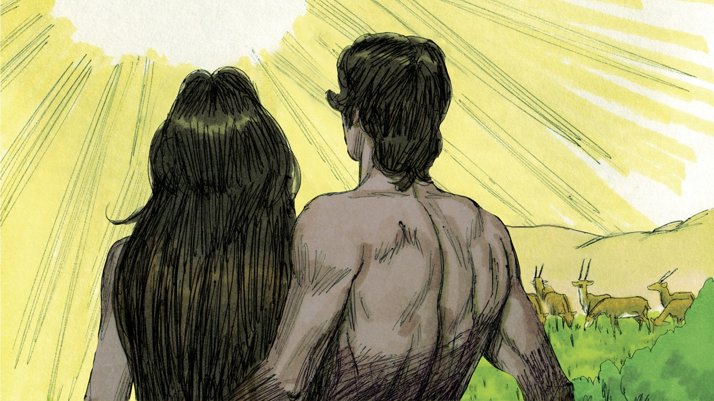
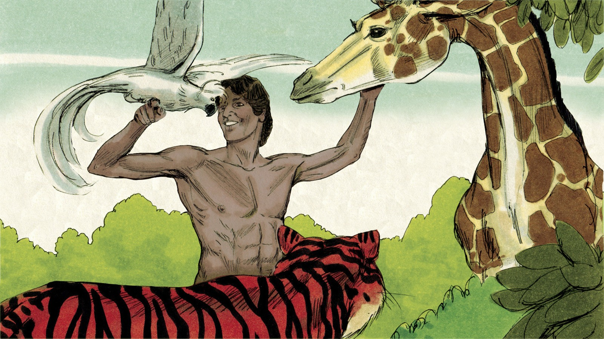
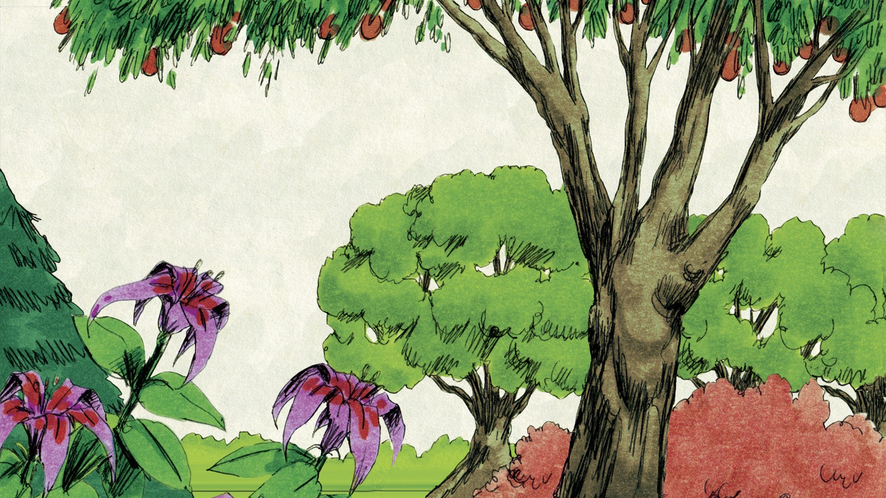

# Кто такой человек?

## Слайд 1. Бог задумал человека

> «Сотворим человека по образу Нашему и по подобию Нашему» (Быт. 1:26).

Человек не случайность. Бог Сам задумал и создал людей.

- Кто говорит: «сотворим»?
- Зачем Бог создал человека?

## Слайд 2. Образ Божий

> «И сотворил Бог человека по образу Своему» (Быт. 1:27).

Каждый человек имеет достоинство, потому что создан Богом по Его образу. Образ Божий не делает нас богами, но показывает особое призвание человека.

- Почему нельзя считать человека бесполезным?
- Как уважать Божий образ в другом?

## Слайд 3. Мужчина и женщина

> «Мужчину и женщину сотворил их» (Быт. 1:27).

Бог создал и мужчину, и женщину по Своему образу. Возраст, внешность и способности не отменяют достоинства человека.

- Кто носит образ Божий?
- Что меняется в нашем отношении к людям?

## Слайд 4. Бог дал человеку жизнь

> «И создал Господь Бог человека из праха земного, и вдунул в лице его дыхание жизни» (Быт. 2:7).

Тело человека создано Богом из праха, а жизнь дана Им. Мы зависим от Творца каждое мгновение.

- Из чего Бог создал тело?
- Кому мы благодарны за жизнь?

## Слайд 5. Человек получает поручение

> «И благословил их Бог… и владычествуйте над… всяким животным» (Быт. 1:28).

Владычествовать — значит заботливо управлять Божьим миром, а не разрушать его.

- Как можно заботиться о людях, животных и природе?
- Чем ответственность отличается от власти ради себя?

## Слайд 6. Бог увидел: хорошо весьма

> «И увидел Бог всё, что Он создал, и вот, хорошо весьма» (Быт. 1:31).

Божье творение было хорошим. Грех ещё не вошёл в мир; о грехопадении мы узнаем дальше.

- Кто оценил творение?
- Что это говорит о Божьем замысле?

## Слайд 7. Жизнь через Сына

> «Всё чрез Него начало быть, и без Него ничто не начало быть» (Ин. 1:3).

Иоанн говорит об Иисусе Христе: через Него Бог сотворил всё. Сын Божий — Творец, а человек — Его творение.

- Кто такой Иисус в этих стихах?
- Почему человек не может быть Богом?

## Слайд 8. Что запомнить

Бог создал человека по Своему образу, дал ему жизнь и поручил заботиться о мире. Поэтому мы благодарим Бога, уважаем людей и ответственно относимся к творению.

**Главная истина:** жизнь и достоинство человека — дар Творца.
