# Урок 3. Грехопадение

**Тема:** Грехопадение.  
**Цель:** Рассказать детям о грехопадении Адама и Евы: как сатана обманул их («подлинно ли сказал Бог?», «будете как боги») и как грех отделил человека от Бога. Показать, что Бог Сам приготовил спасение: Он обещал Спасителя (Быт. 3:15) и одел людей в кожаные одежды (Быт. 3:21) — картина Жертвы Иисуса Христа.  
**Библейская история:** Бытие 3 гл.  
**Золотой стих:** Бог во Христе примирил с Собою мир. 2 Кор. 5:19

### Комментарий для учителей

Для раскрытия этой темы я часто использую урок от Суперкниги. Файл прикрепляю ниже. Адаптирую для своей группы, что-то меняю и придумываю новые поделки. Представление Евангелия в этом уроке очень доступно показано. Поэтому часто использую на своих уроках.  
Добавляю фото, как можно представить наглядно Библейскую историю.  
Поделка на уроке была в технике пластилинографии. Как дети представляют Древо жизни и Дерево познания добра и зла.  
Главные акценты истории: сатана обманывает всегда одинаково — «подлинно ли сказал Бог?» (заставить усомниться в Слове Божьем) и «будете как боги» (справитесь сами, без Бога). Листья смоковницы, которыми прикрылись Адам и Ева, — попытка человека самому решить свою проблему, свои дела. А кожаные одежды, которые дал Бог (Быт. 3:21), — Божье решение: ради них пролилась кровь, это картина Жертвы Иисуса, Который покрывает наши грехи. Быт. 3:15 — первое обещание о Христе: Семя жены поразит змея в голову. Восстановление человека — Божий план, а не заслуга человека.  
Применение для детей: перечитать дома эту историю с родителями и найти в ней Иисуса; поговорить с Иисусом в молитве — Он рядом и не оставит (Эммануил — значит «Бог с нами»). А если сделал плохое — не прячься, как Адам, а приди к Богу, скажи Ему об этом и прими прощение, потому что Иисус уже понёс наказание за наши грехи.  
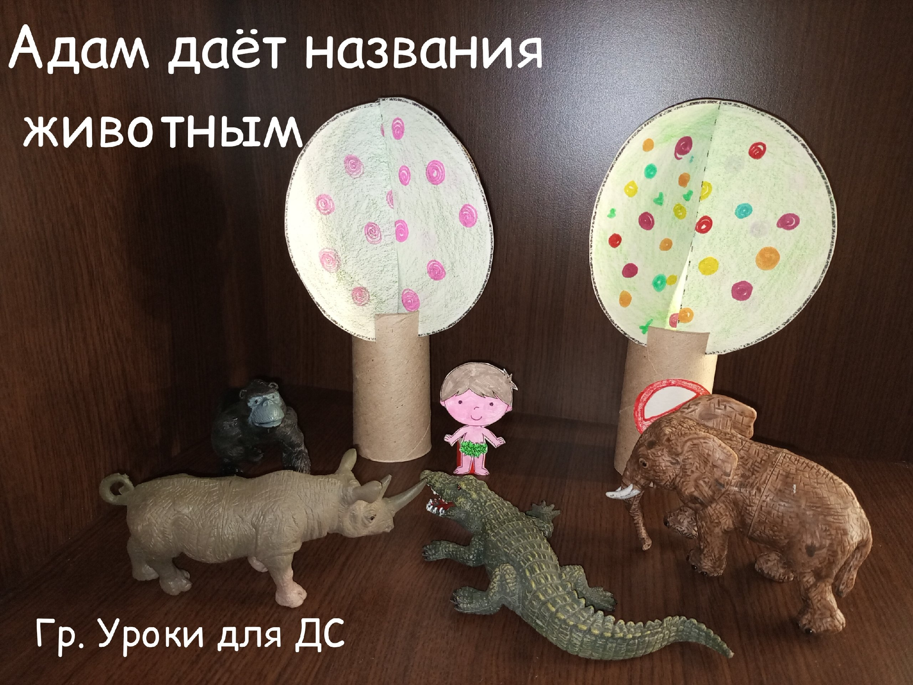  
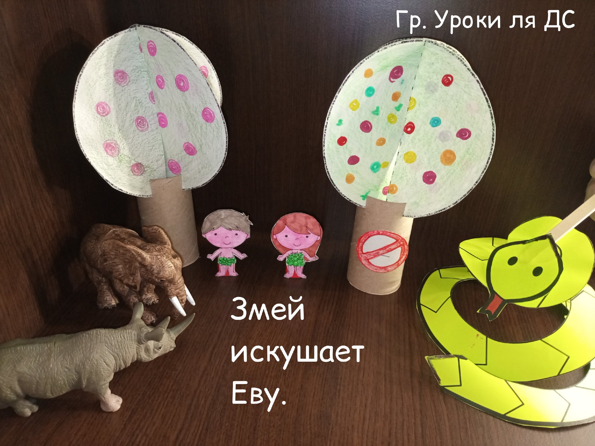  
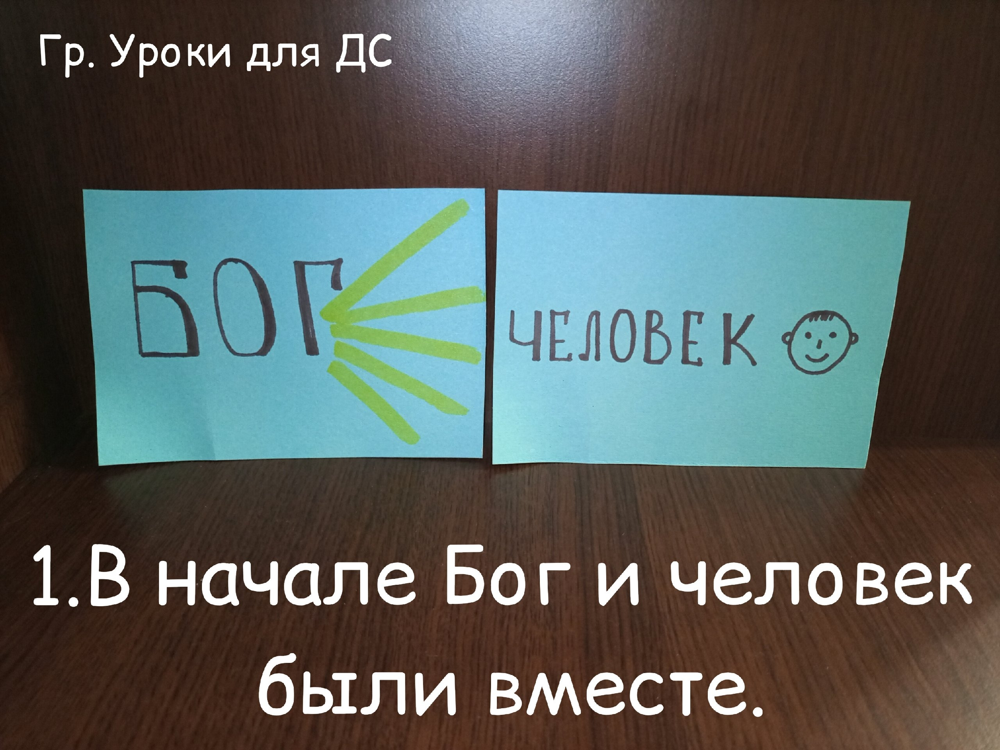  
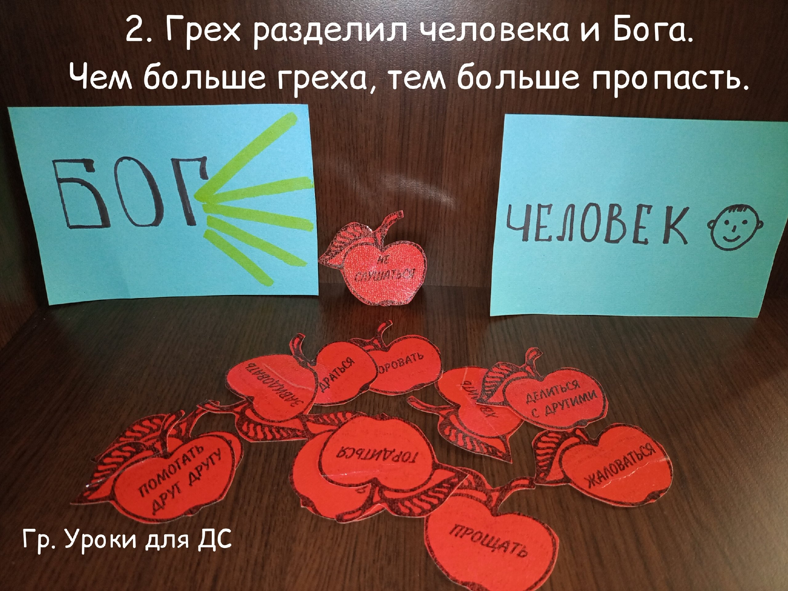  
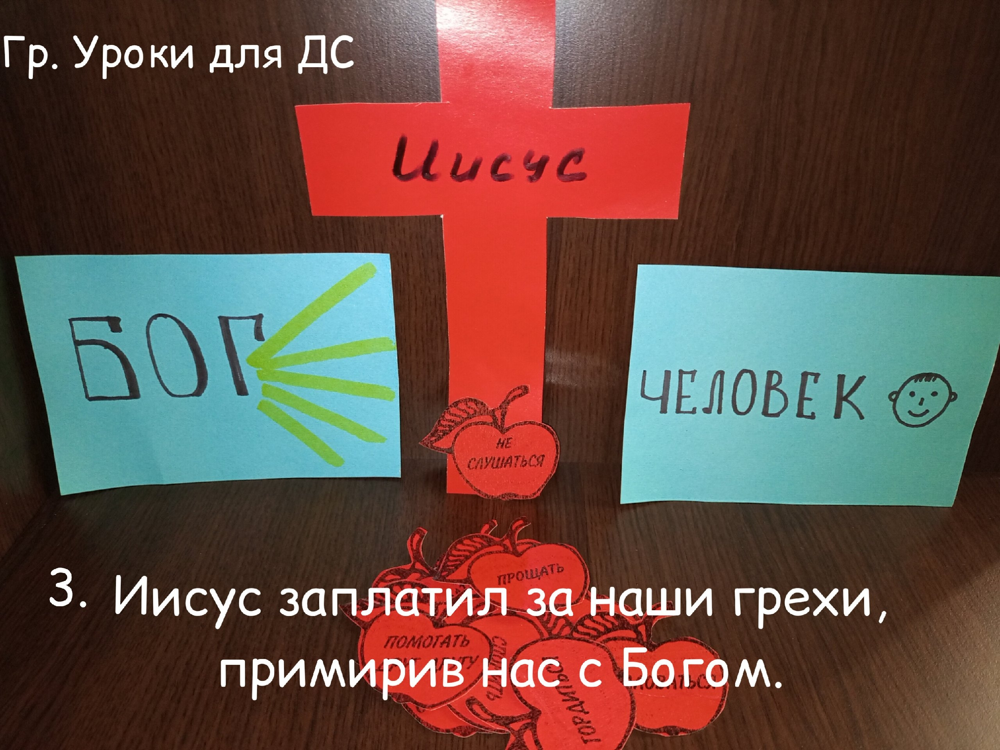  
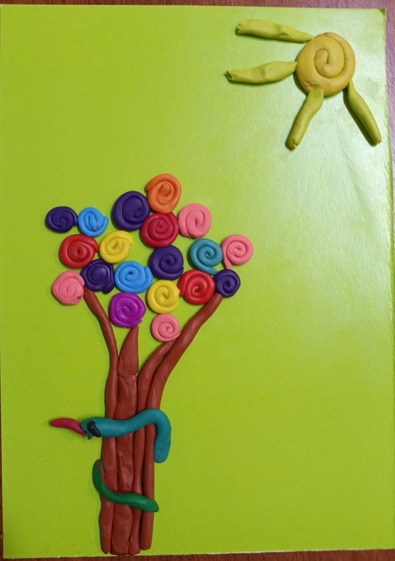  
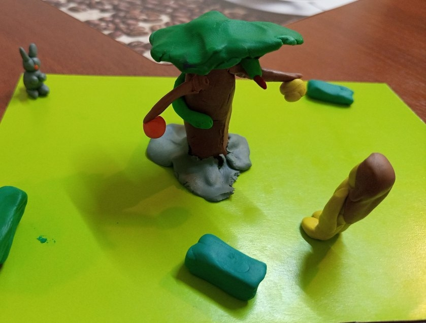  
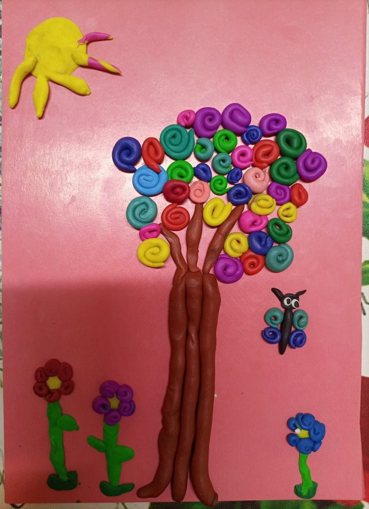  
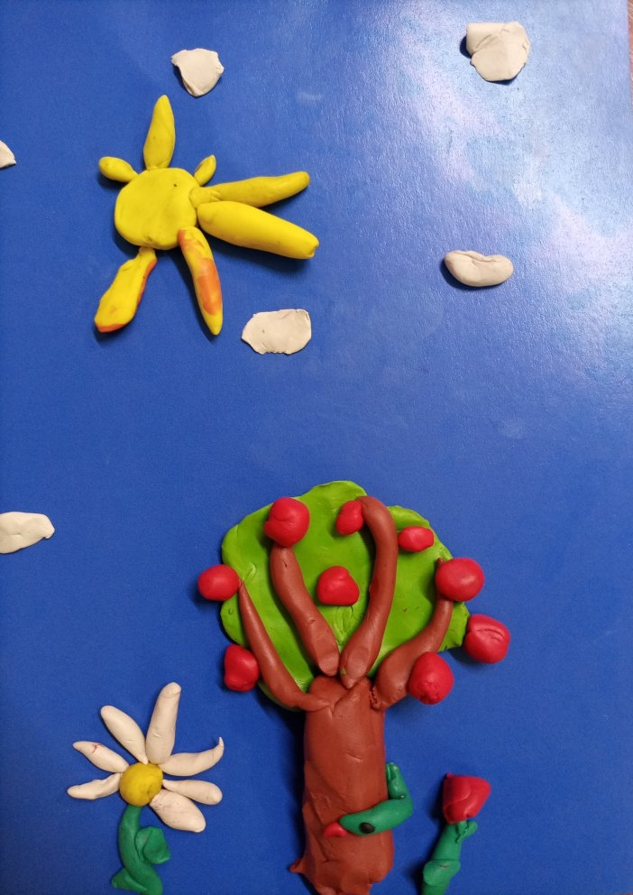  
📎 [Vstrecha_01.pdf](../vk_board/01_50314759_Бытие.%20Цикл%20уроков%20для%20детей%20Красная%20нить/docs/Vstrecha_01.pdf)

### Идеи наглядности

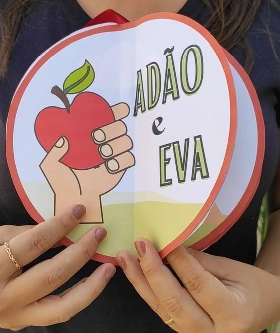  
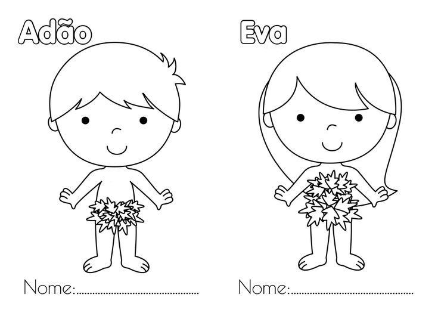  
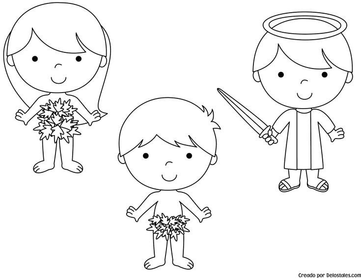  
📎 [Адам и Ева 1.pdf](../vk_board/01_50314759_Бытие.%20Цикл%20уроков%20для%20детей%20Красная%20нить/docs/Адам%20и%20Ева%201.pdf)  
📎 [Адам и Ева 2.pdf](../vk_board/01_50314759_Бытие.%20Цикл%20уроков%20для%20детей%20Красная%20нить/docs/Адам%20и%20Ева%202.pdf)

### Задания для детей

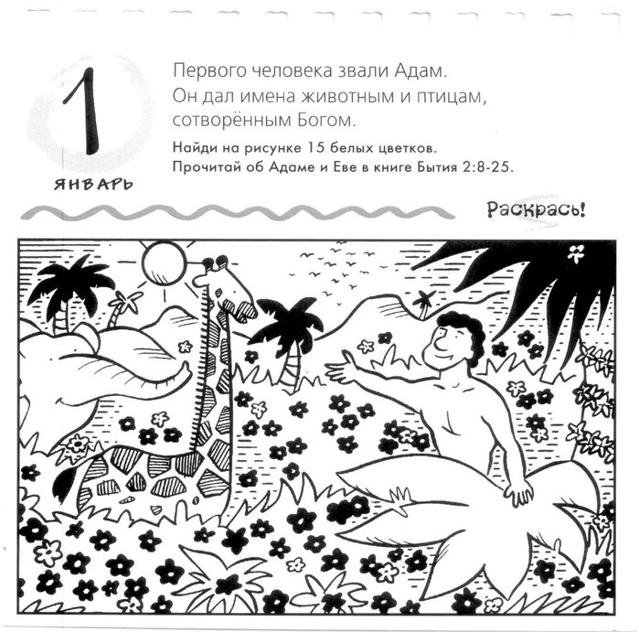  
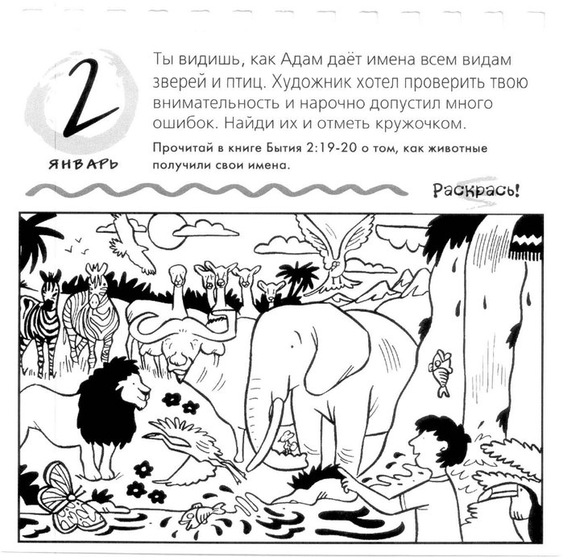  
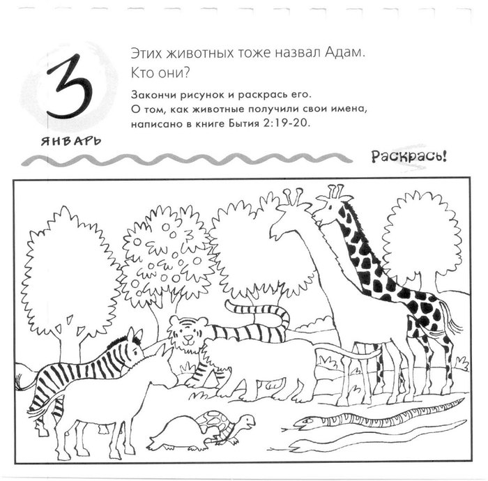  
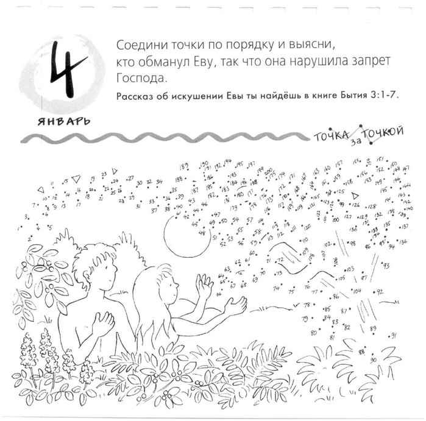  
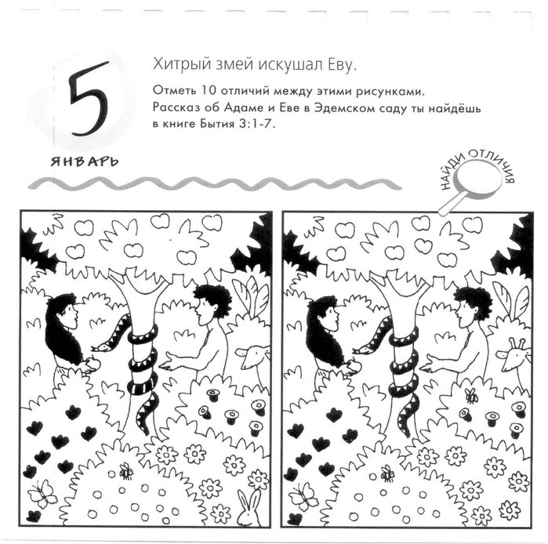  
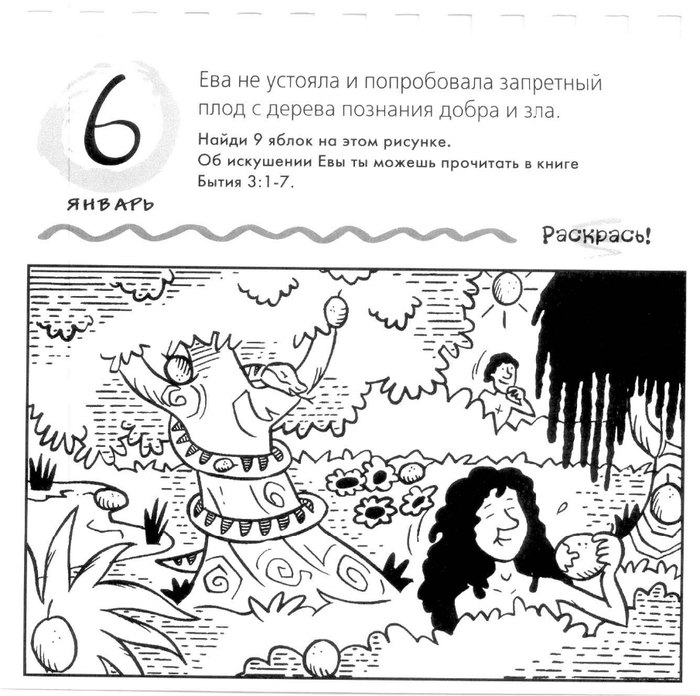
