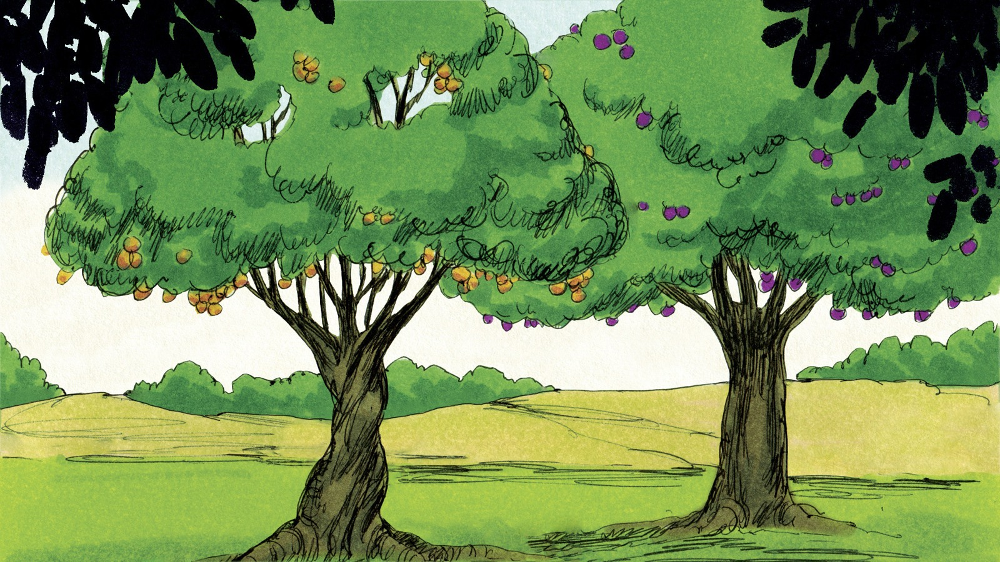
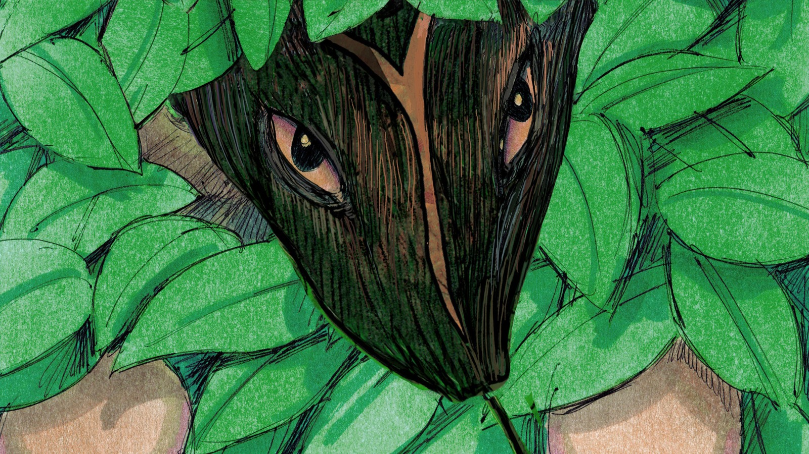
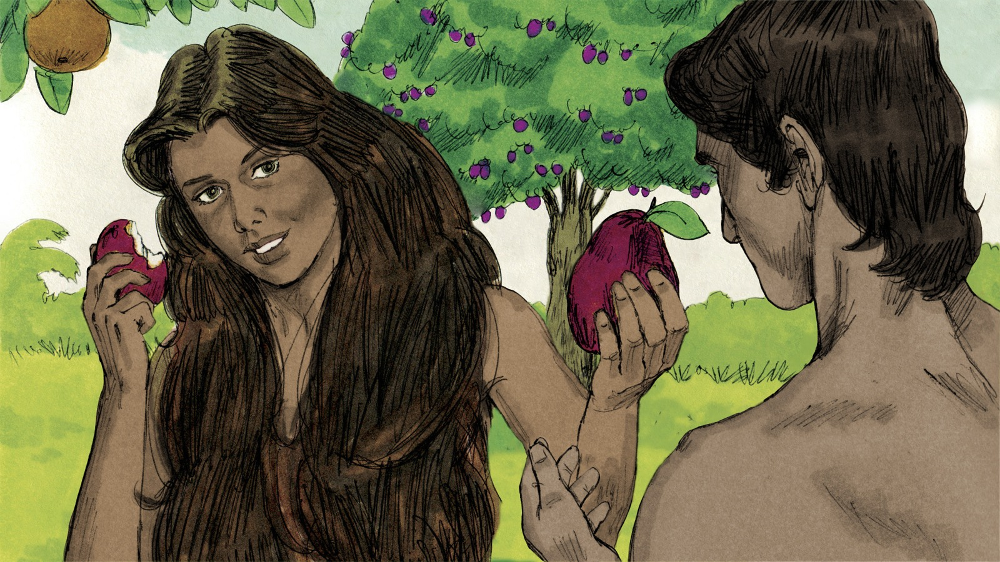
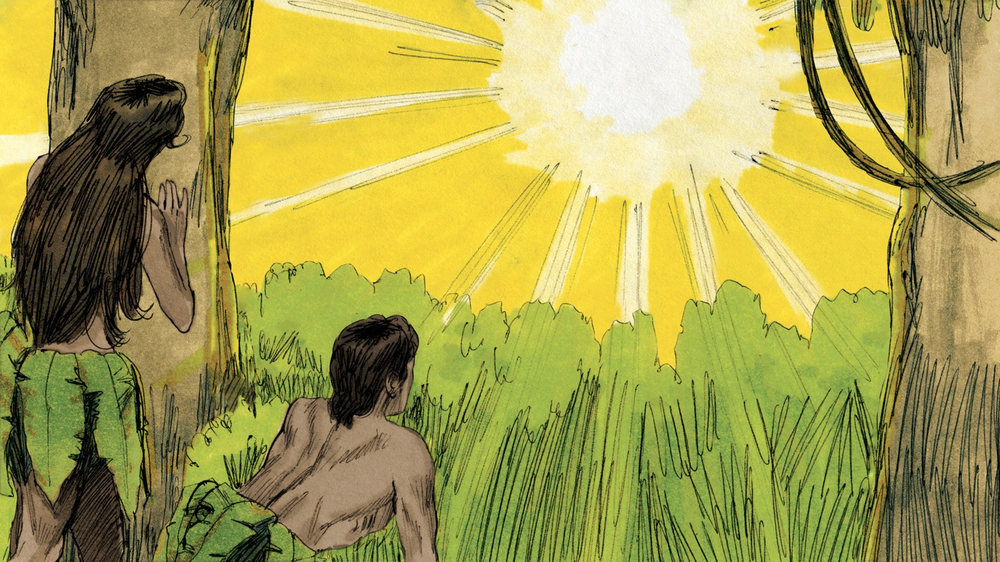
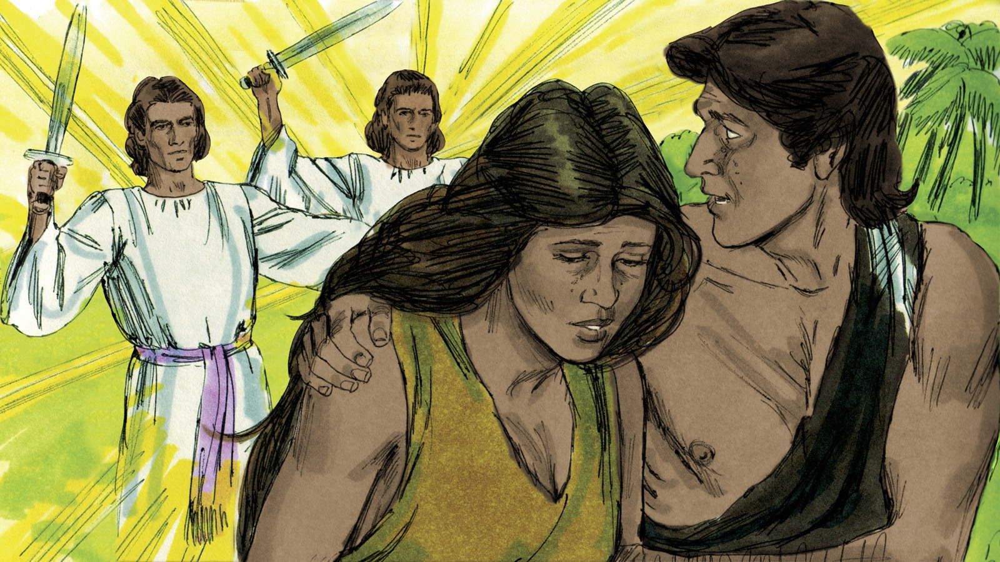

# Когда человек спрятался от Бога

## Слайд 1. Добрый Божий сад

> «И увидел Бог всё, что Он создал, и вот, хорошо весьма» (Быт. 1:31).

Адам и Ева жили в саду, который приготовил Бог. Они слышали Его слово и доверяли Ему.

- Каким был мир в начале?
- Что значит жить рядом с Богом?

## Слайд 2. Божья заповедь

> «А от дерева познания добра и зла не ешь от него» (Быт. 2:17).

Бог дал человеку свободу и ясное слово. Доверять Богу — значит принимать Его границы как добрые.

- Что Бог разрешил?
- Какую заповедь Он дал?

## Слайд 3. Вопрос змея

> «Подлинно ли сказал Бог: не ешьте ни от какого дерева в раю?» (Быт. 3:1).

Змей начал с сомнения в Божьем слове. Искушение часто заставляет нас думать, будто Бог не говорит правду или не желает добра.

- Что пытался сделать змей?
- Почему важно помнить точные слова Бога?

## Слайд 4. Человек поверил лжи

> «И взяла плодов его и ела; и дала также мужу своему» (Быт. 3:6).

Адам и Ева выбрали собственное решение вместо доверия Богу. Так в мир вошёл грех — непослушание Творцу.

- Чьему слову поверили люди?
- Что произошло с их отношениями с Богом?

## Слайд 5. Страх и стыд

> «И услышали голос Господа Бога… и скрылся Адам и жена его» (Быт. 3:8).

Грех принёс стыд и страх. Люди спрятались, но Бог Сам пришёл искать их.

- Почему Адам спрятался?
- Что показывает Божий вопрос: «Где ты?»

## Слайд 6. Бог обещает победу

> «Он будет поражать тебя в голову» (Быт. 3:15).

Бог объявил змею, что зло не победит навсегда. В дальнейшем Писание показывает исполнение этого обещания в Иисусе Христе, Который победил грех и смерть.

- Кому Бог обещал поражение?
- Как Иисус победил грех?

## Слайд 7. Божье покрытие

> «И сделал Господь Бог Адаму и жене его одежды кожаные и одел их» (Быт. 3:21).

Люди не смогли скрыть свой грех сами. Бог Сам дал им одежду. Этот рассказ напоминает: спасение и покрытие вины приходят от Бога, а не из человеческих попыток.

- Кто сделал одежду?
- Что это говорит о Божьей милости?

## Слайд 8. Не прячься от Бога

Когда мы согрешили, не нужно притворяться и убегать. Бог зовёт нас признать грех и обратиться к Нему. Иисус Христос принимает кающихся и даёт прощение.

- Что сделать после плохого поступка?
- К Кому обратиться в молитве?

**Главная истина:** грех разрушает общение с Богом, но Бог Сам обещал Спасителя и зовёт нас вернуться к Нему.
