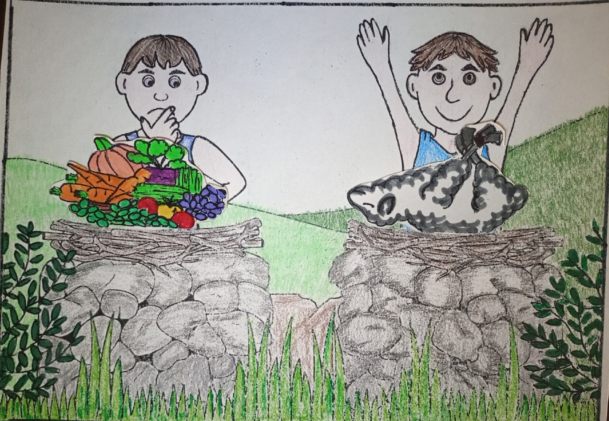
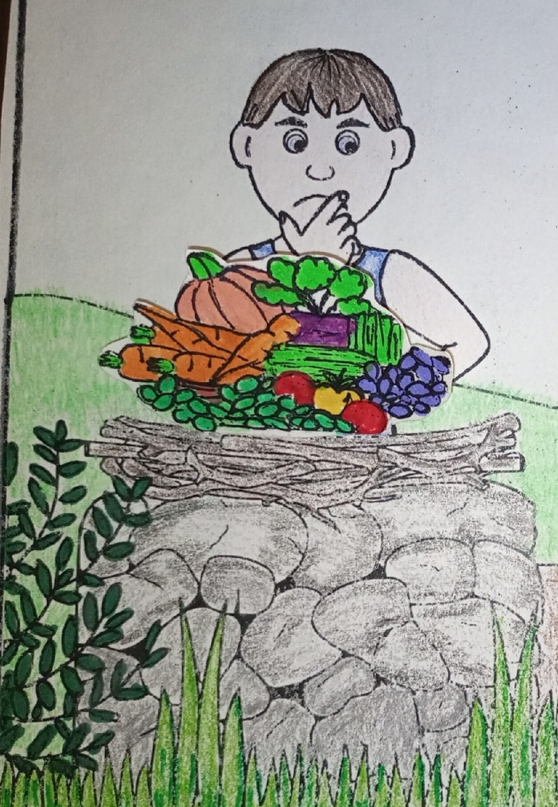
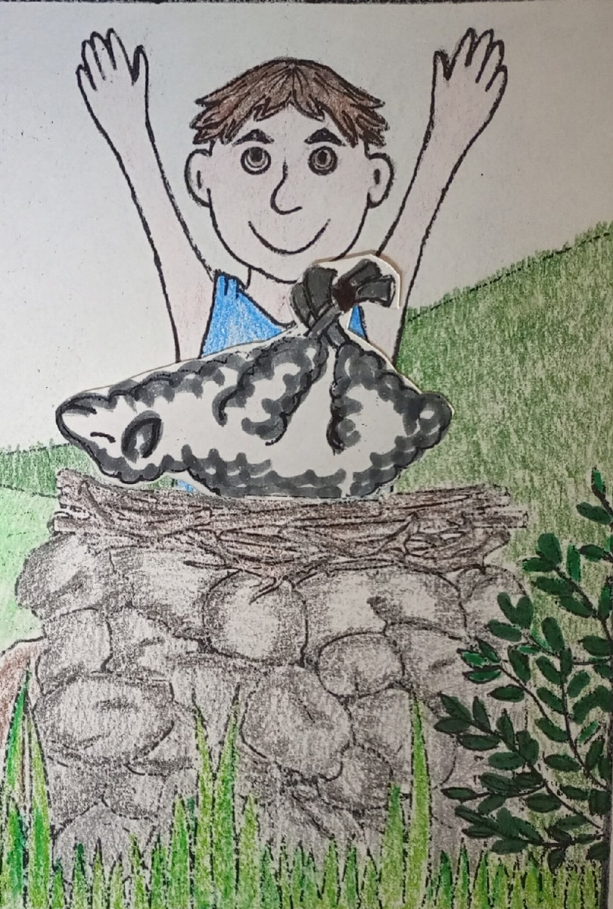

# Как угодить Богу?

## Слайд 1. Два брата и два дара

> «И был Авель пастырь овец, а Каин был земледелец» (Быт. 4:2).

Каин и Авель трудились по-разному. Оба знали Бога и однажды принесли Ему дары.

- Чем занимался каждый брат?
- Зачем люди приносили Богу дары?

## Слайд 2. Бог смотрит на сердце

> «И призрел Господь на Авеля и на дар его, а на Каина и на дар его не призрел» (Быт. 4:4–5).

Библия не говорит, что овощи плохи, а овца хороша сама по себе. Бог видел веру и отношение каждого человека.

- На кого и на что смотрел Бог?
- Почему одного дара Он принял, а другой — нет?

## Слайд 3. Вера Авеля

> «Верою Авель принес Богу жертву лучшую, нежели Каин» (Евр. 11:4).

Апостол объясняет: Авель пришёл к Богу верой — доверяя Божьему обещанию и Его пути.

- Что значит «верою»?
- Можно ли угодить Богу, игнорируя Его слово?

## Слайд 4. Предупреждение Каину

> «У дверей грех лежит; он влечёт тебя к себе, но ты господствуй над ним» (Быт. 4:7).

Бог не оставил Каина без предупреждения. Он призвал его признать опасность греха и выбрать правильный путь.

- Где, по словам Бога, лежит грех?
- Как Бог обращается к Каину?

## Слайд 5. Добрые дела и вера

Добрые дела важны, но они не покупают Божье принятие. Мы приходим к Богу через веру в Иисуса Христа, а добрые дела становятся плодом благодарной жизни.

- Что появляется раньше: вера или её плоды?
- Почему нельзя хвалиться своими делами перед Богом?

## Слайд 6. Иисус — совершенная жертва

> «Вот Агнец Божий, Который берёт на Себя грех мира» (Ин. 1:29).

Жертвы Ветхого Завета указывали на Иисуса. Он однажды принёс Себя за грех и открыл нам путь к Богу.

- На Кого указывали жертвенные животные?
- Что сделал Иисус для грешников?

## Слайд 7. Как прийти к Богу сегодня

> «А без веры угодить Богу невозможно» (Евр. 11:6).

Мы слушаем Божье слово, доверяем Иисусу, исповедуем грех и благодарим Бога. Послушание не заменяет веру, а показывает её плод.

- Что значит верить Иисусу?
- Как вера проявляется на этой неделе?

## Слайд 8. Итог

Бог принимает не за впечатляющие подарки и не за список заслуг. Авель пришёл верой; мы приходим к Богу через Иисуса Христа.

**Главная истина:** угодить Богу можно только верой в Его обещание и в жертву Иисуса Христа.
