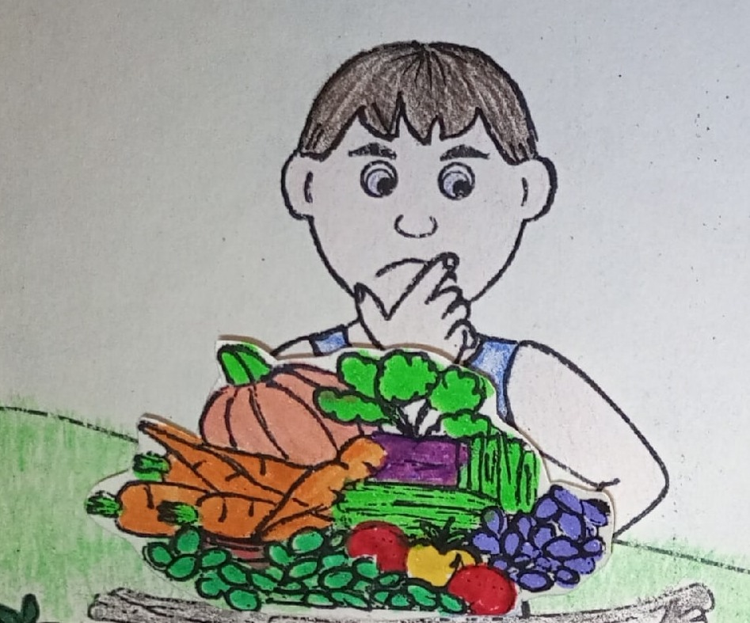

# Как победить гнев

## Слайд 1. У каждого бывает гнев

Гнев может начаться с обиды и разочарования. Бог видит, что происходит в нашем сердце.

- Что обычно вызывает у тебя гнев?
- Что происходит, если прятать гнев внутри?

## Слайд 2. Каин и Авель принесли дары

Авель доверился Божьему обещанию и принёс жертву веры. Каин пришёл по-своему. Бог принял Авеля, а Каин разгневался.

- Чем отличались их дары?
- Почему вера важнее попытки заслужить Божье принятие?

## Слайд 3. Бог предупреждает Каина

> «…у дверей грех лежит; он влечет тебя к себе, но ты господствуй над ним» (Быт. 4:7).

Бог не оставил Каина: Он предупредил его и предложил выбрать послушание.

- Что лежало у дверей?
- Какой выбор Бог дал Каину?

## Слайд 4. Гнев может взорваться

Накопленные обида и злость похожи на надутый шар. Если не обратиться к Богу, гнев может причинить боль другим и самому себе.

- Что случится с шаром, если продолжать надувать?
- Как остановить гнев до «взрыва»?

## Слайд 5. Каин убил Авеля

Каин не послушал Бога и убил брата. Грех разрушает отношения и жизнь. Много лет спустя люди убили Иисуса — обещанного Спасителя.

- Стало ли Каину легче после преступления?
- Почему важно остановиться и послушать Бога?

## Слайд 6. Где твой брат?

> «Где Авель, брат твой?» (Быт. 4:9).

Бог видит зло и спрашивает человека о его поступках. От Него нельзя спрятаться за оправданиями.

- Что ответил Каин?
- Как честно рассказать Богу о своём гневе?

## Слайд 7. Господствуй над грехом

> «…у дверей грех лежит; он влечет тебя к себе, но ты господствуй над ним» (Быт. 4:7).

Когда злишься, остановись, помолись Иисусу и назови свои чувства. Он Эммануил — Бог с нами, и не оставляет Своих детей.

- Что можно сделать вместо толчка или злых слов?
- Кому можно рассказать о своей обиде?

## Слайд 8. Иисус спасает от власти греха

> «…не оставлю тебя и не покину тебя» (Евр. 13:5).

Мы не заслуживаем Божьей любви добрыми делами. Иисус прощает и помогает жить по Божьему Слову.

**Главная истина:** Бог предупреждает нас о грехе и зовёт довериться Ему, когда приходит гнев.
