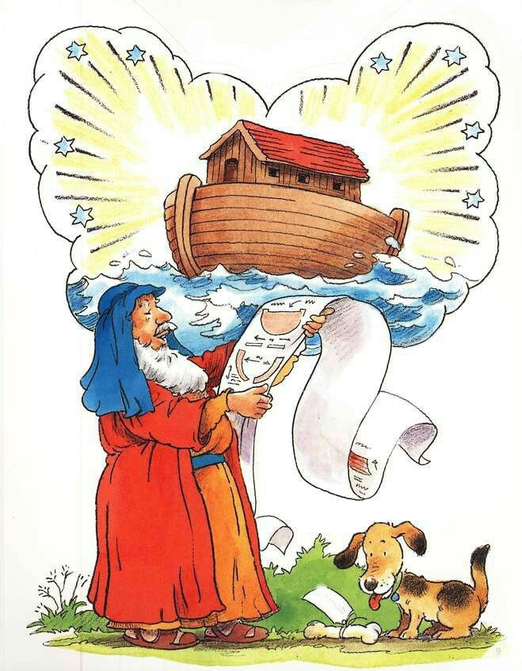
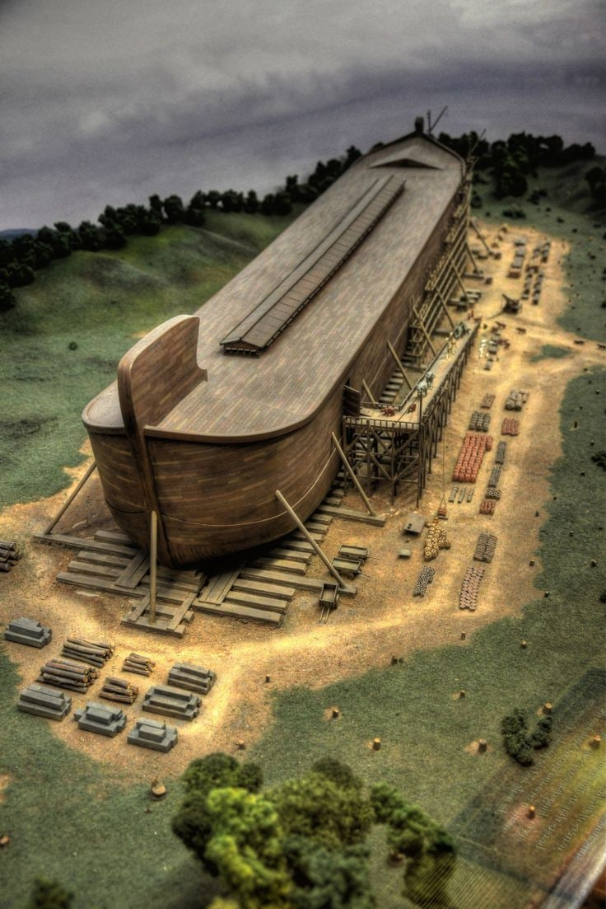
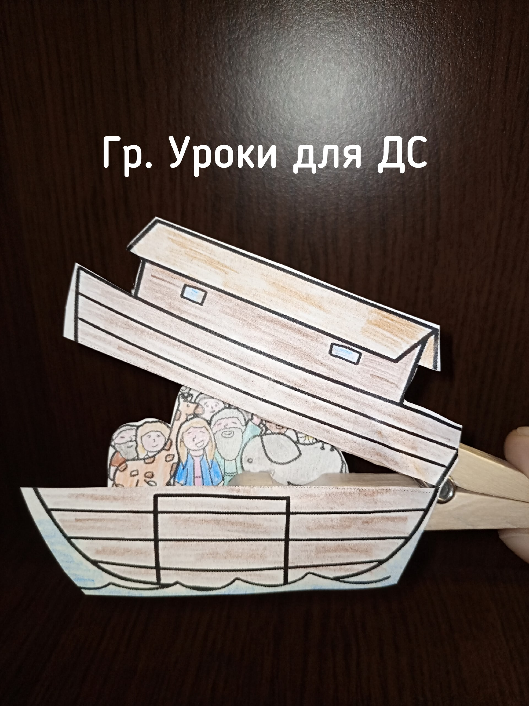
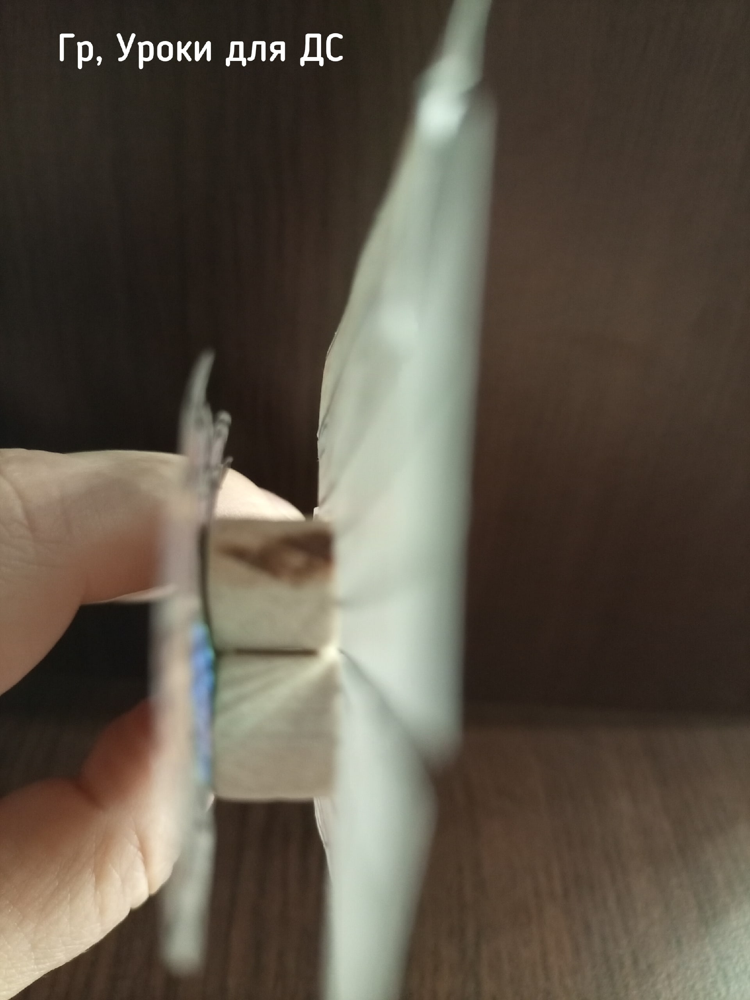
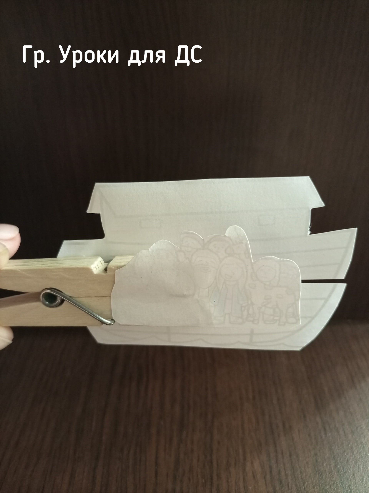

# Урок 6. Ковчег спасения

**Тема:** Ковчег спасения.  
**Истина:** Ковчег — прообраз Христа: в ковчеге жизнь, вне ковчега смерть.  
**Цель:** Объяснить детям, что как во времена потопа спастись можно было только в ковчеге, так и сегодня спасение от Божьего суда — только во Христе; ковчег указывает на Иисуса, и каждый, кто принимает Его Слово, спасён.  
**Библейская история:** Бытие 6-8 главы  
**Золотой стих:** «Я есмь дверь: кто войдет Мною, тот спасется…» Евангелие от Иоанна 10:9  
**План урока:**

## 1. Молитва

## 2. Повторение

Для повторения необходимо собрать набор карточек с картинками или мешочек с предметами относящимися к прошедшим урокам. Дети по очереди не глядя достают один предмет и рассказывают какую историю он им напомнил.  
Например: земной шар или маленький глобус (сотворение), змея (змей обманывает Еву), цифра 6 и 1 (Бог 6 дней творил и 1 отдыхал), фигурка ангела или меч (вход в Эдем закрыт), фрукты (Каин),  
овечка (Авель), капля крови или бутылочка с окрашенной в красный цвет водой (Каин убивает Авеля)  
Вспомнить и повторить золотые стихи прошлых уроков.

## 3. Заинтересуй

Загадать детям загадку.  
Все дома идут под воду  
Все деревья и цветы.  
И не видно даже гору  
Где спасемся я и ты?  
С неба дождь все льет и льет.  
Знаю, наступил…? (Потоп)  
Спросить:

- Что происходит во время потопа? (Выслушать ответы)

Поиграть.  
Попросите детей изобразить шум дождя. Пусть закроют глаза и начнут потихоньку стучать руками по столу. Постепенно ускоряясь.  
Спросите:

- Вы когда-нибудь видели такой сильный ливень? Как вы спасались от ливня?

Выслушайте ответы.

## 4. Библейская история

(Вам понадобится 3 картинки. На первой перечеркнутое изображение дождя. На второй торт с цифрой 1000. На третьей изображение двух семей (двух родов людей).  
Любые наглядности к истории про Ноя.)  
Вступление:  
Очень часто на нашей планете Земля, в разных ее уголках случаются такие сильные ливни, которые приводят к беде. Например, от большого кол-ва осадков река может переполниться водой и выйти из берегов. И если рядом находится населенный пункт, то там начинается наводнение. И чтобы спастись люди забираются на крыши своих домов и ждут, когда их спасут.  
Сегодня наша история будет о человеке по имени Ной, который тоже однажды пережил потоп.  
Если бы мы попросили Ноя рассказать, как жили люди на земле в то время, то он рассказал бы много удивительного.  
1 картинка. Например то, что времена от сотворения мира до Ноя на земле не было до дождя.  
Как такое может быть? В Библии написано (Бытие 2:6), что при сотворении «Бог не посылал дождя на землю, но пар поднимался с земли и орошал все лице земли.»  
2 картинка. Было еще кое-что удивительное. Во времена от Адама и Евы до Ноя люди жили почти 1000 лет. Адам, например жил 930 лет. Так что земля очень быстро наполнилась людьми.  
3 картинка. Но было еще кое-что не очень хорошее. Помните историю о Каине и Авеле? Потомки Каина забыли Бога и жили только для себя. А потомки Сифа знали Бога и передавали друг другу Его Слово. Но постепенно даже те, кто знал Бога, стали дружить и создавать семьи с теми, кто жил без Бога, и перенимали их злую жизнь, забывая Божье Слово.  
Поэтому земля очень быстро наполнилась злом. Люди стали настолько злыми, что Господь пожалел, что сотворил человека на земле, и сердце Господа наполнилось болью. И решил Бог уничтожить все, что сотворил.  
Но среди всего этого зла был один человек, который верил Богу и держался Его Слова. Это Ной! У Ноя была жена и три сына: Сим, Хам и Иафет. Бог назвал Ноя праведным не за то, что тот никогда не ошибался, а потому что Ной верил Богу и принял Его обещание о Спасителе. В Библии написано: «Верою Ной… приготовил ковчег для спасения дома своего» (Евреям 11:7).  
Поэтому Бог решил спасти Ноя и его семью от наказания. Ною было 500 лет, когда Бог заговорил с ним и рассказал о Своем плане. Бог повелел ему построить ковчег из дерева гофер в котором Ной и его семья будут спасены. Бог дал четкие указания как его построить. Ной сделал все точно так, как повелел Бог. (Показать изображение ковчега)  
Точно неизвестно сколько лет продолжалось строительство. Есть разные предположения. Может и 30 лет, а может и 100.  
(Продолжение урока ниже)  
  
  
Может и 30 лет, а может и 100. Но все это время Ной и его семья на виду у всех строили ковчег. Конечно, всем вокруг было любопытно что это и для чего. За эти годы многие люди услышали о надвигающемся Божьем суде и наказании за все злодеяния. Но Ною никто не поверил. Откуда мог прийти потоп? Разве бывает вода с неба?  
«Это сказки, Ной! Мы никогда в это не поверим.» - говорили они и смеялись над странной верой Ноя.  
Так происходит и в нашей жизни. В Библии написано, что однажды нашему миру тоже придет конец. Бог будет судить всех людей — но суд придет не просто за плохие поступки, а за то, что люди не приняли Божье Слово и Его Сына Иисуса Христа.  
Хочет ли этого Бог? Неужели Богу не жалко людей?  
Нет! Бог любит всех людей и хочет, чтобы все были спасены.  
«Не медлит Господь исполнением обетования, …но долготерпит нас не желая, чтобы кто погиб, но чтобы все пришли к покаянию.» 2 Петра 3:9  
И сейчас Иисус приглашает всех людей, как и Ноя, войти в КОВЧЕГ СПАСЕНИЯ. Что это за Ковчег спасения? Где он находится и как он выглядит? Догадались?  
Ковчег спасения — это Сам Иисус Христос! Ковчег из нашей истории — это прообраз, то есть картинка-намек на Иисуса. Посмотрите, как похоже: в ковчеге — жизнь, вне ковчега — смерть; так и тот, кто во Христе, спасен от суда. У ковчега была всего одна дверь — и Иисус сказал: «Я есмь дверь: кто войдет Мною, тот спасется». А еще у ковчега не было ни руля, ни весел — Бог Сам вел его по водам. Так и Бог ведет тех, кто доверился Ему. Правда здорово? Это очень хорошая новость! Каждый, кто примет Иисуса и поверит Его Слову, будет спасен. А в Церкви мы как раз узнаем об этом Ковчеге — об Иисусе.  
Но давайте вернемся к Ною. Ной построил большой ковчег. И когда строительство ковчега было завершено, Бог собрал для спасения и продолжения жизни разных животных и птиц мужского и женского рода. И велел Ною поместить в ковчег по 7 пар чистых и по 2 пары нечистых животных.  
Когда все животные были в ковчеге, то последними вошли Ной с женой и тремя сыновьями и их женами. Всего 8 человек. И Бог Сам закрыл за ними дверь в ковчег. Ною было 600 лет. И начался дождь, который длился 40 дней и ночей. (Пусть дети снова закроют глаза и изобразят шум дождя) Вода покрыла все деревья и даже самые высокие горы и даже выше гор. «И лишилась жизни всякая плоть».  
На этом мы пока остановимся, а продолжим говорить о Ное на следующем уроке.

## 5. Закрепление

Беседа с детьми « Что мы сегодня узнали нового»  
Спросить:

- Что мы узнали о Ное?
- Что мы узнали удивительного о том времени?
- Что мы узнали о Боге?
- На Кого указывает ковчег? (На Иисуса) Как мы можем спастись? (Принять Иисуса, поверить Его Слову)

## 6. Золотой стих

«Я есмь дверь: кто войдет Мною, тот спасется…» Евангелие от Иоанна 10:9  
Найти в Библии, прочитать, записать, разучить на уроке.  
Объясните непонятные слова. Спросите, как дети понимают этот стих.  
Игра на запоминание. Вы говорите первое слово стиха,дети второе и т.д.  
Потом наоборот. Либо делите детей на команды и они по очереди говорят по одному слову из стиха.

## 7. Применение

- **Размышляй о Слове:** перечитай дома историю о Ное с родителями и подумай, где в ней виден Иисус. Вера приходит, когда мы слушаем Божье Слово (Рим. 10:17).  
- **Поговори с Иисусом в молитве:** Он рядом, ведь Он Эммануил — «Бог с нами». Поблагодари Его, что Он — твой Ковчег спасения, и расскажи Ему обо всем, что у тебя на сердце.  
- **Расскажи об Иисусе** кому-нибудь из друзей или родных — как Ной рассказывал людям о Божьем Слове.  
- А еще Ной слушался Бога во всем. И мы слушаемся Бога не чтобы заслужить спасение, а потому что мы уже дети Божьи и Бог с нами.

## 8. Молитва

Поблагодарите Бога за Иисуса Христа — наш Ковчег спасения — и за то, что каждый, кто принимает Его, может быть спасен.

8. Песня «Бог велел Ною построить ковчег»

## 9. Поделка на прищепке.

  
  
  
📎 [ковчег на прищепке.pdf](../vk_board/01_50314759_Бытие.%20Цикл%20уроков%20для%20детей%20Красная%20нить/docs/ковчег%20на%20прищепке.pdf)  
🎬 [Детская песня Ной (1 минуту 43 секунды)](https://vk.com/video169210391_456239916)  
🎬 [Бог сказал Ною построить ковчег (2 минуты 18 секунд)](https://vk.com/video169210391_456239915)  
**Игра "НОЙ СОБИРАЕТ ЖИВОТНЫХ"**  
Задайте детям вопрос: Кто из вас хотел бы быть Ноем? Выбранный ученик выходит за дверь. Затем выбираются два ребенка, которые будут животными, например: котята. Все дети опускают головы на руки, и Ной приглашается обратно в класс. Ученики, которые играют роль выбранных животных, тонким голосом издают звук, подражая животному; остальные дети сидят очень тихо. Ной идет по классу и пытается найти своих животных. Когда он обнаружит своего животного, он кладет руку ему на плечо и говорит: " Пошли в ковчег!". Этот ученик может поднять голову. Когда пара животных будет найдена, можно сыграть в игру еще раз, заменив участников и выбрав других животных, например: поросят.  
🎬 [Как сделать ПОДЕЛКИ на тему "НОЕВ КОВЧЕГ". Важные важности! (5 минут 53 секунды)](https://vk.com/video169210391_456239732)
