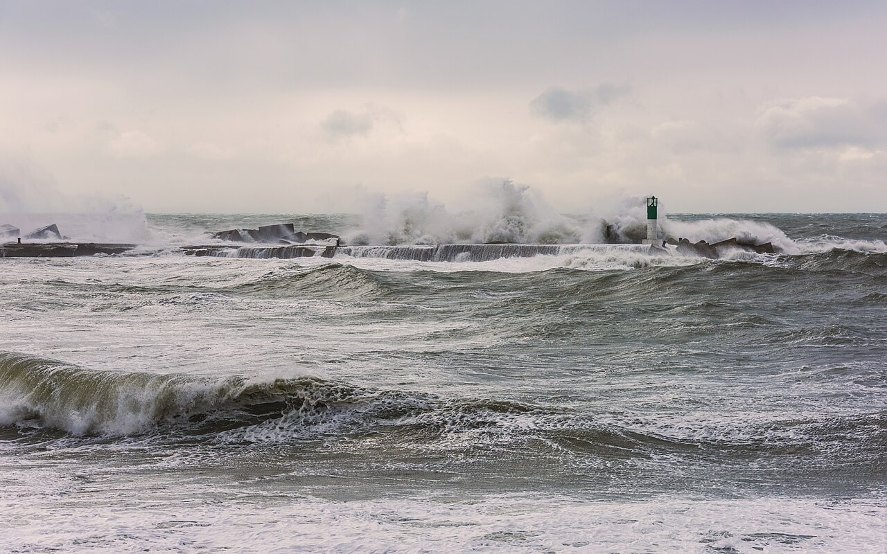
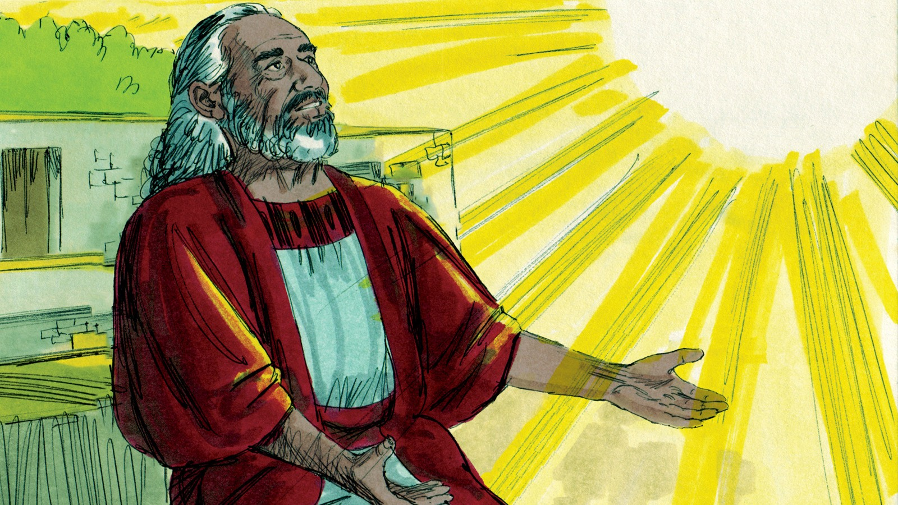
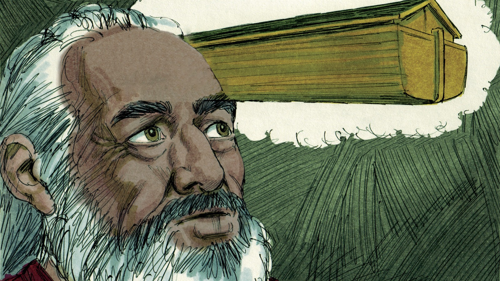
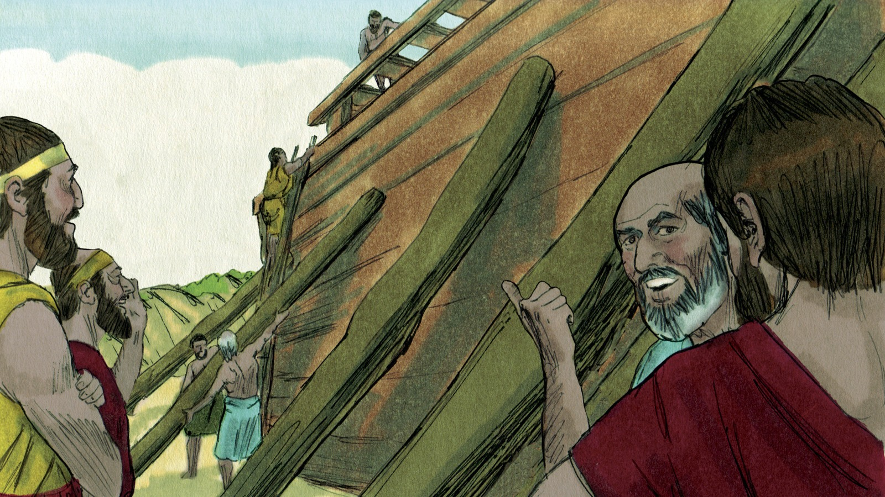
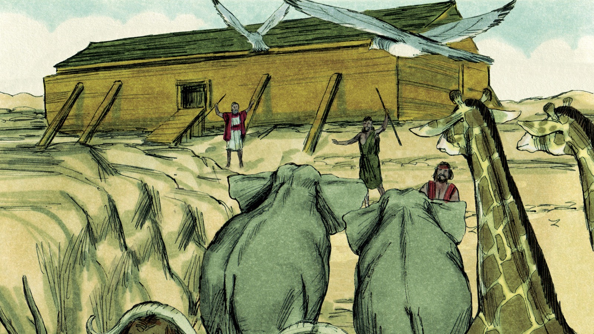
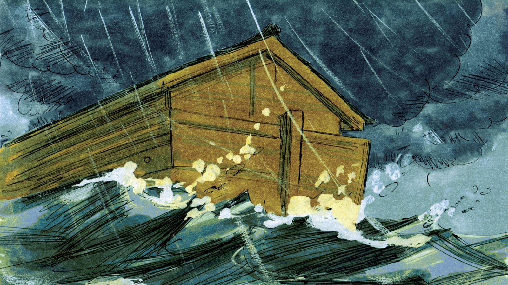

# Ковчег спасения

## Слайд 1. Мир наполнился злом

Люди забыли Бога и делали много зла. Бог справедливо судит грех, но милостиво готовит спасение.

- Почему людям нужен был спаситель?
- Видит ли Бог зло, которое происходит на земле?

## Слайд 2. Ной верил Божьему слову

> «Верою Ной… приготовил ковчег для спасения дома своего» (Евр. 11:7).

Ной доверился Божьему обещанию и сделал всё, что повелел Господь.

- За что Ной назван праведным?
- Что значит слушаться Бога верой?

## Слайд 3. Бог повелел построить ковчег

Бог дал Ною точные указания. Ковчег стал безопасным местом среди суда.

- Кто придумал план спасения — Ной или Бог?
- Почему важно доверять Божьему Слову?

## Слайд 4. Люди не поверили предупреждению

Новый Завет называет Ноя «проповедником правды» (2 Пет. 2:5). Иисус говорит, что люди жили обычными заботами и «не думали, пока не пришел потоп» (Мф. 24:39).

- Как Новый Завет называет Ноя?
- Как мы отвечаем, когда слышим Благую весть?

## Слайд 5. В ковчеге — жизнь

Ной, его семья и животные вошли в ковчег. Бог Сам закрыл дверь, и начался дождь.

- Кто вошёл в ковчег?
- Кто сохранил Ноя и его семью?

## Слайд 6. Вне ковчега — смерть

Вода покрыла землю. Суд Божий реален, но Бог заранее приготовил единственный путь спасения.

- Можно ли было спастись, оставаясь снаружи?
- Что это показывает о Божьей святости?

## Слайд 7. Ковчег указывает на Иисуса

> «Я есмь дверь: кто войдет Мною, тот спасется…» (Ин. 10:9).

Ковчег — образ Христа: во Христе есть жизнь и защита от суда. У ковчега была одна дверь; Иисус — единственная дверь спасения.

- На Кого указывает ковчег?
- Как войти в спасение через Иисуса?

## Слайд 8. Приглашение войти

Бог не хочет, чтобы люди погибли, но зовёт к покаянию (2 Пет. 3:9). Услышь приглашение Иисуса и доверься Ему.

**Главная истина:** как Ной спасся в ковчеге, так мы спасаемся от суда, доверившись Иисусу Христу.
