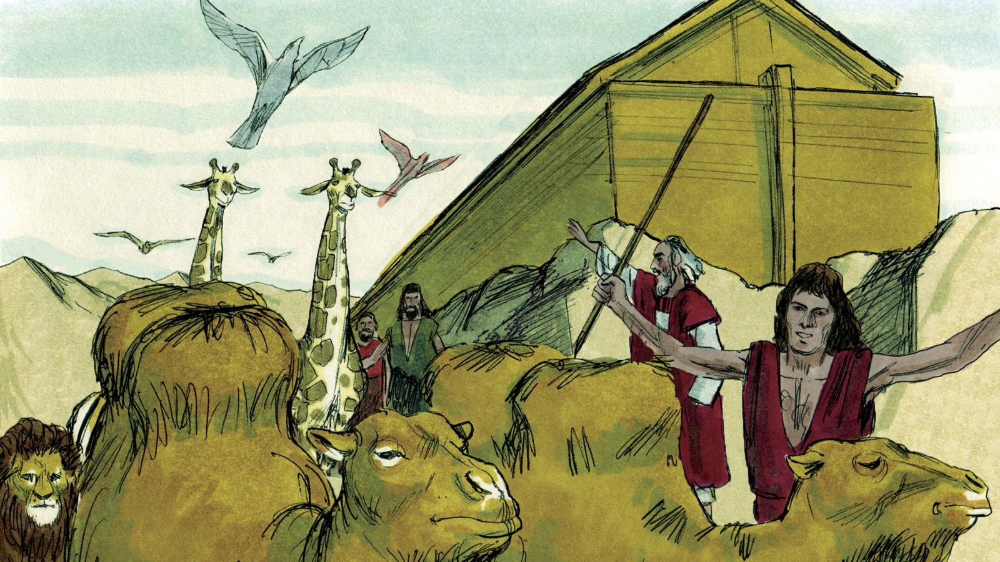
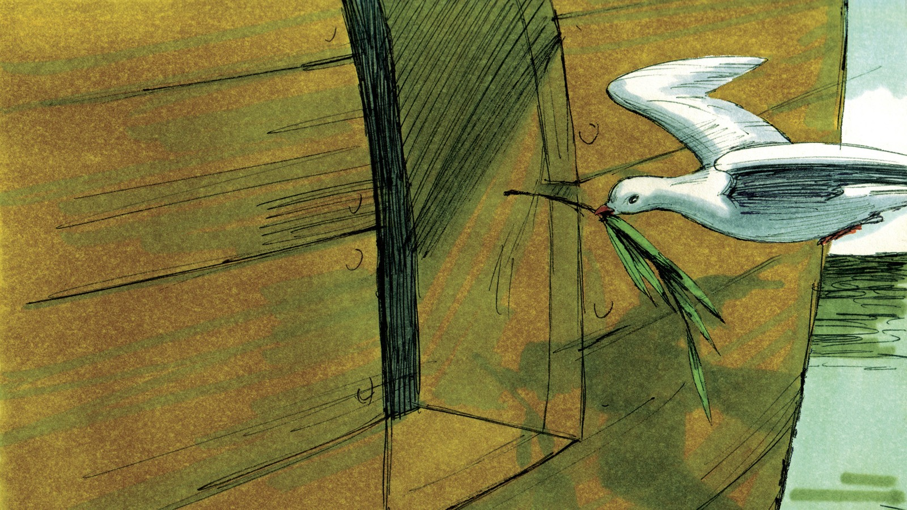
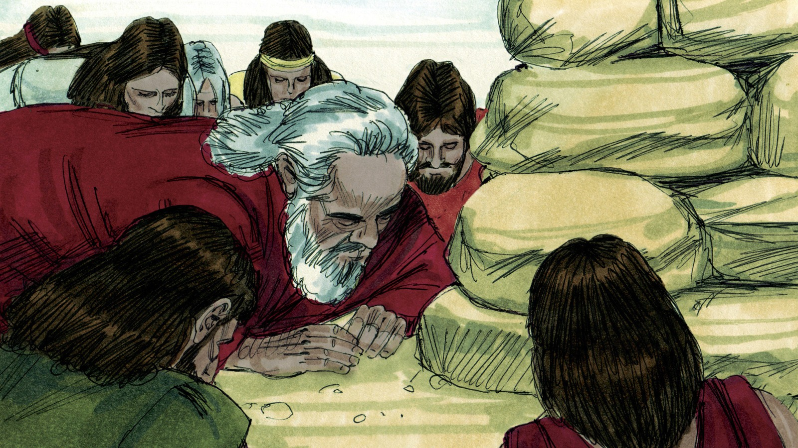
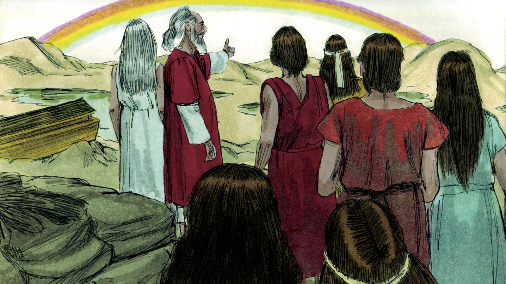
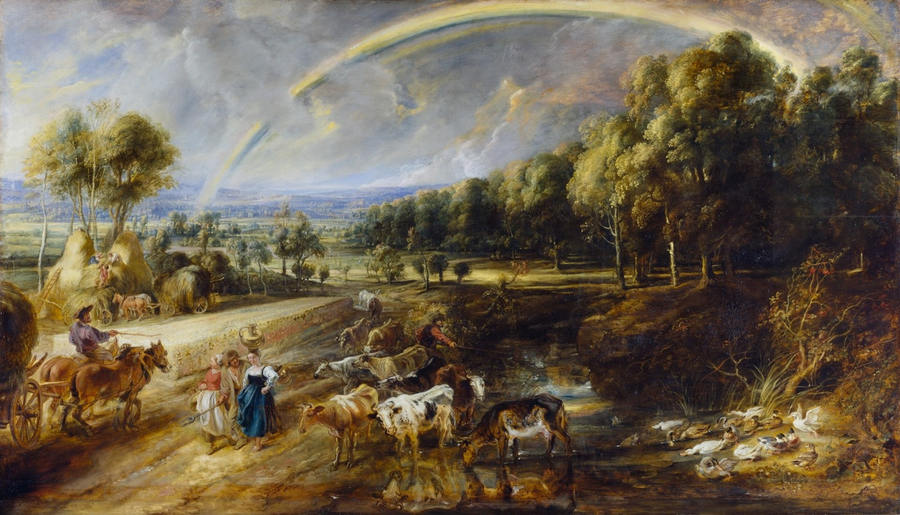
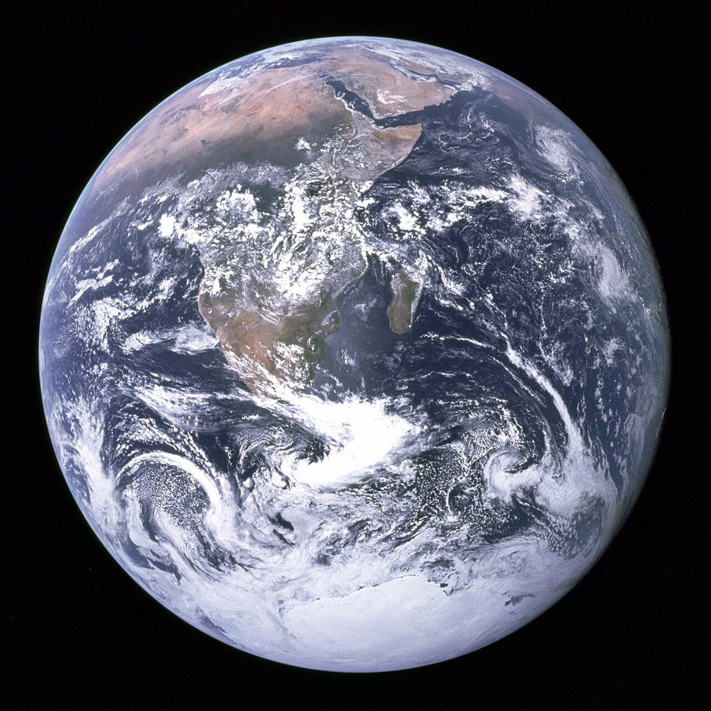
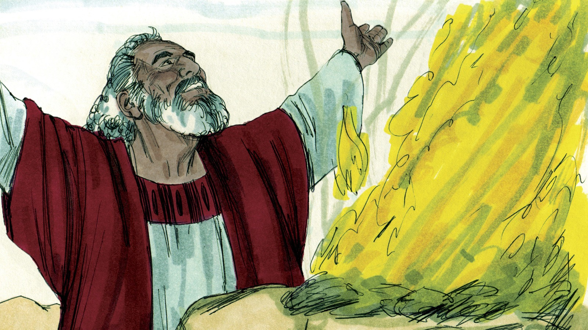

# Бог верен Своим обещаниям

## Слайд 1. Бог вывел Ноя из ковчега

После долгого ожидания Бог сказал Ною выйти из ковчега. Он сохранил Ноя, его семью и животных.

- Кто открыл Ною путь наружу?
- Что сделал Бог после суда?

## Слайд 2. Голубь принёс оливковый лист

Голубь с листом показал: вода убывает, жизнь возвращается. Бог исполняет Свой план шаг за шагом.

- Как Ной узнал, что земля высохла?
- Можно ли торопить Божье время?

## Слайд 3. Ной благодарит Бога

Выйдя из ковчега, Ной построил жертвенник и принёс благодарение. Жертва напоминала о Спасителе, Которого Бог обещал.

- Что Ной сделал первым?
- На Кого указывала жертва?

## Слайд 4. Бог заключает Завет

Завет — Божье обещание. Бог Сам заключил его с Ноем и всей землёй: всемирного потопа больше не будет.

- Кто был инициатором Завета?
- Можно ли положиться на Божье слово?

## Слайд 5. Радуга — знак Завета

> «Я полагаю радугу Мою в облаке, чтоб она была знамением завета…» (Быт. 9:13).

Радуга напоминает: Бог милостив и верен Своим обещаниям.

- О чём напоминает радуга?
- Какой Завет дал Бог после потопа?

## Слайд 6. Бог хранит землю

Бог благословил Ноя и поручил его семье наполнять землю и передавать детям Божье Слово.

- Что Ной должен был рассказать своим детям?
- Как мы можем говорить о Божьих обещаниях?

## Слайд 7. Завет напоминает об Иисусе

Люди не могут всегда исполнять обещания, но Иисус совершил спасение и заступается за Своих. Его жертва — основание Божьей милости.

- Почему нам нужен Спаситель?
- Как Иисус исполняет Божий план?

## Слайд 8. Радуга вокруг престола

В Откровении радуга окружает престол Божий. Она напоминает о славе, милости и верности Бога.

- Что радуга говорит о Боге?
- Какой Божий знак ты видел?

## Слайд 9. Помни Божье обещание

Увидев радугу, поблагодари Иисуса и вспомни: Бог рядом и не забывает Своих детей.

- Кому можно рассказать о Божьем Завете?
- Какое обещание Бога ты хочешь запомнить?

## Слайд 10. Бог верен

> «…Бог… верен» (1 Кор. 1:9).

**Главная истина:** Бог Сам заключает Завет и всегда исполняет Свои обещания. Радуга указывает на Его милость и напоминает о Спасителе Иисусе.
