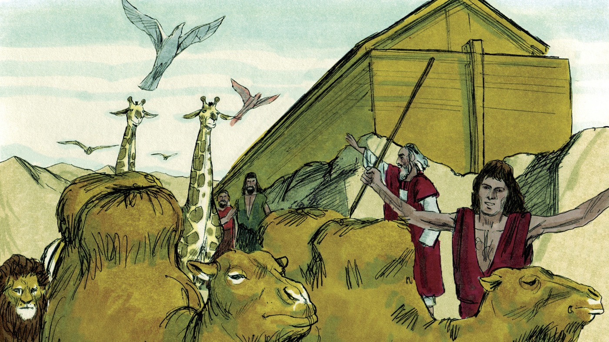
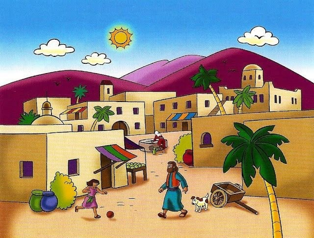
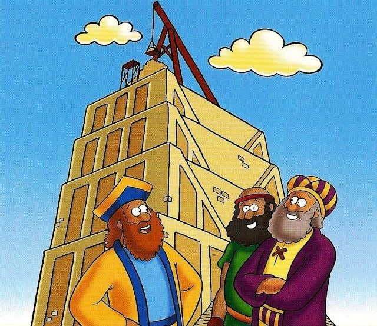
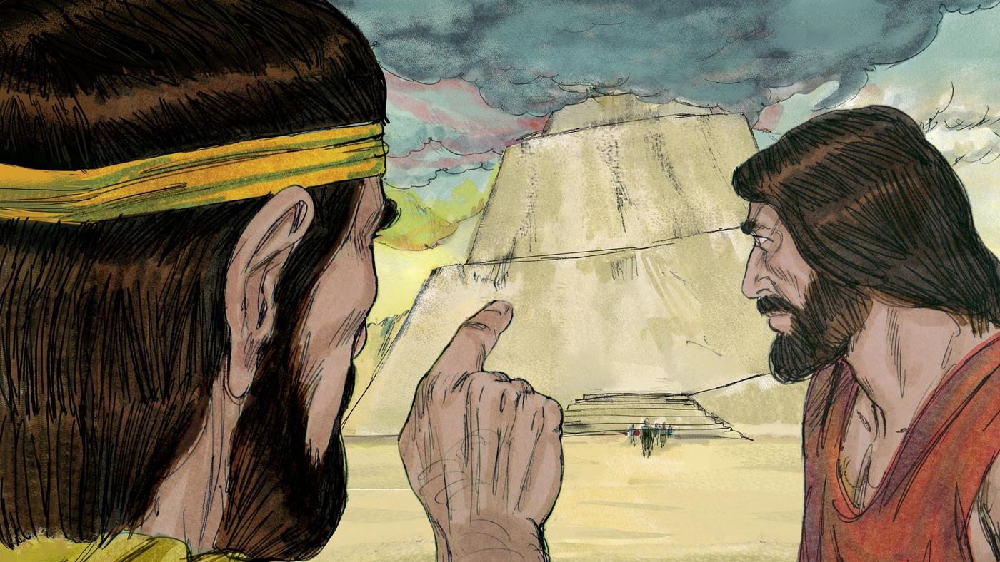
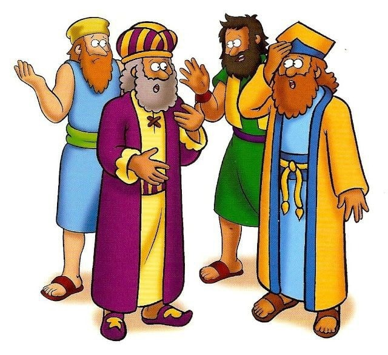
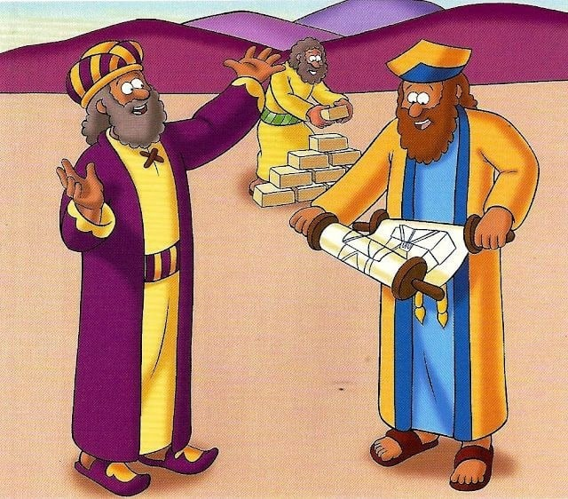

# Как попасть на небеса?

## Слайд 1. После потопа

> «Плодитесь и размножайтесь, и наполняйте землю» (Быт. 9:1).

Бог дал людям новую жизнь и поручил им расселиться по земле.

- Что Бог повелел людям?
- Кто дал им эту возможность?

## Слайд 2. Один язык — один народ

Люди говорили на одном языке и жили вместе. Они решили построить город и башню.

- Что помогало им понимать друг друга?
- Зачем они строили башню?

## Слайд 3. «Сделаем себе имя»

> «Построим себе город и башню, высотою до небес, и сделаем себе имя» (Быт. 11:4).

Люди захотели прославить себя и жить без доверия Богу.

- На кого они надеялись?
- Чем опасна гордость?

## Слайд 4. Бог видит сердца

Бог увидел город и башню. Он остановил общий план людей и смешал их язык.

- Могла ли башня достичь неба?
- Почему Бог остановил строительство?

## Слайд 5. Вавилон и рассеяние

Люди перестали понимать друг друга и разошлись по всей земле. Так город получил имя Вавилон.

Бог судит гордость, но не оставляет людей без надежды.

## Слайд 6. Наши «башни»

Добрые дела, знания и успехи не могут сами открыть дорогу к Богу.

- Можно ли заслужить спасение своими силами?
- На что мы должны надеяться?

## Слайд 7. Иисус — путь к Отцу

> «Я есмь путь и истина и жизнь; никто не приходит к Отцу, как только через Меня» (Ин. 14:6).

Иисус Сам пришёл с неба и открыл нам путь к Богу.

## Слайд 8. Главная истина

К Богу ведёт не башня и не наша заслуга, а Иисус Христос.

**Мы оставляем гордость, слушаем Божье Слово и доверяем Спасителю.**
