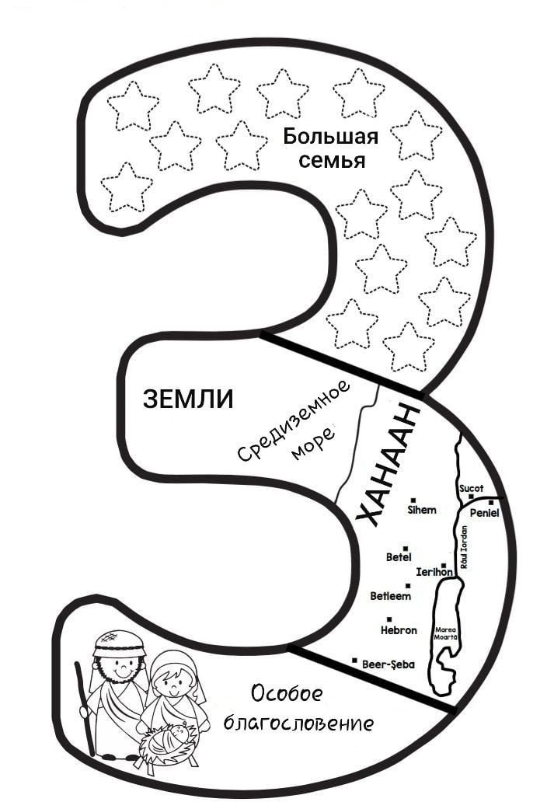
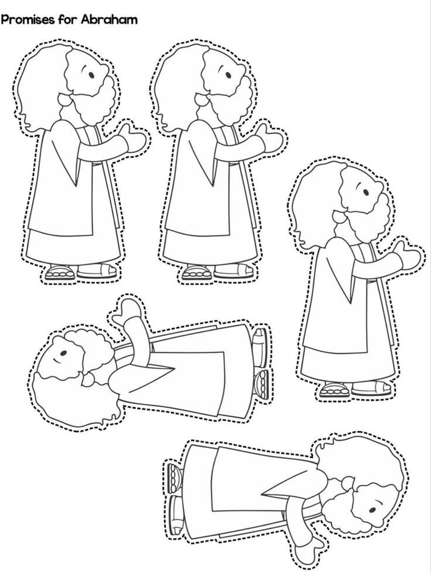
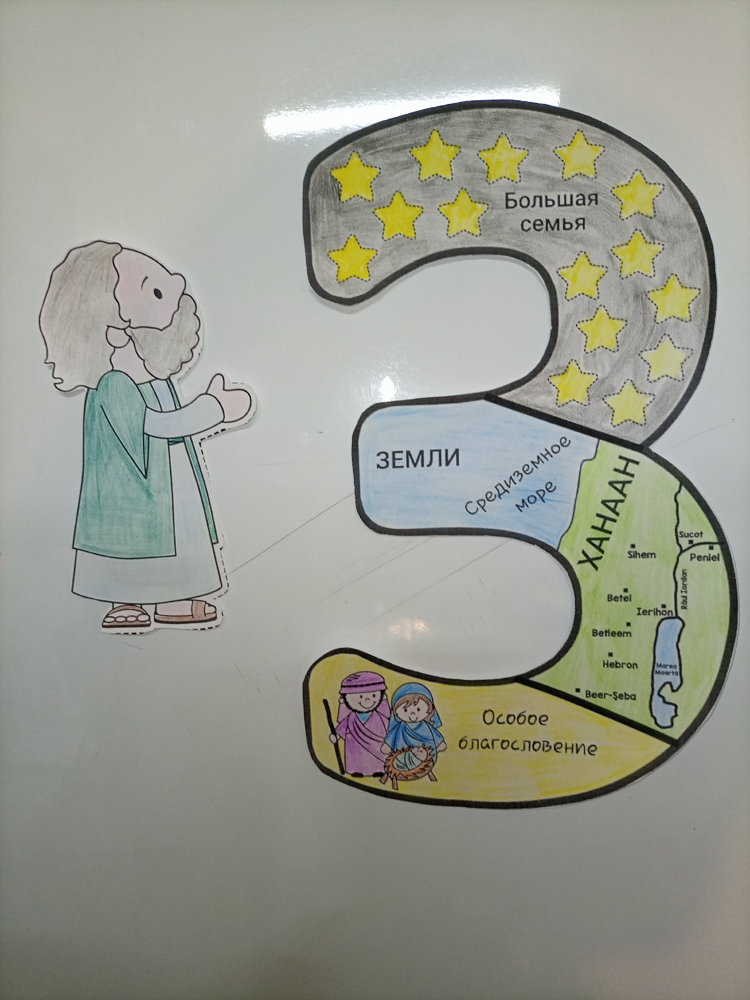
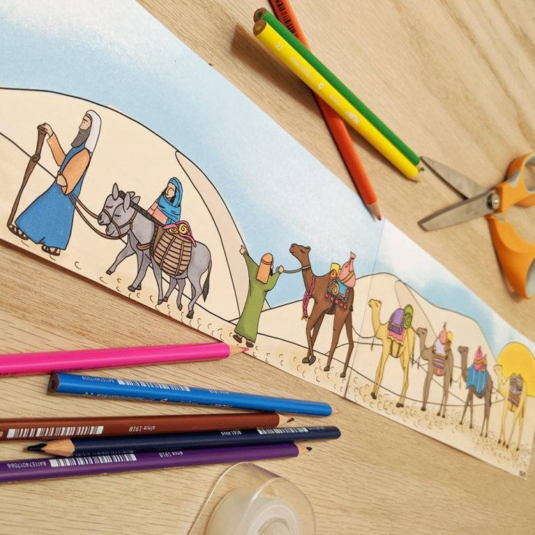

# Урок 9. Что такое вера

**Тема:** Что такое вера.  
**Истина:** Вера — это не слепое доверие, а принятие Слова Божьего: слушать, что говорит Бог, верить Ему и поступать по Его Слову.  
**Цель:** Объяснить детям, что такое вера. Показать, что Авраам поверил Божьему обещанию о Спасителе — Иисусе Христе, а все верующие во Христа — сыны Авраама и по обетованию наследники.  
**Библейская история:** Бытие 12:1-7; 13:14-17; 15  
**Золотой стих:** «Аврам поверил Господу, и Он вменил ему это в праведность.» Бытие 15:6  
**План урока:**

## 1. Молитва

## 2. Повторение

Отвечая на вопросы строим башню из стаканчиков.

1. За сколько дней Бог сотворил землю?
2. Сколько дней Бог отдыхал?
3. Почему Бог изгнал Адама и Еву из Эдемского сада?
4. Как звали сыновей Адама и Евы?
5. Почему Бог принял жертву Авеля, а жертву Каина нет?
6. Символом чего является жертвенное животное?
7. Почему Бог пожалел, что сотворил человека на земле?
8. Почему Бог спас Ноя?
9. Символом чего является ковчег в наше время?
10. О чем напоминает нам радуга в небе?
11. Что решили построить люди после потопа? И для чего?
12. Почему Богу не понравилось строительство башни?
13. Как Бог помешал людям продолжать строить?
14. Расскажи золотой стих прошлого урока. («Я есмь путь и истина и жизнь; никто не приходит к Отцу, как только через Меня». Иоанна 14:6)

Вывод: мы можем с вами построить самую высокую башню, но это не поможет нам попасть на небеса.

15. А как мы можем попасть на небеса?

## 3. Заинтересуй

Сегодня мы будем говорить о том, что такое вера. Возьмите в руки мячик или любой другой предмет. Скажите: «Дети, у меня в руке мячик. Скажите, вы видите, что у меня в руке мячик или верите? (Видят)  
А теперь спрячьте руку за спиной и скажите: «Дети, у меня за спиной в руке мячик. Вы видите или верите, что это так?» (Верят)  
Это и есть вера. Так и в нашей жизни: мы не видим Бога, но мы верим, что Он есть. Откуда приходит вера? Когда мы слышим Слово Божье — Библию — и принимаем его. Бог дал нам Библию не просто чтобы читать, а чтобы доверять Слову Божьему и исполнять его. И вот что важно: Бог называет праведными не тех, кто «очень старается быть хорошим», а тех, кто верит Его Слову.  
Кто был праведником из тех, о ком мы говорили на прошлых уроках? Авель и Ной.  
Сегодня мы узнаем еще об одном человеке, герое веры, которого Бог назвал праведным. Это Авраам.

## 4. Библейская история

(Показать Авраама)  
Авраам жил в городе Ур. Люди в этом городе не знали истинного Бога и поклонялись идолам (ложным богам) .  
Сам Бог избрал Авраама и призвал его. Однажды Бог сказал Аврааму: «Оставь твой дом и твою страну и иди в землю, которую Я укажу тебе. Я благословлю тебя и произведу от тебя великий народ.» Авраам понял, что его призывает Истинный Бог. Он взял свою жену Сарру, племянника Лота, всех своих слуг, свое имущество и скот и отправился в путь. Аврааму было 75 лет Путешествие было долгим и нелегким, но Бог всегда помогал Аврааму. Наконец, они пришли в землю Ханаанскую и поселились там. Именно эту землю Бог пообещал отдать потомкам Авраама.  
Кому из вас приходилось переезжать? Легко ли оставить свой дом, школу или детский сад, друзей и переехать в совсем новое и чужое для тебя место. Конечно, это не легко. И вам, приходиться довериться своим родителям, преодолеть свой страх и поверить, что все будет хорошо. Бог не оставит вас и благословит вас на новом месте.  
Авраам доверился Богу и сделал так, как Он сказал. Вот перед Авраамом прекрасная земля, на которой должны будут жить его дети и внуки и правнуки… Однажды Бог пообещал, что у Авраама будет столько потомков, сколько песка земного. (Покажите детям песок в баночке) Можно ли сосчитать песок на земле, если его невозможно сосчитать в маленькой баночке? Вот как Бог хотел благословить Авраама. А еще Бог обещал ОСОБОЕ благословение! Бог сказал, что благодаря вере Авраама, Бог благословит все племена земные. Как? Из потомков Авраама родится обещанный Спаситель — Иисус Христос! Авраам верил в Иисуса, Который должен был прийти, и радовался этому обещанию (Ин. 8:56).  
И все было бы замечательно, но есть одно Но! У Авраама не было детей. Авраам был стар, да и Сарра, его жена была уже не молода. Они были в том возрасте, когда уже родить было невозможно. Это их очень огорчало. Однажды Авраам обратился к Господу в молитве: «Господь, Ты не дал мне детей, и слуга моего дома станет моим наследником.»  
В ответ было ему слово от Господа:

- Он не станет твоим наследником. От семени твоего будет тебе наследник. Взгляни на небеса и сосчитай звезды, если сможешь их сосчитать. Таким будет твое потомство.

Авраам ПОВЕРИЛ Господу, и Он вменил ему это в праведность. Это значит: Бог назвал Авраама праведным не за добрые дела, а за веру в Его Слово. После этого Бог заключил с Авраамом Завет. Что такое Завет? Это особое обещание, договор, который Сам Бог заключает с человеком и Сам исполняет. Бог никогда не нарушает Свои обещания! А самое главное обещание этого Завета — приход Иисуса Христа, Спасителя всего мира. Впоследствии у Авраама и Сарры родился сын. Но мы поговорим об этом на следующих уроках.

## 5. Применение

Показать наглядное пособие «три обещания Бога Аврааму»  
А теперь давайте посмотрим, выполнил ли Бог Свои обещания Аврааму. Да! Потомки Авраама поселились в земле Ханаанской. Еврейский народ до сих пор живет на этой земле.  
Можно ли сосчитать потомков Авраама? Нет. А что же это за ОСОБОЕ благословение для всех народов и племен, которые не являются потомками Авраама. Не евреи по происхождению?  
Посмотрите, что нарисовано на картинке? Это рождество Иисуса Христа! Иисус был потомком Авраама. Верующие в Иисуса Христа стали детьми Божьими. Апостол Павел писал «Если же вы Христовы, то вы семя Авраамово и по обетованию наследники.» Гал.3:29  
Благословение Авраамово через Иисуса Христа распространилось на язычников, то есть на все народы, которые поверили, что Христос Сын Божий. «Верующие суть сыны Авраама» (Гал. 3:7).  
Как же нам верить, как верил Авраам?  
- Размышляй о Слове: перечитай дома с родителями историю об Аврааме и подумай, где в ней Иисус. Вера приходит, когда мы слышим Слово Божье (Рим. 10:17).  
- Поговори с Иисусом в молитве: Он рядом, Он Эммануил — это значит «Бог с нами». Скажи Ему вслух, кто ты: «Иисус — мой Спаситель, я — дитя Божье, мои грехи прощены». И расскажи кому-нибудь об Иисусе — так и ты продолжаешь дело Авраама!

## 6. Золотой стих

«Аврам поверил Господу, и Он вменил ему это в праведность.» Бытие 15:6  
Что значит «вменил в праведность»? Это значит: Бог посмотрел на веру Авраама и назвал его праведным. Не за дела, а за то, что Авраам принял Божье Слово — обещание о Спасителе.

## 7. Игра на применение.

КАК ОБЪЯСНИТЬ ДЕТЯМ, ЧТО ТАКОЕ ВЕРА.  
Найдите помощника и завяжите ему глаза. Скажите, что он должен довериться вам и точно исполнять то, что вы говорите. За это в конце пути он получит благословение.  
Вера не может видеть (как не может видеть ваш помощник). Вера — это слушать Бога и доверять Ему, что Он поможет тебе и поведет тебя туда, куда тебе следует идти.  
Покрутите помощника несколько раз, чтобы он теперь были дезориентирован и не знал, в какую сторону идти безопасно.  
Затем...  
Укажите ребенку с завязанными глазами, куда идти, пока он идет по комнате. Время от времени давайте ему инструкции, чтобы казалось, что он может наткнуться на что-нибудь.  
Цель здесь состоит в том, чтобы все наблюдатели немного беспокоились о том, сможет ли ваш помощник сделать это, не упав и не наткнувшись на что-нибудь.  
Когда ваш помощник приближается к другой стороне комнаты...  
скажите ему, что когда вы дадите команду, вы хотите, чтобы он сел. Ему не позволено чувствовать, есть ли на чем сесть, он просто должен поверить и сесть.  
Пока вы объясняете это, очень тихо принесите стул или табурет и поставьте его так, чтобы он мог сидеть на нем. Прикажите аудитории не шуметь. Помните, когда ваш помощник начинал, у него не было стула, чтобы сесть, он не знает, будет ли стул, когда он сядет.  
Наконец скажи своему помощнику сесть. Когда он благополучно сядет на стул, снимите повязку с глаз и попросите всех поддержать его.  
Дайте ребенку небольшой приз. Это благословение за то, что он доверился вам.  
Сделайте вывод, что так же, как ваш помощник должен был слушать инструкции, чтобы знать, что делать, так и мы слушаем Слово Божье — Библию.  
Самое главное, что говорит нам Слово Божье: Иисус Христос — Сын Божий, Он умер на кресте за наши грехи и воскрес. Верить Богу — значит принять это Слово и довериться Иисусу, как это сделал Авраам.  
А если ты уже дитя Божье, Слово Божье учит тебя, как жить: «Почитай отца твоего и мать», «любите врагов ваших». Мы поступаем так не для того, чтобы Бог нас полюбил — Он уже любит нас! — а потому что мы Его дети и верим, что Он знает, что для нас лучше. Даже когда мы не видим конечного результата, Бог с нами и не оставит нас.

## 8. Молитва

Поведите детей в молитве: поблагодарите Бога за то, что Он исполнил Свое обещание и послал Иисуса Христа, и попросите Его научить вас, как Авраама, слышать Его Слово и доверять Ему.

## 9. Поделка

  
  

### Наглядное пособие «Авраам отправляется в путешествие»

  
📎 [Abram_Follows_God.pdf](../vk_board/01_50314759_Бытие.%20Цикл%20уроков%20для%20детей%20Красная%20нить/docs/Abram_Follows_God.pdf)  
https://youtu.be/aNrNWjYhi5k?feature=shared  
📎 [OT07ru (1).pdf](../vk_board/01_50314759_Бытие.%20Цикл%20уроков%20для%20детей%20Красная%20нить/docs/OT07ru%20%281%29.pdf)  
🎬 [God calls Abraham - Easy Bible craft for kids. Paint (1 минуту)](https://vk.com/video169210391_456239955)

### Песня на закрепление

Первую строчку я пою по другому.  
"Было много сыновей и дочерей у Авраама." Так мне нравится больше😊  
https://youtube.com/watch?v=QpGZaTWWjqU&amp;feature=s..  
🎬 [Много сыновей у Авраама   Medium (2 минуты 20 секунд)](https://vk.com/video169210391_456239964)
