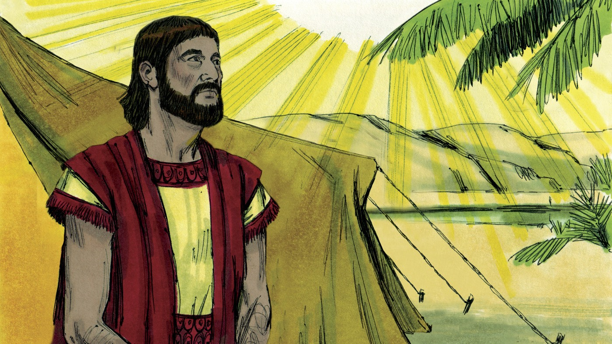
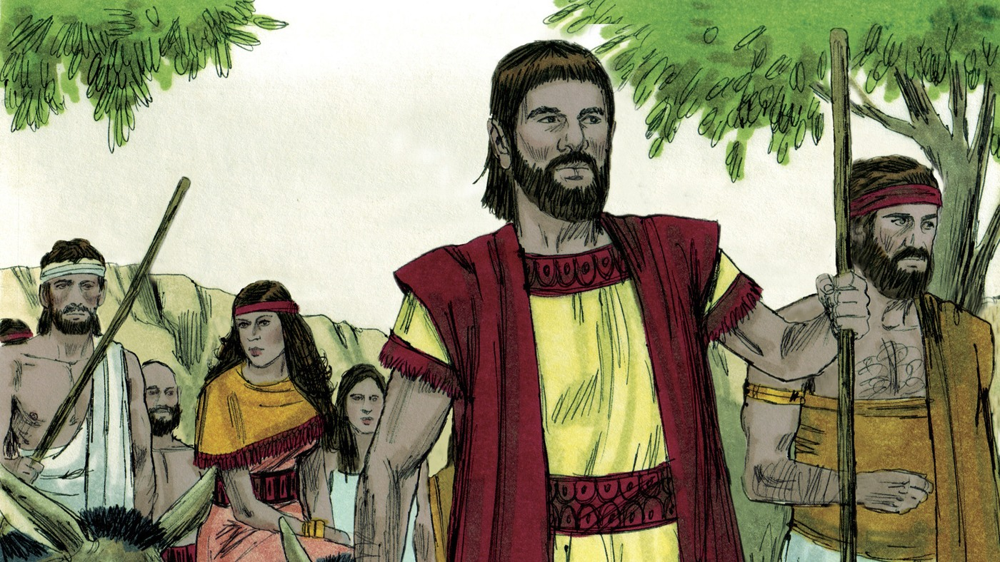
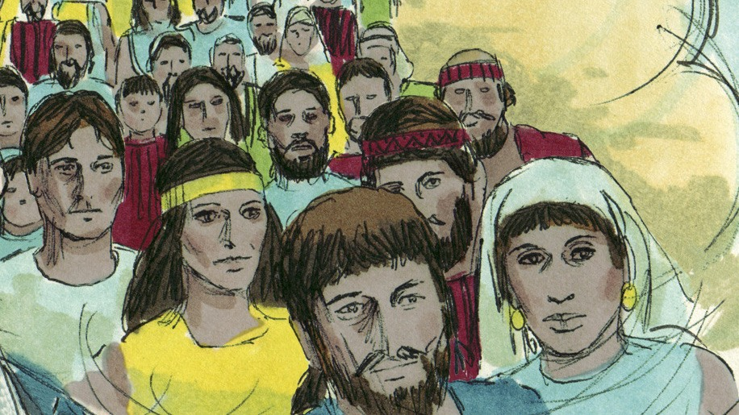
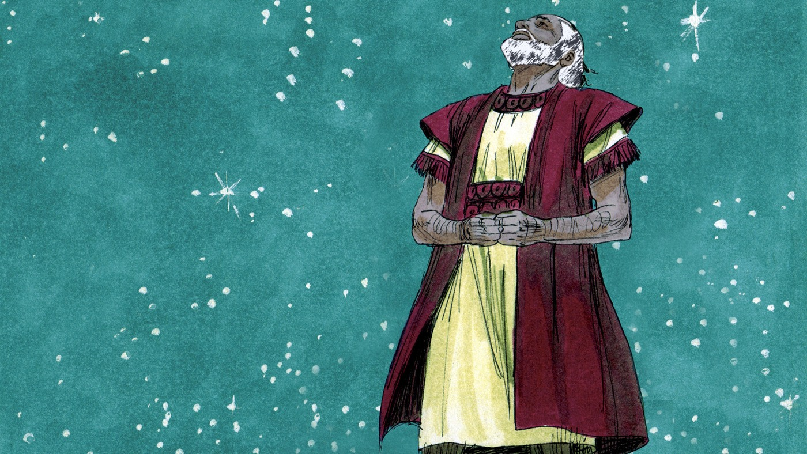
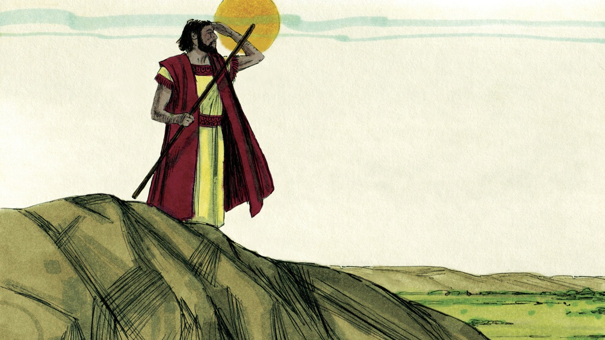

# Что такое вера?

## Слайд 1. Бог призывает Аврама

> «Пойди из земли твоей… в землю, которую Я укажу тебе» (Быт. 12:1).

Бог Сам позвал Аврама и обещал благословить его.

## Слайд 2. Аврам пошёл

Аврам оставил знакомый дом и отправился туда, куда велел Бог. Он доверился Божьему слову.

- Что было неизвестно Авраму?
- Кто знал путь?

## Слайд 3. Обещание потомков

> «Я произведу от тебя великий народ, и благословлю тебя» (Быт. 12:2).

Божий план включал множество потомков и благословение для всех народов.

## Слайд 4. Звёзды как обещание

> «Посмотри на небо и сосчитай звёзды… столько будет у тебя потомков» (Быт. 15:5).

Аврам ещё не видел исполнения, но слушал Бога.

## Слайд 5. Аврам поверил

> «Аврам поверил Господу, и Он вменил ему это в праведность» (Быт. 15:6).

Бог назвал Аврама праведным не за заслуги, а за веру в Его обещание.

## Слайд 6. Что такое вера?

Вера — это услышать Божье Слово, довериться Ему и поступить по Нему.

- Верим ли мы только тому, что видим?
- Как вера проявляется в поступках?

## Слайд 7. Обещанный Потомок

Бог обещал, что через потомка Авраама благословятся народы. Этот Потомок — Иисус Христос.

> «Если же вы Христовы, то вы семя Авраамово» (Гал. 3:29).

## Слайд 8. Главная истина

**Мы принимаем Божье обещание и доверяем Иисусу Христу.**
