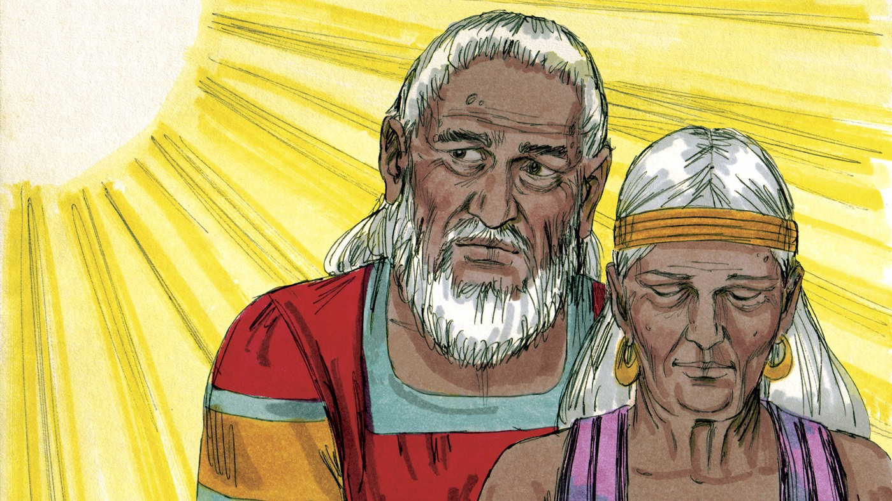
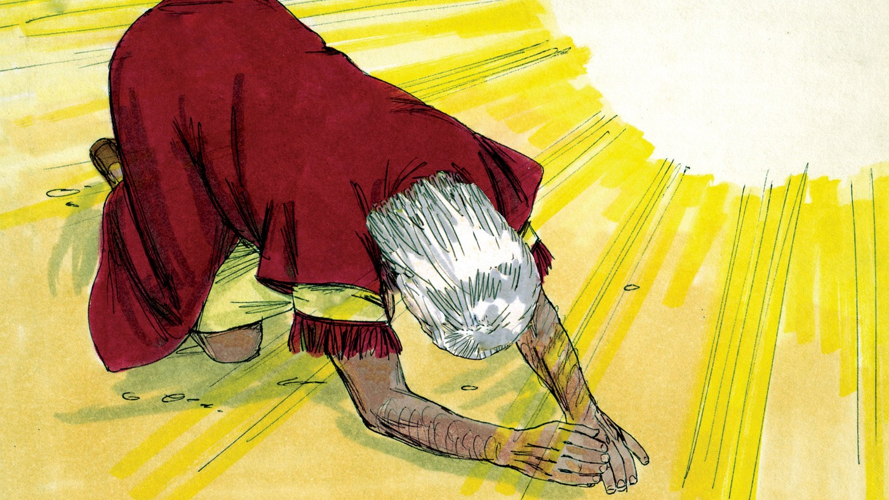
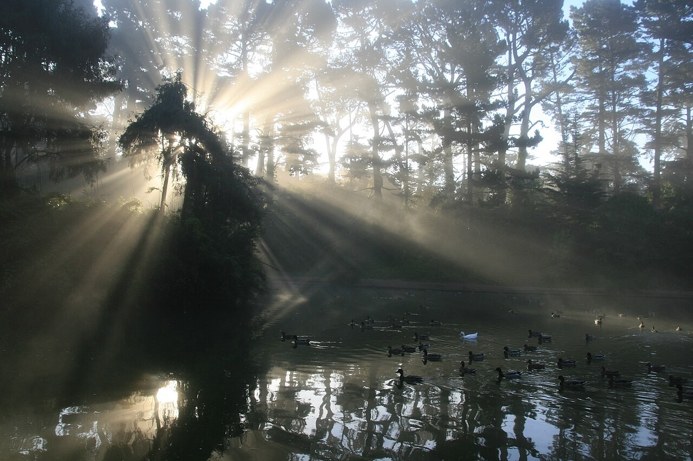
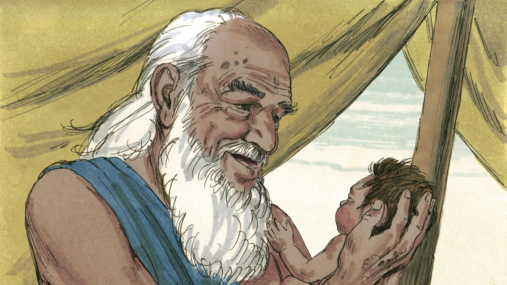
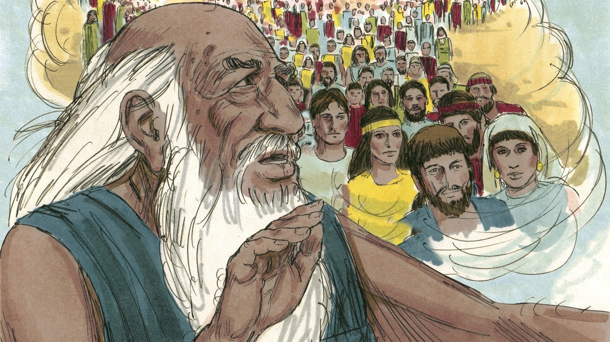

# Бог верен Своим обещаниям

## Слайд 1. Долгое ожидание

Бог обещал Аврааму и Сарре сына. Годы шли, а ребёнка не было.

- Забыл ли Бог Своё слово?

## Слайд 2. Бог приходит с обещанием

> «Я опять буду у тебя в это же время, и будет сын у Сарры» (Быт. 18:10).

Для людей это казалось невозможным, но Бог всемогущ.

## Слайд 3. «Есть ли что невозможное?»

Бог не ограничен возрастом, обстоятельствами или человеческими силами.

- Что невозможно человеку?
- Что может Бог?

## Слайд 4. Родился Исаак

> «И призрел Господь на Сарру, как сказал, и сделал Господь Сарре, как говорил» (Быт. 21:1).

Исаак родился точно в обещанное Богом время.

## Слайд 5. Радость Сарры

> «Смех сделал мне Бог» (Быт. 21:6).

Бог превратил долгую печаль в радость.

## Слайд 6. Сын обетования

Исаак родился не благодаря человеческой силе, а по Божьему обещанию и милости.

## Слайд 7. Большое обещание

Через семя Авраама Бог готовил приход Иисуса — обещанного Спасителя.

## Слайд 8. Главная истина

**Бог верен: Он исполняет Своё Слово и ведёт Свой народ к Христу.**
