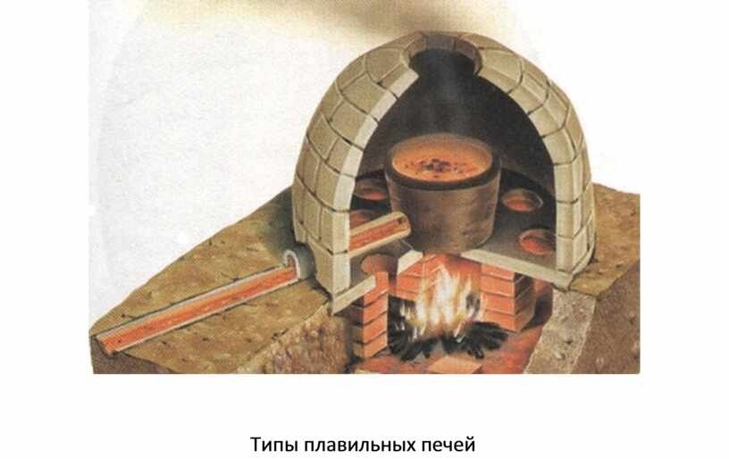
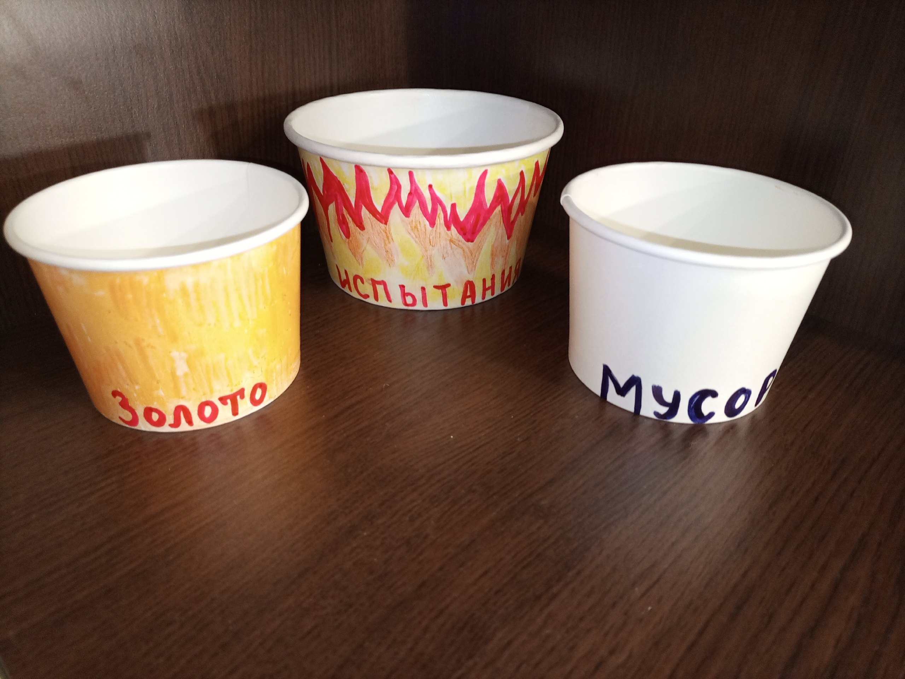
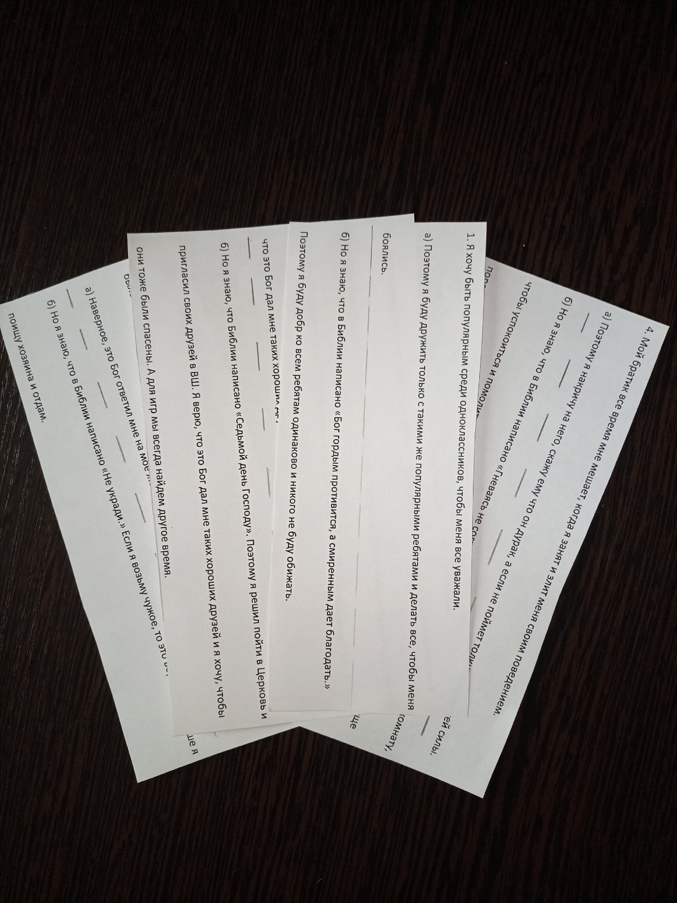
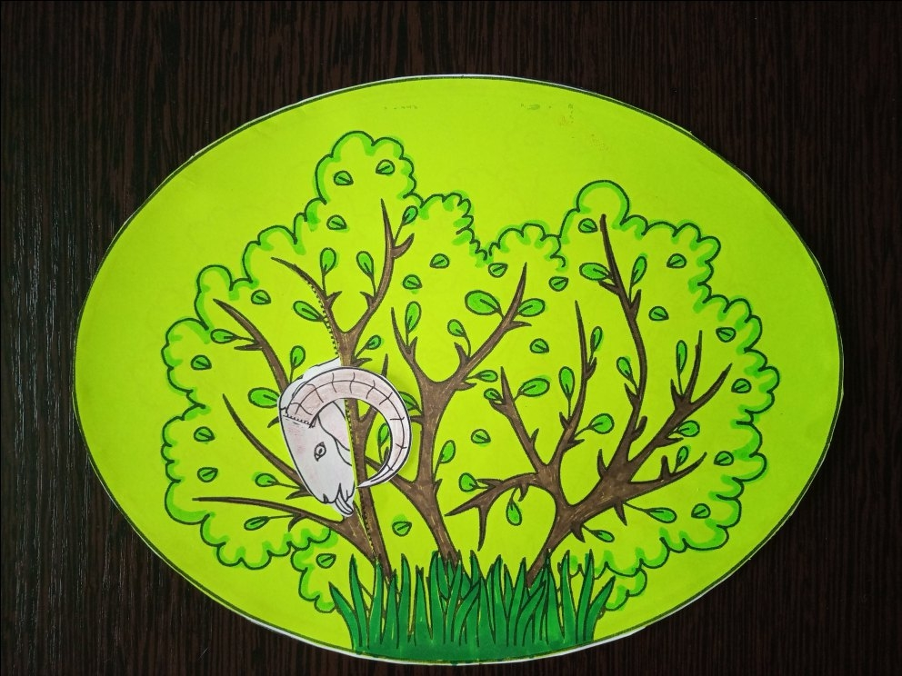
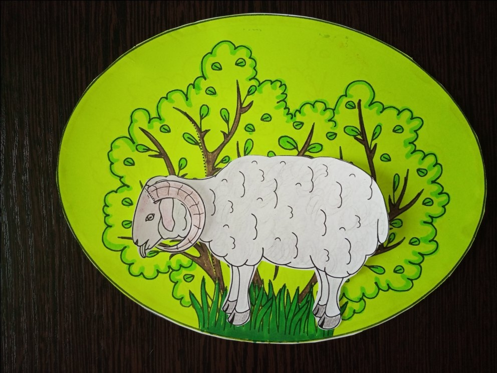
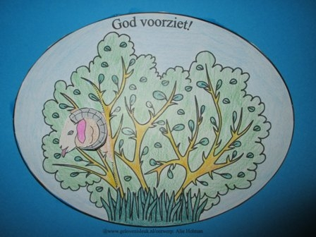

# Урок 11. Испытание веры

**Тема:** Испытание веры.  
**Истина:** Бог Сам усмотрел Агнца: Иисус умер вместо нас. Испытанная вера — это вера, которая доверяет Слову Божьему.  
**Цель:** Показать детям, что история Авраама и Исаака — это картинка об Иисусе: Бог Отец не пожалел Своего единственного Сына, а овен умер вместо Исаака, как Иисус — вместо нас. Испытание веры — это проверка того, доверяем ли мы Слову Божьему.  
**Библейская история:** Бытие 22:1-18  
**Золотой стих:** «Бог усмотрит Себе агнца для всесожжения, сын мой.» Бытие 22:8  
**План урока:**

## 1. Молитва

## 2. Повторение

Вопросы для повторения.  
Для повторения нужно подготовить вырезанные из цветного картона звезды, а так же любые конфетки равные количеству звезд. И звезды, и конфетки подвесить за нитку к любому подходящему предмету. Можно использовать палку, ветку, плечики для одежды или просто натянуть веревку между спинками стульев. На звездах написать номер вопроса. Объяснить детям, что для того, чтобы получит конфетку им нужно терпение. Сначала они должны ответить на вопросы. По очереди дети отрезают звезды и отвечают на тот вопрос, который им попался. После того, как они ответят на все вопросы и повторят библейский стих, можно будет и получить обещанные конфетки.

1. Что Бог обещал Аврааму? (Земли, многочисленное потомство, особое благословение)
2. Кого однажды увидел Авраам в жаркий день? (Трех путников. Это были ангелы и Господь)
3. Что Авраам предложил гостям? (Отдых, еду)
4. Что сказал Господь Аврааму? (Через год у них будет сын)
5. Как отреагировала Сарра, когда это услышала? (Рассмеялась внутри себя и подумала, что это невозможно)
6. Почему Сарра испугалась, что рассмеялась? (Она поняла, что среди гостей был Господь. Так как Он услышал ее мысли и сказал об этом. )
7. Исполнил ли Бог свое обещание, данное Аврааму и когда? (Через год родился сын, но ожидали они обещанного почти 20 лет)
8. Всегда ли Бог сразу отвечает на наши молитвы и почему? (Не всегда. Иногда Бог говорит «нет», а иногда нужно время)
9. Какое качество нашего характера вырабатывается, когда мы с верою ожидаем ответа на молитву, как ожидал Авраам? (Терпение)
10. Давайте повторим золотой стих прошлого урока.

«И призрел Господь на Сарру, как сказал; и сделал Господь Сарре, как говорил.» Быт. 21:1

## 3. Заинтересуй

Ребята, на последних уроках мы с вами много говорим о ВЕРЕ. Почему? Помните мы учили с вами  
библейский стих «А без веры угодить Богу невозможно» Евр.11:6 Оказывается, для Бога очень важна наша ВЕРА! Для Бога наша Вера, это драгоценность!  
Давайте подумаем о том, что является драгоценностью для людей на земле? Выслушать ответы детей. Самое популярное это золото. Почему же люди так ценят золото? Показать детям любое золотое изделие. Рассказать о свойстве золота. Золото, в отличии от других металлов, не ржавеет, не окисляется, не темнеет. Поэтому во все временя люди ценили золото. Из него в основном изготавливали монеты и украшения. До сих пор в каждой стране есть золотой фонд, который хранится в центральном банке. И от этого фонда зависит сколько страна может напечатать денег.  
В Библии написано, что для Бога: «испытанная вера ваша оказалась драгоценнее гибнущего, хотя и огнем испытываемого золота.» 1.Петра 1:7 Оказывается, что золото обретает свою ценность, когда его испытывают огнем. Как это происходит? Показать детям фото древней плавильни. Объяснить детям процесс очистки золота от примесей. Сначала золото находят в земле в виде небольших самородков, похожих на маленькие камни. Эти самородки бывают разных размеров. Их собирают и отправляют в плавильню или горнило. Это такая печь, которая нагревается до очень больших температур и там можно плавить различный металл, так, что он из твердого состояния становится жидким. Так вот, чтобы очистить золото от различных примесей, его плавят в такой печи до жидкого состояния, а все примеси оседают. Таким образом очищают все драгоценные металлы и серебро и золото.  
А сегодня мы с вами поговорим, что значит ИСПЫТАННАЯ ВЕРА. Давайте вернемся к Аврааму. Авраам назван героем веры. А значит его вера была испытана много раз. Сегодня я расскажу вам о самом трудном испытании, через которое прошел Авраам.  
(Продолжение ниже)  

## 4. Библейская история

Презентация прикреплена к уроку.

1. У Авраама и Сарры родился их долгожданный сын Исаак. Родители очень его любили и заботились о нем.
2. Однажды Бог решил проверить, насколько Авраам доверяет Его Слову, и сказал: «Возьми своего единственного сына, которого любишь ты, и принеси его в жертву в земле Мориа на одной из гор.» Догадывался ли Авраам, что это было испытание? Наверное нет. Но Авраам знал, что Бог верен Своему Слову. А Бог обещал, что у Авраама будет много потомков и что именно из рода Исаака придет обещанный Спаситель. Значит, Слово Божье должно исполниться, и Исаак должен жить. Авраам верил, что Бог может даже воскресить его из мертвых (Евр. 11:17-19).
3. Авраам не стал спорить с Богом. Он просто повиновался. Бог знал, что происходит в сердце Авраама и как это тяжело и больно. Ведь однажды Бог Отец сделает то же самое для всех нас. Он отдаст Своего любимого и единственного Сына Иисуса в жертву за грехи всех людей.
4. Рано утром Авраам разбудил Исаака.
5. Они взяли дрова и еду, и погрузив все это на осла отправились в землю Мориа вместе с двумя слугами.
6. Это был долгий путь, и им потребовалось три дня, чтобы добраться туда.
7. Когда они приблизились к горе, которую избрал Бог, Авраам сказал своим слугам: «Подождите здесь и посмотрите за ослом. Мы с Исааком пойдем на гору и там поклонимся Господу. А затем вернемся к вам.»
8. Авраам положил дрова на спину Исаака, чтобы тот нес их. (Однажды единственный и любимый Сын Божий возьмёт Свой крест и будет так же подниматься на гору под названием Голгофа.)
9. Авраам взял с собой огонь в горшке и нож, прежде чем подняться в гору, чтобы построить жертвенник.
10. Исаак был озадачен. «Отец?»-спросил он.

- Да, Исаак? -ответил Авраам.
- У нас есть огонь и дрова, а где же ягненок для жертвоприношения? – спросил Исаак.

11. Авраам ответил: «Бог усмотрит Себе агнца для всесожжения, сын мой.» И они пошли дальше.
12. Когда они достигли вершины горы, избранной Богом, Авраам построил там жертвенник.
13. Затем Авраам положил дрова на жертвенник, связал своего сына и положил его на жертвенник поверх дров. Понимал ли Исаак, что собирается сделать с ним отец? Конечно.

Кричал ли он? Сопротивлялся? Умолял отца отпустить его? В Библии ничего об этом не написано. Возможно, Исаак, как и его отец, доверял Божьему Слову: он знал обещание Бога и понимал, что без пролития крови жертвы не бывает прощения грехов. Исаак не сделал ничего дурного, чтобы с ним так поступили. Это и для него было испытанием, которое он должен пройти. Однажды Сын Божий Иисус добровольно принесет Себя в жертву. Иисус также не сделал ничего дурного в Своей жизни, но Он решил быть до конца послушным воле Своего Небесного Отца.

14. Авраам продолжал доверять Богу. Он протянул руку, чтобы взять нож. Неужели Бог позволит ему принести Исаака в жертву? В конце концов, разве Бог не обещал ему сына, чтобы он стал отцом великого народа?
15. Он поднял нож и уже собирался пустить его в ход, как вдруг Ангел Господень воззвал: «Авраам! Авраам!»
16. «Не поднимай руки твоей на отрока и не делай над ним ничего, ибо теперь Я знаю, что боишься ты Бога и не пожалел сына твоего, единственного твоего, для Меня.» Однажды Бог также, как и Авраам, не пожалеет отдать Своего Единственного Сына, ради нас.
17. В этот момент Авраам услышал шум в кустах. Оглядевшись он увидел барана, запутавшегося своими рогами в ветках куста.
18. Авраам поймал этого барана и принес его в жертву вместо Исаака. Заметьте: жертву приготовил Сам Бог, Авраам ее не искал и не покупал. В Библии написано: «без пролития крови не бывает прощения» (Евр. 9:22). Однажды Сын Божий Иисус Христос станет такой жертвой вместо нас. Он поменяется с нами местами. И Сам заплатит за наши грехи.
19. Поскольку Авраам доверял Богу до последней минуты, Бог обещал дать ему столько потомков, сколько звезд на небе или песка земного. Вера Авраама была испытана и стала очень драгоценной для Бога.
20. По верному обещанию Бога, спустя примерно 2000 лет среди потомков Авраама родился наш Спаситель Иисус Христос.
21. Иисуса, Сына Божьего, не пощадили и невиновного осудили на смерть. Иисус смирился и добровольно пошел умирать.

(Продолжение ниже)  
📎 [Авраам и Исаак.pdf](../vk_board/01_50314759_Бытие.%20Цикл%20уроков%20для%20детей%20Красная%20нить/docs/Авраам%20и%20Исаак.pdf)

22. Так бывает и в нашей жизни. Каждый встречается с трудностями, благодаря которым наша вера проходит испытания. У каждого эти трудности разные. Бог никогда не требовал и не требует от людей жертвовать своими близкими — наоборот, Он Сам отдал Своего единственного Сына Иисуса вместо нас! Такое испытание было только для Авраама, чтобы показать нам картинку о Христе. Но Господь всё же будет испытывать наши сердца: доверяем ли мы Его Слову, как Авраам? Тогда наша вера станет крепкой и драгоценной для Господа!

## 5. Золотой стих

Найти в Библии и прочитать.  
«Бог усмотрит Себе агнца для всесожжения, сын мой.» Бытие 22:8  
Объяснить непонятные слова. Агнец — это ягненок, всесожжение — жертва Богу. Слова Авраама сбылись: Бог Сам приготовил жертву. Так и для нас Бог приготовил Агнца — Своего Сына Иисуса, Который умер вместо нас.

## 6. Применение

Сначала коротко поговорите с детьми о главном:  
1. **Размышлять о Слове.** Дома перечитайте эту историю с родителями (Бытие 22) и найдите в ней Иисуса: где в этой истории Отец, где Сын, где жертва вместо нас? Вера приходит, когда мы слушаем и думаем о Слове Божьем.  
2. **Говорить с Иисусом.** Иисус — Эммануил, это значит «Бог с нами». Он рядом, и Ему можно рассказать всё: и радость, и страх, и трудности. Можно сказать Ему вслух: «Иисус, Ты мой Спаситель, Ты умер вместо меня, мои грехи прощены!»

А теперь игра. Сделать макет печи. На бумажном стакане нарисовать огонь и написать «испытания» или «трудности». Внутрь положить ситуационные вопросы с двумя вариантами ответов. Так же понадобятся еще два стакана. Один стакан обклеить золотой бумагой и написать «золото» или «испытанная вера». На втором написать «мусор» или «примеси». С помощью этой игры дети должны понять, как наша вера становится драгоценной. В «печь» нужно положить карточки с примерами из жизни. Задача детей отделить «мусор» от «золота».  
Вот несколько примеров ситуаций.

1. Я хочу быть популярным среди одноклассников, чтобы меня все уважали.

а) Поэтому я буду дружить только с такими же популярными ребятами и делать все, чтобы меня боялись.  
б) Но я знаю, что в Библии написано «Бог гордым противится, а смиренным дает благодать.» Поэтому я буду добр ко всем ребятам одинаково и никого не буду обижать.

2. У меня появились друзья среди одноклассников. Они очень хорошие и мне с ними весело. В воскресенье они приглашают меня гулять и в гости, чтобы поиграть в компьютерные игры вместе.

а) Поэтому я с радостью иду в воскресенье в гости, а в Церковь я пойду в следующий раз. Я верю, что это Бог дал мне таких хороших друзей.  
б) Но я знаю, что Библии написано «Седьмой день Господу». Поэтому я решил пойти в Церковь и пригласил своих друзей в ВШ. Я верю, что это Бог дал мне таких хороших друзей и я хочу, чтобы они тоже были спасены. А для игр мы всегда найдем другое время.

3. Однажды в Церкви я нашел на лавочке игрушку, о которой я давно мечтал и никого рядом не было.

а) Наверное, это Бог ответил мне на мое желание, поэтому я заберу ее себе.  
б) Но я знаю, что в Библии написано «Не укради.» Если я возьму чужое, то это воровство. Лучше я поищу хозяина и отдам.

4. Мой братик все время мне мешает, когда я занят и злит меня своим поведением.

а) Поэтому я накричу на него, скажу ему что он дурак, а если не поймет толкну его со всей силы.  
б) Но я знаю, что в Библии написано «Гневаясь не согрешайте» Поэтому я выйду в другую комнату, чтобы успокоиться и помолиться. А потом спокойно попрошу брата мне сейчас не мешать. И еще порошу так со мной не поступать, потому что мне это не приятно.  
(Остальные ситуации напишите сами, ориентируясь на свою группу детей)  
ВЫВОД: Показать золотой стаканчик и сказать, что в жизни каждого из нас бывают трудные ситуации, когда нам нужно сделать сложный выбор. Поступить, как нам хочется или как говорит Слово Божье. Когда мы, как Авраам, доверяем Слову Божьему и поступаем по нему, наша вера укрепляется и становится драгоценной для Господа.

## 7. Молитва

Сначала поблагодарите Иисуса за то, что Он Сам стал Жертвой вместо нас. Затем помолитесь с детьми о том, чтобы Дух Святой помогал вам в трудных ситуациях доверять Слову Божьему и делать правильный выбор. Пусть дети поделятся своими трудностями в правильном выборе и помолитесь индивидуально.

## 8. Поделка

  
  
  
  
  
📎 [Овен в кустах.pdf](../vk_board/01_50314759_Бытие.%20Цикл%20уроков%20для%20детей%20Красная%20нить/docs/Овен%20в%20кустах.pdf)
