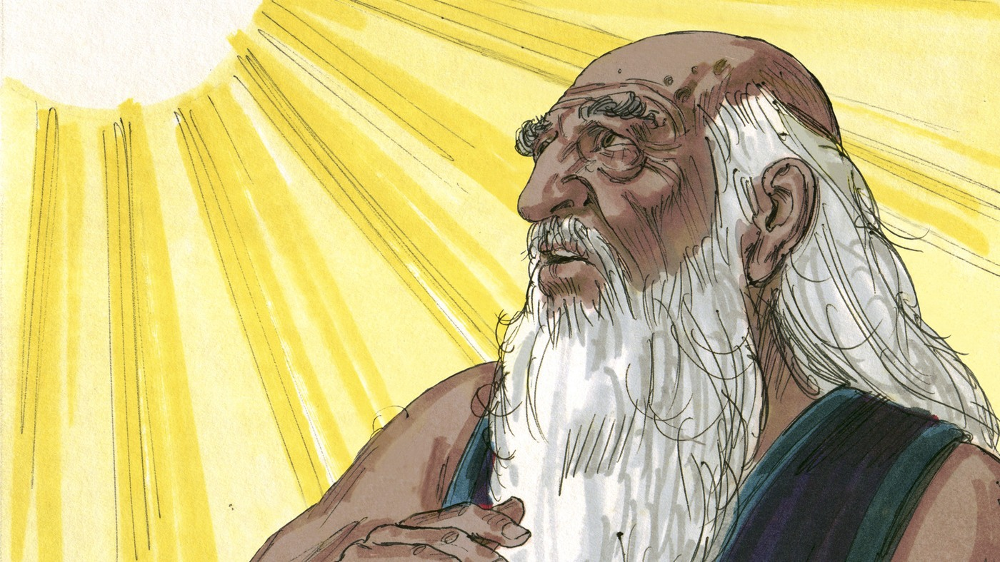
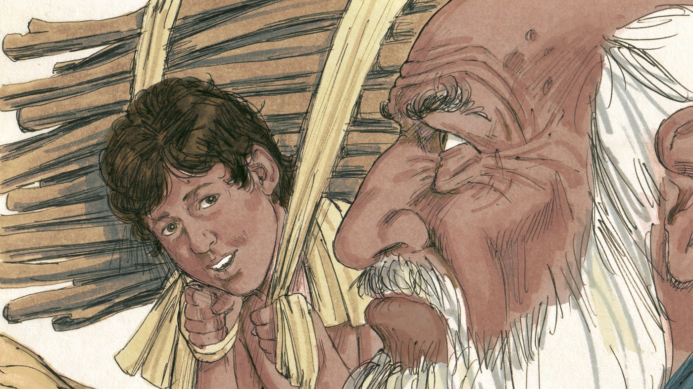
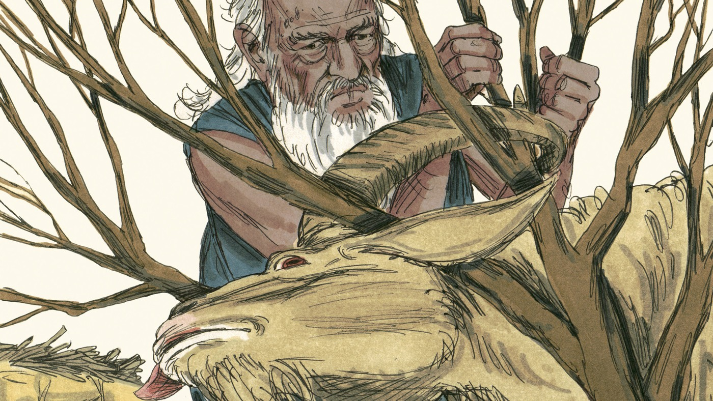

# Испытание веры

## Слайд 1. Бог испытывает Авраама

> «Бог сказал: возьми сына твоего… Исаака… и принеси его во всесожжение» (Быт. 22:2).

Это было тяжёлое испытание доверия Божьему слову.

## Слайд 2. Авраам идёт

Авраам встал рано и пошёл с Исааком на гору. Он не перестал доверять Богу.

## Слайд 3. Вопрос Исаака

> «Где же агнец для всесожжения?» (Быт. 22:7).

## Слайд 4. Бог усмотрит агнца

> «Бог усмотрит Себе агнца для всесожжения, сын мой» (Быт. 22:8).

Авраам верил: Бог исполнит Своё обещание.

## Слайд 5. Овен вместо Исаака

Бог остановил Авраама и дал овна, запутавшегося в кустах. Овен умер вместо Исаака.

## Слайд 6. Картина Евангелия

Как овен умер вместо Исаака, так Иисус Христос умер вместо грешников.

Бог Отец не пожалел Своего Сына и дал Его для нашего спасения.

## Слайд 7. Испытанная вера

Вера держится за Божье слово даже тогда, когда обстоятельства страшны и непонятны.

## Слайд 8. Главная истина

**Бог Сам усмотрел Агнца: Иисус умер вместо нас.**
