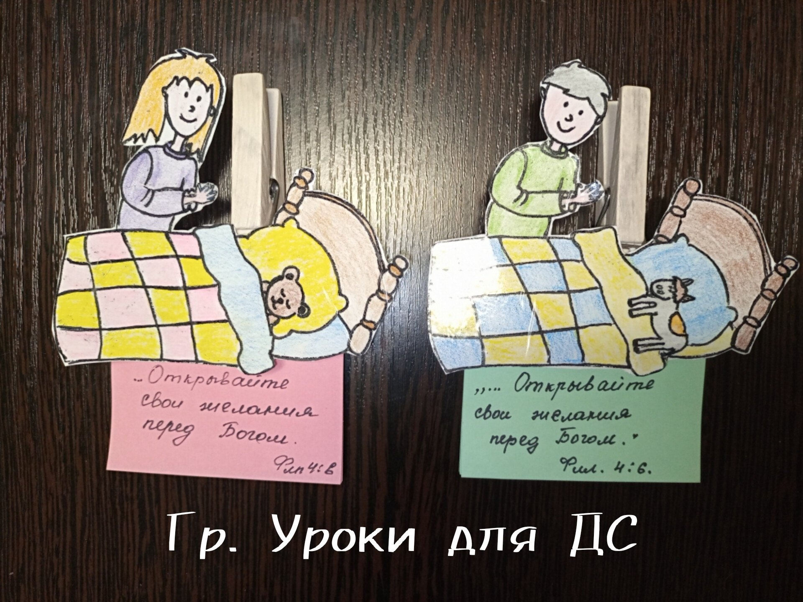
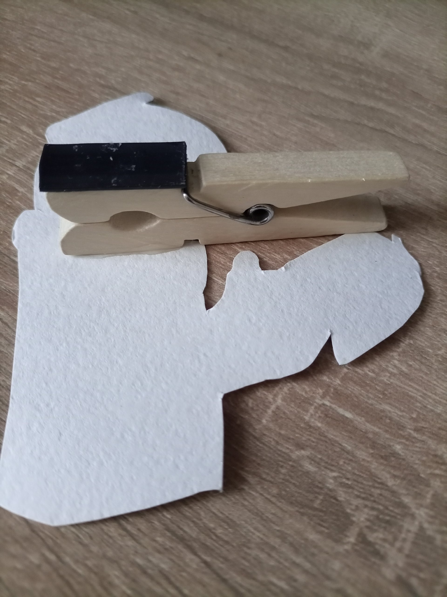
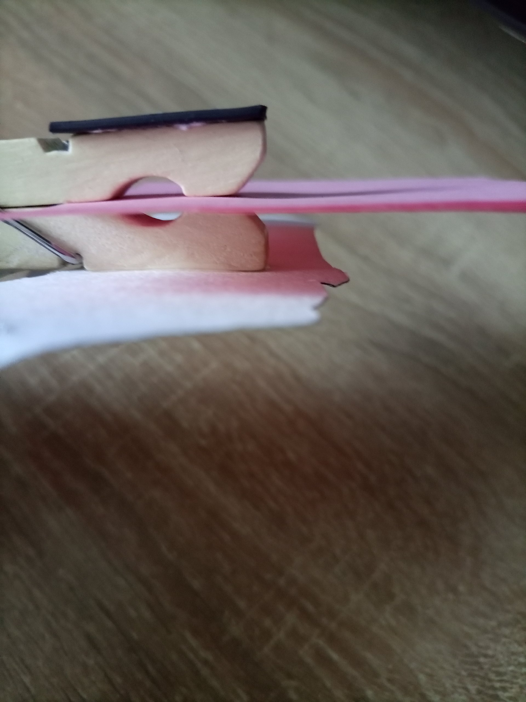
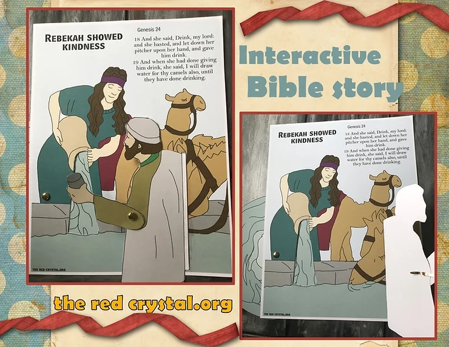

# Урок 12. Молитва веры — просить по воле Божьей

**Тема:** Молитва веры — просить по воле Божьей.  
**Истина:** Бог слышит молитву веры и отвечает, когда мы просим согласно Его Слову и Его воле.  
**Цель:** Показать детям, что Бог верен Своему обещанию и ведёт тех, кто просит Его с верой; научить детей говорить в молитве с Иисусом, Который всегда рядом.  
**Библейская история:** Бытие 24 глава.  
**Золотой стих:** «И вот какое дерзновение мы имеем к Нему, что, когда просим чего по воле Его, Он слушает нас.» 1 Иоанна 5:14  
**План урока:**

## 1. Молитва

## 2. Повторение

На листе бумаге или доске написать слова, которые упоминались в библ.истории, и несколько слов, вообще не относящихся к ней. Желающему завяжите глаза, поверните вокруг себя и направьте к доске. Ребенок должен дойти до доски и коснуться ее указательным пальцем. Снимите повязку. Если палец попадет на слово, ребенок говорит, относится ли оно к данной истории, и если относится, то составляет с этим словом предложение, рассказывающем о каком- то факте этой библейской истории. Затем завяжите глаза следующему ребенку. Играйте до тех пор, пока не будут использованы все написанные слова.  
СЛОВА: смех, осел, жертвенник, гора, огонь, нож, ангел, рога, звезды, испытание, золото, плавильня (относятся к истории). Разбойники, корабль, животные, сон. (не относятся к истории)  
Повторить золотой стих прошлого урока. «Бог усмотрит Себе агнца для всесожжения, сын мой.» Бытие 22:8

## 3. Заинтересуй

Спросить у детей:  
Что такое молитва? Зачем нам нужно молиться? Как вы думаете, как часто нужно молиться?  
Что вы говорите Богу, когда случается что-то хорошее? (Благодарите)  
А что говорите утром, когда проснулись? А перед сном? А перед едой? (Прошу благословения)  
А что вы говорите Богу, когда сделали что-то плохое? (Прошу прощения)  
А о чем вы просите Бога, когда у вас трудности или какое-то важное дело? (Прошу помощи)  
Слово Божье учит нас молиться с верой — просить Бога согласно Его Слову и Его воле. Сегодня мы узнаем, как один слуга молился о важном Божьем деле — о Божьем обещании, — и Бог чудесно ответил ему.

## 4. Библейская история

(Файл с презентацией прикреплен в конце урока)

1. Когда Авраам состарился, он решил найти хорошую жену для своего сына Исаака. Это было очень важно: Бог обещал Аврааму, что через семью Исаака однажды придёт Спаситель — Иисус. Но в Ханаане не было девушек, которые бы так же верили Богу и Его обещанию, как Авраам и Исаак. Поэтому Авраам позвал своего слугу, который был управляющим в доме его.
2. «Я не хочу, чтобы мой сын Исаак женился на местных женщинах хананеянках», сказал Авраам,- Я отправляю тебя туда, где я жил раньше. Там ты найдешь жену для моего сына. Поклянись, что выполнишь мою просьбу!»

- Но…Слуга сказал: «А что, если она не захочет идти со мной? Неужели мне придется привести к ней Исаака?

3. «Если она не захочет, -ответил Авраам, - то ты свободен от клятвы. Только сына моего не возвращай туда, так как Бог обещал дать эту землю Ханаанскую потомкам сына моего.»

Авраам заботился не просто о женитьбе сына. Он хотел, чтобы в семье Исаака продолжалась вера в Божье обещание — ведь от этой семьи должен был родиться Спаситель мира. И нам Бог дал самое драгоценное — Своё Слово и Иисуса, и хочет, чтобы мы берегли это сокровище и передавали дальше.

4. Слуга стал собираться в путь. Он взял десять верблюдов господина своего и нагрузил их провизией и всякими сокровищами в подарок будущей невесте. Затем он отправился в Месопотамию, в город где жил Нахор, брат Авраама.
5. Прибыв туда под вечер, он остановился за городом возле колодца с водой. В это время обычно приходили местные женщины черпать воду.
6. Слуга понимал, что дело, которое доверил ему его господин Авраам, очень важное: речь шла о Божьем обещании! Поэтому он помолился. «Господи Боже, пошли девушку, которую Ты выбрал в жёны для Исаака, сегодня мне навстречу. Когда девушки придут к колодцу, я попрошу их дать мне пить. И если девушка скажет мне: пей, я и верблюдам твоим дам пить, - я пойму, что это та, которую Ты избрал.

Обрати внимание: слуга просил не о том, чего хотел сам, а о Божьем плане — согласно воле Божьей. Это и есть молитва веры. В Библии написано: «…когда просим чего по воле Его, Он слушает нас» (1 Иоанна 5:14). Так поступил слуга Авраама. Так можем поступать и мы: говорить с Богом о том, что важно Ему, и доверять Его воле!

7. Пока он молился, к колодцу подошла девушка по имени Ревекка. На плече она несла кувшин для воды.
8. Когда она наполнила кувшин водой, слуга попросил у Ревекки пить. Она быстро опустила кувшин и дала ему пить, вежливо сказав: «Пей, господин мой». И, когда напоила его, сказала: я стану черпать и для верблюдов твоих, пока не напьются все.
9. Слуга с изумлением смотрел, как девушка ходила взад и вперед от колодца, чтобы наполнить корыто для верблюдов. Когда она закончила, он достал для нее серьгу и два золотых браслета.
10. «Чья ты дочь?»- спросил слуга. И есть в вашем доме место для ночлега?

«Я Ревекка, дочь Вафуила, внучка Нахора»-ответила она.

11. Слуга был счастлив. Ревекка оказалась родственницей Авраама. Внучкой его брата Нахора.
12. Слава Богу! Бог так быстро ответил на  молитву и привел меня прямо к дому брата господина моего.

А девушка,просто чудо! Добрая, приветливая, работящая и очень красивая! Бог ответил на молитву самым лучшим образом!  
Так и в нашей жизни. Когда мы просим Бога с верой, согласно Его Слову и Его воле, Он слышит нас и отвечает — потому что Он верен Своему обещанию.

13. Ревекка побежала домой и рассказала о том, что случилось. Брат Ревекки Лаван побежал к колодцу.
14. Лаван был взволнован, встретив слугу Авраама. И обрадовался, увидев дары, которые слуга принес с собой.
15. Пойдем со мной, благословенный Господом,- сказал Лаван. У меня есть место для тебя и твоих верблюдов. И я приготовлю еду для всех нас.
16. Но слуга не стал есть, пока не объяснил, для чего Авраам отправил его сюда. Он рассказал о своей молитве возле колодца и о том, как Господь сразу ответил на нее, послав Ревекку.

Ответьте мне прямо сейчас, отдадите ли вы Ревекку в жены Исааку? Ревекка и вся семья были согласны, так как поняли, что это от Господа. Слуга одарил всех богатыми подарками, которые привез с собой. А потом они ели и пили за праздничным столом.

17. На следующий день Ревекка согласилась отправиться со слугой Авраама в обратный путь, чтобы встретиться с Исааком, своим будущим мужем.
18. Вечером Исаак вышел в поле и увидел верблюдов и своего слугу. Он познакомился с Ревеккой, и она стала его женой. Так Бог продолжал Свой великий план: много лет спустя в этой семье родился обещанный Спаситель — Иисус Христос. Бог вёл слугу шаг за шагом, потому что его молитва была о Божьем обещании!

📎 [Ревекка.pdf](../vk_board/01_50314759_Бытие.%20Цикл%20уроков%20для%20детей%20Красная%20нить/docs/Ревекка.pdf)

## 5. Закрепление

Спросить детей:

- Почему поиск жены для Исаака был так важен? (Бог обещал, что через семью Исаака придёт Спаситель — Иисус)  
- Как молился слуга? (Он просил не о своих желаниях, а о Божьем плане — согласно воле Божьей)  
- Чему нас учит эта история? (Бог слышит и отвечает, когда мы просим с верой, согласно Его Слову и Его воле)

## 6. Золотой стих

«И вот какое дерзновение мы имеем к Нему, что, когда просим чего по воле Его, Он слушает нас.» 1 Иоанна 5:14  
Найти в Библии, прочитать, записать, разучить на уроке.

## 7. Применение

**Заветное применение:**  
- **Размышлять о Слове:** перечитайте дома с родителями историю из Бытия 24 и подумайте, где в ней видно Божье обещание об Иисусе. Вера приходит, когда мы слышим Слово Божье (Рим. 10:17).  
- **Говорить с Иисусом в молитве:** Иисус — Эммануил, что значит «Бог с нами». Он всегда рядом и обещал: «Не оставлю тебя и не покину тебя» (Евр. 13:5). Ему можно рассказать всё и просить: «Господи, пусть будет Твоя воля» — как это делал слуга Авраама.  

А когда ответ не приходит сразу — не торопи Бога и не обижайся на Него: доверься Его воле, Он любит тебя и отвечает в лучшее время.  

Беседа и предметный урок о важности молитвы.  
Необходимо: Стеклянный сосуд, спички, воздушный шар на котором написано Иисус.  
Сосуд символизирует нас. Спички-молитву. Шарик-Господа.  
Что происходит, когда мы начинаем молиться Господу? (Зажечь спичку и бросить в сосуд. Подождать пока она немного прогорит, а потом закрыть горлышко сосуда плотно шариком. Шарик должен присосаться к горлышку так, что можно будет поднять шарик вместе с сосудом)  
Когда мы молимся, мы говорим с Иисусом, Который уже рядом с нами — Он Эммануил, «Бог с нами». При любой трудной ситуации в нашей жизни мы всегда можем обратиться к Иисусу и искренне попросить Его о помощи, доверяя Его воле. Когда мы имеем постоянное общение с Иисусом в молитве, то между нами появляется тесная взаимосвязь. Как в этом эксперименте. (Показать, как шарик крепко держит сосуд. )Так и в нашей жизни: когда у нас такая тесная связь с Богом через молитву, Бог ведёт нашей жизнью и помогает в любых ситуациях. Повторить еще раз золотой стих.

## 8. Молитва

Узнать у детей о их нуждах. Помолиться о Божьей помощи.

## 9. Поделка

Сделать молитвенные блокнотики. Файл для поделки под фото.  
  
  
  
📎 [молитвенник.pdf](../vk_board/01_50314759_Бытие.%20Цикл%20уроков%20для%20детей%20Красная%20нить/docs/молитвенник.pdf)

### Эксперимент о молитве

https://youtu.be/mrvXSDL66QU?si=9xDS0jllaZpT9N-_  
🎬 [Эксперимент "О молитве - для детей"| Детская проповедь | Александр Антонов (2 минуты 46 секунд)](https://vk.com/video169210391_456239998)

### Идея поделки-наглядности

  
📎 [ревекка цв.pdf](../vk_board/01_50314759_Бытие.%20Цикл%20уроков%20для%20детей%20Красная%20нить/docs/ревекка%20цв.pdf)  
📎 [ревекка2 цв.pdf](../vk_board/01_50314759_Бытие.%20Цикл%20уроков%20для%20детей%20Красная%20нить/docs/ревекка2%20цв.pdf)  
📎 [ревекка чб.pdf](../vk_board/01_50314759_Бытие.%20Цикл%20уроков%20для%20детей%20Красная%20нить/docs/ревекка%20чб.pdf)  
📎 [ревекка2 чб.pdf](../vk_board/01_50314759_Бытие.%20Цикл%20уроков%20для%20детей%20Красная%20нить/docs/ревекка2%20чб.pdf)
