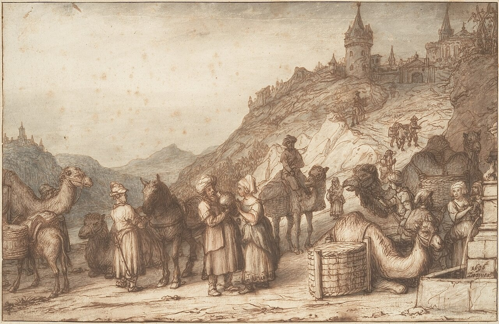

# Молитва веры — просить по воле Божьей

## Слайд 1. Авраам ищет жену для Исаака

Авраам поручил слуге найти жену для Исаака среди родных. Это было ответственное путешествие.

## Слайд 2. Слуга молится

> «Господи, Боже господина моего Авраама! Устрой это предо мною» (Быт. 24:12).

Слуга просил Бога направить его, а не полагался только на себя.

## Слайд 3. Просьба по Божьему характеру

Он попросил знак: девушка, которая добровольно даст воды ему и верблюдам, будет избранной Богом.

- Была ли эта просьба эгоистичной?
- Что она показывала о характере девушки?

## Слайд 4. Бог отвечает

> «Он ещё не перестал говорить, и вот, вышла Ревекка» (Быт. 24:15).

Ревекка сделала именно то, о чём просил слуга.

## Слайд 5. Бог ведёт шаг за шагом

Бог услышал молитву и открыл правильный путь. Слуга поклонился и поблагодарил Господа.

## Слайд 6. Просить по воле Божьей

> «Когда просим чего по воле Его, Он слушает нас» (1 Ин. 5:14).

Молитва веры слушает Божье Слово и доверяет Его мудрости.

## Слайд 7. Иисус рядом

Мы можем молиться через Иисуса. Он наш Примиритель и всегда слышит Своих детей.

## Слайд 8. Главная истина

**Молимся с верой, просим согласно Божьему Слову и благодарим за Его ответ.**
