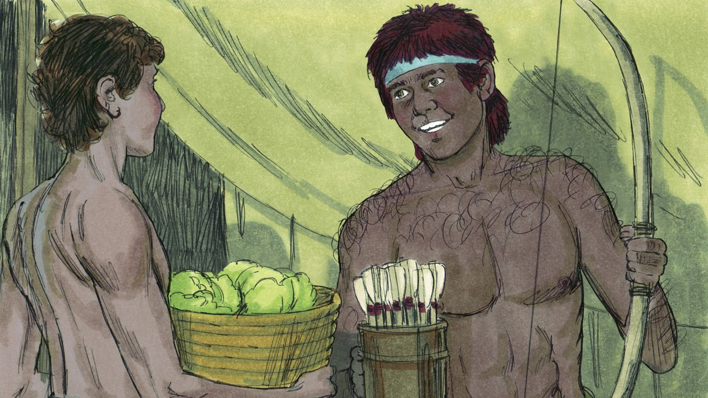
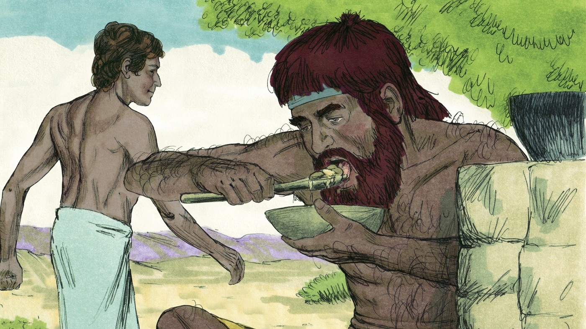
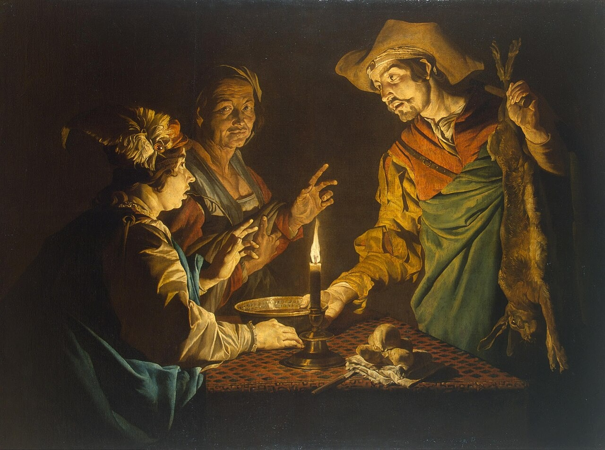
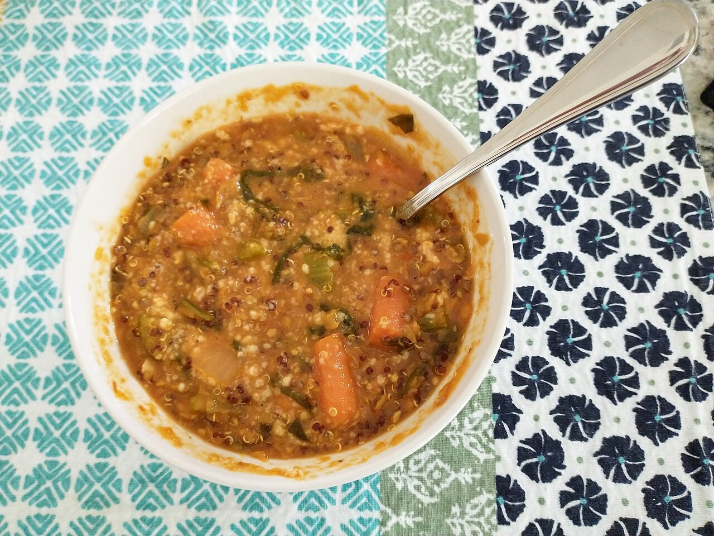
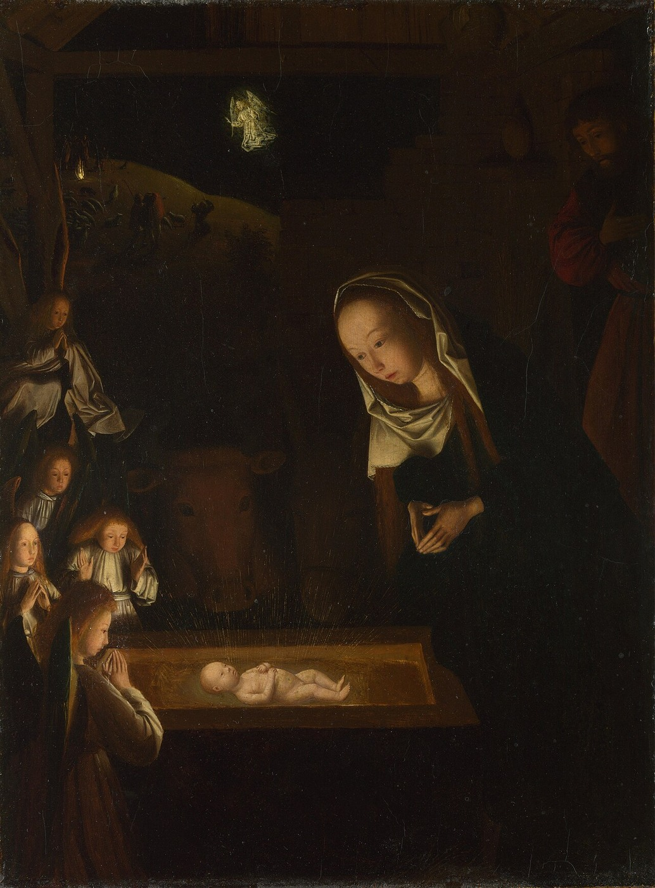

# Временное и вечное

## Слайд 1. Два брата

Иаков готовил еду, а Исав вернулся с поля голодный.

## Слайд 2. Исав продаёт первородство

> «Вот, я умираю; что мне в этом первородстве?» (Быт. 25:32).

Исав обменял особое право первенца на одну похлёбку.

## Слайд 3. Что он потерял?

Первородство напоминало о Божьем обещании Аврааму: быть частью семьи Завета и ждать обещанного Спасителя.

## Слайд 4. Мгновенное желание

Исав выбрал то, что нужно было сейчас, и пренебрёг Божьим обещанием.

- Какие желания могут ослеплять нас?

## Слайд 5. Временное

Еда, игрушки и успех радуют ненадолго. Всё видимое проходит.

## Слайд 6. Вечное

Во Христе мы получаем вечное наследие — примирение с Богом и жизнь в Его Царстве.

> «А если вы Христовы, то вы семя Авраамово и по обетованию наследники» (Гал. 3:29).

## Слайд 7. Выбор сердца

Мы ценим Божье Слово и Иисуса больше, чем минутное удовольствие.

## Слайд 8. Главная истина

**Иисус и Божье обещание драгоценнее всего временного.**
