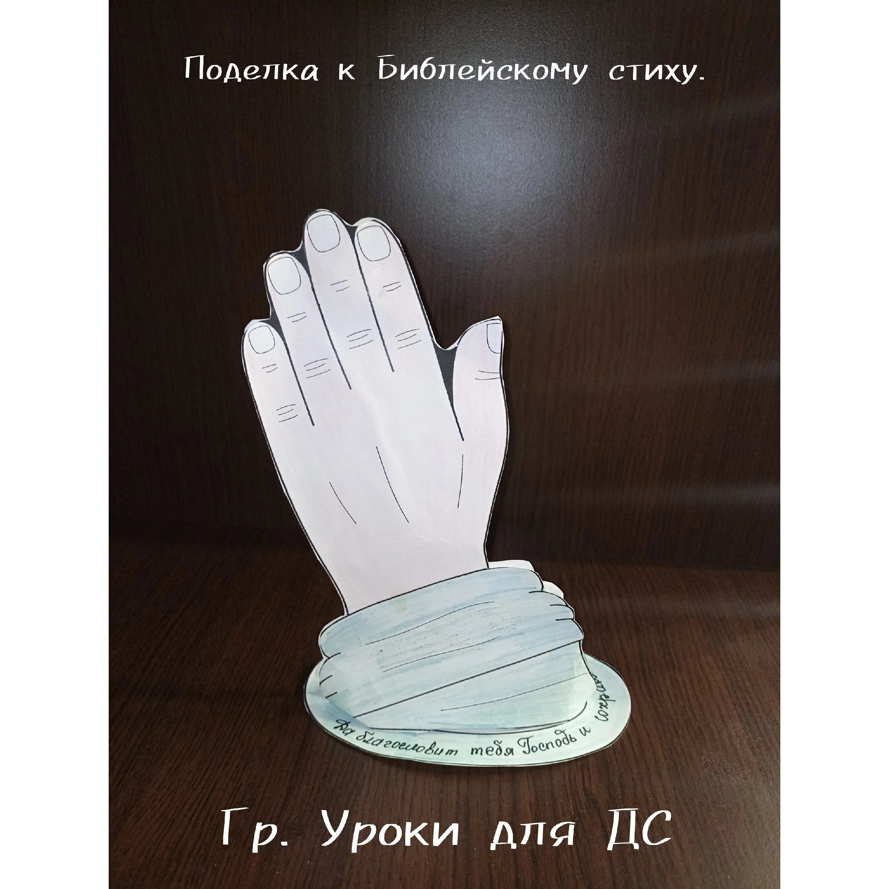
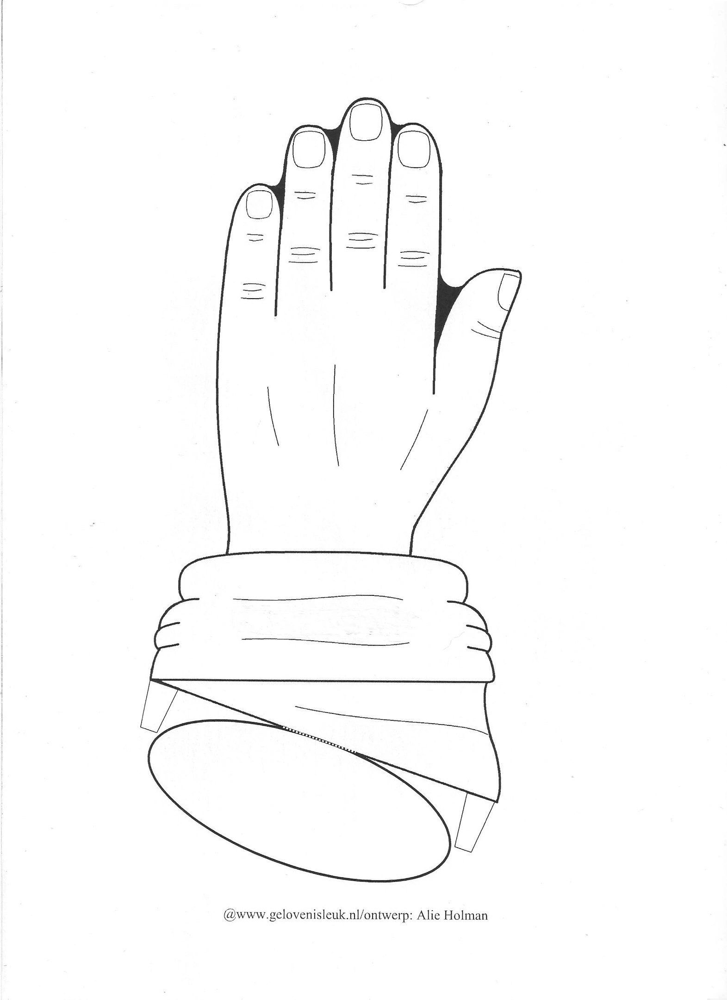
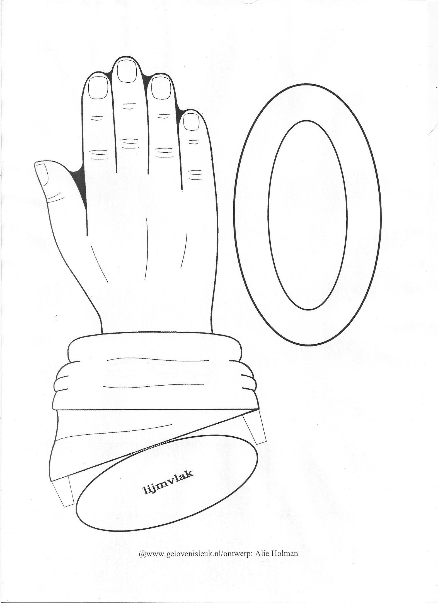

# Урок 14. Важность благословения

**Тема:** Важность благословения.  
**Истина:** Благословение Божье — это Его Завет (святое обещание Бога) и Христос. Божий план исполняется всегда, даже когда люди ошибаются.  
**Цель:** Показать детям, что благословение, переданное от Авраама, — это Божье обещание о Спасителе, Христе. Учить детей наследовать это благословение верой и передавать его другим — рассказывать об Иисусе и молиться за людей.  
**Библейская история:** Бытие 27 гл. Иаков хитростью получает благословение отца.  
**Золотой стих:** «Да благословит тебя Господь и сохранит тебя!» Числа 6:24  
**План урока:**

## 1. Молитва

## 2. Повторение

Для повторения и рассказа Библейской истории используем бумажные куклы прошлого урока.

## 3. Заинтересуй

Для заинтересованности поговорите с детьми о том, как влияют наши слова на окружающий нас мир. Для примера посмотрите видеоролики с экспериментами Масару Эмото с водой и водой и рисом.  
Так же можно рассказать о том, как реагируют растения на слова. Все описания таких экспериментов есть в интернете. После просмотра скажите:

- А теперь на минутку представьте, что такой эксперимент решили провести над детьми. Допустим над двумя братьями – близнецами. В течении какого-то времени одному из них окружающие говорили только добрые слова: хвалили, благодарили, говорили, что любят, делали комплименты и т.д. А другого брата только ругали. Все время делали замечания, обзывали глупым, дураком и т.д. Как вы думаете, изменился ли их характер в конце такого эксперимента? Какими бы они стали? Сделайте вывод, что наши слова имеют силу. От Адама и Евы до наших дней верующие знали, что слова имеют силу. Плохие слова и пожелания в адрес другого человека называются ПРОКЛЯТИЕМ.

Добрые слова и пожелания, которые мы говорим в жизнь другого человека называются БЛАГОСЛОВЕНИЕМ. А самое главное благословение — это не просто добрые слова, а Божье обещание, Его Завет. Такое благословение всегда исполняется, и его желали все, кто знал Бога.

## 4. Библейская история

(Для рассказа используйте бумажные куклы прошлого урока. В моменте, когда Иаков обложил руки козлиной кожей я надела перчатку и просунув пальцы в отверстия изобразила, как Исаак ощупывает руки Иакова.)  
Сегодня я расскажу вам об одном человеке, который так сильно хотел получить благословение, что решился на обман.  
Когда Исаак состарился, его зрение стало очень плохим. Его жене Ревекке приходилось все время быть рядом со своим мужем, чтобы помогать ему. По обычаю того времени старший сын имел право на особое благословение отца. Старшим в семье был Исав, да и к тому же он был любимым сыном отца. А ведь еще до рождения близнецов Бог сказал Ревекке, что старший будет служить младшему, — значит, особое благословение Бог приготовил для Иакова. Но Исаак любил Исава и хотел поступить по-своему, вопреки Слову Божьему. Однажды Исаак позвал Исава и сказал: «Сын мой, я состарился и не знаю дня своей смерти. Поэтому сделай так, как я тебе скажу. Пойди сейчас на охоту, поймай дичи и приготовь мне мое любимое кушанье. После этого я благословлю тебя.»  
Ревекка была неподалеку и слышала весть разговор между Исааком и Исавом. Ей не понравилось то, что она услышала. Почему? Возможно, потому что она любила больше Иакова. А главное — она помнила слова, которые ей сказал Бог о том, что потомки старшего сына будут служить младшему, и поверила, что Божье Слово должно исполниться. Вот только помогать Божьему обещанию обманом не нужно: Бог всегда Сам исполняет то, что сказал.  
Но Ревекка твердо решила этому помешать.  
Когда Исав отправился на охоту, Ревекка сказала Иакову: «Сын мой, отец твой хочет сегодня благословить брата твоего. Я слышала их разговор. Поэтому, послушай слов моих и сделай так как я прикажу. Принеси мне двух козлят хороших из нашего стада, и я приготовлю из них то, что любит твой отец. А ты, вместо Исава принесешь это отцу твоему, чтобы он поел и благословил тебя.»  
Иаков испугался и сказал матери: «У брата моего все тело покрыто волосами, а моя кожа гладкая. Если отец ощупает меня, то поймет, что я его обманул и вместо благословения я получу проклятье.»  
Мать ответила: «На мне будет твое проклятие, только сделай, как я прошу.» Иаков согласился. На самом деле, он очень хотел иметь особое благословение своего отца, который был Божьим человеком и пророком.  
Ревекка приготовила кушанье. Переодела Иакова в богатую одежду старшего сына, а руки его и гладкую шею обложила кожею козлят.  
(Продолжение ниже)  
Когда Иаков принес кушанье отцу, Исаак попросил сына подойти поближе. Отец ощупал сына и сказал: «Голос Иакова, а руки Исава» И не узнал Исаак подмены, и поев произнес слова особого благословения над Иаковом. Исаак благословил потомков Иакова хорошим урожаем хлеба и винограда. Благословил быть господином над братьями. «Проклинающие тебя-прокляты; благословляющие тебя-благословенны!»- сказал он. Но главное в этом благословении — не хлеб и не власть. Через него Иакову передавалось обещание, которое Бог дал еще Аврааму: от этого рода родится Христос, Спаситель мира. Это и есть самое большое благословение.  
Так обманным путем Иаков получил благословение, предназначенное для его старшего брата. Иаков и Ревекка поступили нечестно — Божьему обещанию не нужно помогать обманом. Их ошибка не отменила Божий план, ведь Бог избрал Иакова еще до его рождения. Но у обмана всегда есть последствия — об этом мы узнаем в следующих уроках.  
За это Исав возненавидел брата: «Он взял первородство мое, и вот, теперь и благословение мое взял. Я убью Иакова, когда отца не станет.»  
Ревекке передали слова Исава и испугавшись за жизнь младшего сына она решила отослать его из дома. Она сказала: «Иди в страну, где живет мой брат Лаван, и оставайся там. А когда твой брат успокоится, я дам тебе знак, и ты опять вернешься домой.» Иаков послушался и отправился в чужую страну к своему дяде.

## 5. Закрепление

1. Что Исаак попросил сделать Исава?
2. Что Ревекка попросила сделать Иакова?
3. Почему Исаак не заметил подмены?
4. Хорошо ли поступили Иаков и Ревекка? Почему?
5. Почему каждый из братьев хотели получить благословение отца?
6. Как вы понимаете, что такое благословение?
7. Почему так важно благословлять, а не проклинать?
8. Что было самым главным в благословении отца — богатство или Божье обещание о Спасителе?

## 6. Применение

В Первом послании Петра 3:9 написано «не воздавайте злом за зло или ругательством за ругательство; напротив, благословляйте, зная, что вы к тому призваны, чтобы наследовать благословение.»

Самое большое благословение — это не богатство и не удача, а Христос и Его Завет. Если ты принял Иисуса как своего Спасителя, ты уже наследник благословения Авраама — ты в семье Божьей!

- Размышляй о Слове Божьем: перечитай дома эту историю вместе с родителями и найди в ней обещание о Христе. Вера приходит, когда мы слушаем и думаем о Слове Божьем.
- Поговори с Иисусом в молитве. Он рядом — Он Эммануил, что значит «Бог с нами», и Он никогда не оставит тебя. И расскажи кому-нибудь об Иисусе — так мы благословляем людей по-настоящему, передавая им самое главное.

А еще Иисус учит нас: «Благословляйте проклинающих вас и молитесь за обижающих вас» (Лк.6:28). Ты — дитя Божье, поэтому можешь молиться и за тех, кто обижает тебя: они тоже нуждаются во Христе, и Бог может изменить их сердце.

## 7. Золотой стих

Сегодня я предлагаю выучить стих, которым вы сможете благословлять. Обратите внимание: благословляет не человек, а Сам Господь — Он хранит Своих детей.  
Найдите в Библии и прочитайте Числа 6:24-26  
24«Да благословит тебя Господь и сохранит тебя!»  
25 «Да призрит на тебя Господь светлым лицом Своим и помилует тебя!»  
26 «Да обратит Господь лицо Своё на тебя и даст тебе мир!»  
В зависимости от возраста заучите один или несколько стихов.

## 8. Игра

Пусть детям по очереди завязывают глаза. В каждом туре один ребенок с завязанными глазами должен сидеть на стуле. Остальные дети могут по очереди стоять перед ним и протягивать одну руку. Ребенок с завязанными глазами должен угадать, кто перед ним, пощупав его руку. Вы можете менять условия каждый раунд и просить ребенка с завязанными глазами угадывать личность, ощупывая локоть, колено, ступню и т. д.  
Угадав кто пред ним, ребенок с завязанными глазами должен возложить руку на голову того, кто перед ним и сказать: «Да благословит тебя Господь и сохранит тебя!»

## 9. Поделка

  
  
  
🎬 [Эксперименты Масару Эмото (4 минуты 13 секунд)](https://vk.com/video169210391_456240111)  
🎬 [Эксперимент с водой и рисом доктора Эмото Масару. (1 минуту 11 секунд)](https://vk.com/video169210391_456240112)

## 10. Заключительная молитва.
