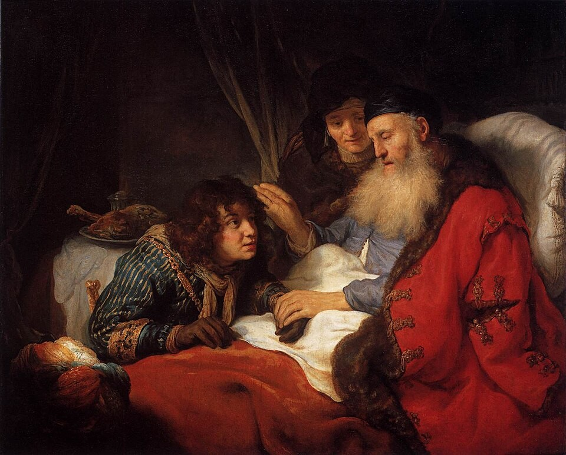
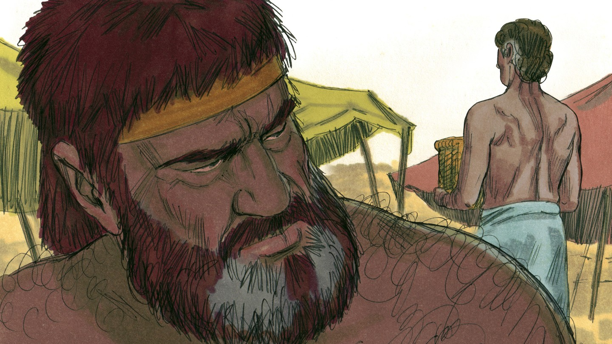
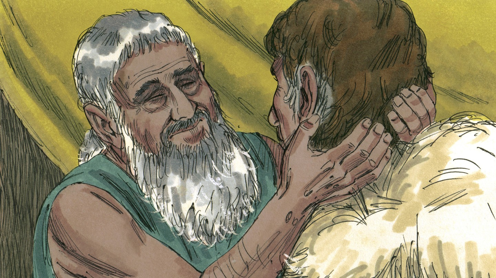
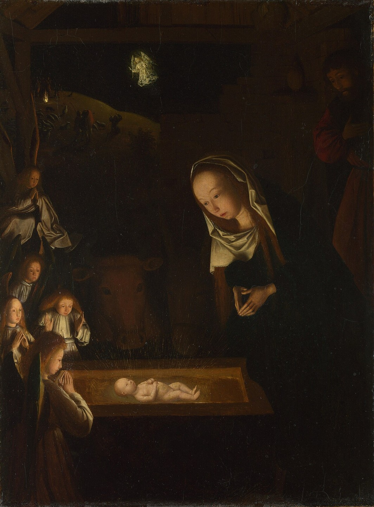

# Важность благословения

## Слайд 1. Благословение Исаака

Исаак состарился и хотел благословить своего старшего сына Исава.

## Слайд 2. Обман в шатре

Ревекка и Иаков обманом приготовили всё так, будто Иаков — Исав. Исаак произнёс благословение Иакову.

## Слайд 3. Что было неправильным?

Иаков получил благословение нечестным путём. Грех обмана приносит боль и разделение.

## Слайд 4. Божий план сильнее ошибок

Бог ещё до рождения сказал, что старший будет служить младшему (Быт. 25:23). Его обещание исполняется, но человеческий обман не становится правильным.

## Слайд 5. Благословение — не магия

Благословение — это Божье обещание и участие в Его Завете, а не волшебная формула.

## Слайд 6. Обещанный Потомок

Через семью Иакова Бог вёл историю к Иисусу Христу — Спасителю народов.

## Слайд 7. Передавать благословение

Мы не присваиваем Божью славу, а рассказываем другим о Христе и молимся за них.

> «Да благословит тебя Господь и сохранит тебя!» (Чис. 6:24).

## Слайд 8. Главная истина

**Божий план исполняется; мы принимаем Его благословение верой и живём честно.**
