# Урок 15. Бог выбирает Иакова

**Тема:** Бог выбирает Иакова.  
**Истина:** Лестница, которую увидел Иаков, — это образ Иисуса Христа: только через Него человек соединяется с Богом. Бог выбирает нас не за хорошие дела, а по Своей милости — и обещает никогда не оставлять.  
**Цель:** Объяснить детям, почему Бог благословил Иакова: не за то, что Иаков был лучше, а по Своему плану и милости.  
Бог смотрит на сердце: дорожит ли оно Его обещанием (Заветом).  
**Библейская история:** Бытие 28 гл.  
**Золотой стих:** "...Я смотрю не так, как смотрит человек; ибо человек смотрит на лице, а Господь смотрит на сердце."  
1-я Царств 16:7(б)  
**План урока:**

## 1. Молитва

## 2. Повторение

**Игра "Меткий бросок"**  
Вам понадобиться 9 листов бумаги А4. На пяти листах написано по одному вопросу. "Кто", "Что". "Зачем", "Где", "Почему". Остальные листы перечеркнуты. Соединить листы между собой 3Х3 с помощью скотча. (См. Фото) Положите лист на пол. Дети становятся на расстоянии 1-2 м.  
По очереди они бросают мягкий мячик (набитый крупой) на бумагу. Затем отвечают на вопрос, написанный в клетке, на которую упал мяч. Если мяч попал на лист с крестиком, его нужно перебросить.

- КТО-
- из родителей больше любил Иакова?
- из родителей больше любил Исава?
- из братьев был старшим?
- ЧТО-
- случилось с глазами Исаака?
- такое благословение?
- такое проклятие?
- ЗАЧЕМ-
- Иаков обложил руки шкурой козлят?
- Ревекка отправила Иакова к брату?
- благословлять тех, кто нас обижает?
- ГДЕ-
- была Ревекка, когда Исаак разговаривал с Исавом?
- любил находиться Иаков?
- в Библии написана история Исава и Иакова?
- ПОЧЕМУ-
- Исаак отправил Исава на охоту?
- Ревекка попросила Иакова принести двух козлят из стада?
- братья хотели получить благословение отца?

(Ответы на вопросы в предыдущем уроке)  
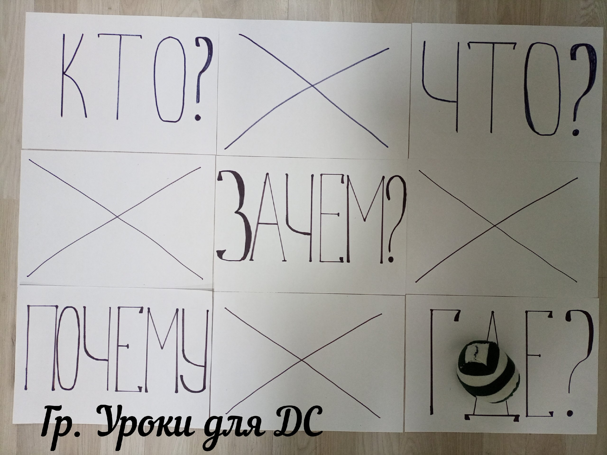

## 3. Библейская история

Сегодня мы продолжим читать историю Иакова и узнаем, что же случилось дальше.  
( Я предлагаю рассказать историю с помощью длинной линейки из четырех прямоугольников скрепленных между собой с помощью брадс.)  
(Крепёж называется «брадсы». Они бывают разных размеров, цветов и форм. Заказать можно на Ozon или Wildberries.)  
  
**1. Сформировать из линейки цифру 2.**  
У Исаака и Ревекки родились два сына. Старший Исав, младший Иаков. В Библии написано, что Бог уже знал, как в будущем будут поступать братья. Он сказал Ревекке, что старший сын будет служить младшему, еще когда дети были в животике (Быт. 25:23). Почему так случилось? Мы говорили об этом на прошлом уроке. Исав не ценил Божье благословение и пренебрег своим правом первородства, продав его Иакову за чечевичную похлебку. И это не понравилось Богу.  
**2. Сформировать из линейки шатер.**  
Помните ли вы что потом произошло в шатре Исаака? Иаков обманом получил благословение, предназначенное .Исаву.  
Исав пренебрег своим первородством и последствие его выбора настигло его. Теперь он лишился и благословения отца!  
**3. Сформировать из линейки ноги.**  
Но и Иакову пришлось несладко. У каждого плохого поступка есть свои последствия. Исав так сильно разозлился на своего брата, что решил его убить. Поэтому Иакову пришлось убегать в другую страну. Отец отправил его к дяде Лавану для того, чтобы он там выбрал себе жену.  
**4. Сформировать прямую линию.**  
Дорога была долгой. И у Иакова было время подумать над своим поступком. Он обманул отца и теперь последствия его плохого поступка настигли его. И теперь он совершенно один, далеко от дома и неизвестно когда он сможет теперь вернуться назад. Простит ли его Исав?  
**5. Сформировать прямую линию с возвышенностью.**  
Ночью Иаков лег спать прямо на землю, а под голову положил камень.  
**6. Сформировать ступеньки.**  
И вот снится Иакову сон. И во сне он видит лестницу, которая стоит на земле, а верх ее касается неба. и Ангелы Божьи спускаются и поднимаются по ней.  
Знаете, что означает эта лестница? Много лет спустя Иисус сказал, что эта лестница — это Он Сам (Ин. 1:51)! Как лестница соединяет землю и небо, так Иисус соединяет человека с Богом. Нет другой «лестницы» до Бога — только Иисус.  
**7. Сформировать букву И.**  
И на этой необыкновенной лестнице Иаков увидел Господа!  
Знаете ли вы, что Господь с нами может говорить во сне? В Библии описано много историй, когда Ангелы Божьи и Сам Бог приходили к людям во снах. Бог может прийти во сне и к нам.  
**8. Сформировать цифру 3.**  
Иаков услышал во сне, как Господь сказал ему: "Я Господь, Бог Авраама, отца твоего, и Бог Исаака... И вот Я с тобою, и сохраню тебя везде, куда ты ни пойдешь; и возвращу тебя в сию землю, ибо Я не оставлю тебя, доколе не исполню того, что Я сказал тебе" (Быт. 28:13-15). Подумайте: Бог сказал это Иакову, который только что обманул отца! Бог выбрал его не за хорошие дела — Бог любит нас по Своей милости. И дальше Господь повторяет Иакову обещание, которое дал Аврааму: от его потомства родится Спаситель, и через Него благословятся все народы земли.  
**9. Сформировать камень.**  
Когда Иаков проснулся, он понял, что это необычное место. Он взял камень на котором спал и возлил на него елей. "Если Бог исполнит все что обещал мне во сне, то я отдам десятую часть из всего, что даст мне Господь."-пообещал Иаков. А место он назвал Вефиль, что значит "Дом Божий"

## 4. Обсуждение

Покажите детям наглядное пособие "3 благословения Авраама"  
Чему учит нас эта история?  
Бог отверг Исава и выбрал Иакова, чтобы он наследовал благословение Авраама. Напомните эти три благословения. (Земля, многочисленное потомство и особое благословение — рождение Спасителя)  
Спросите детей, почему Бог так поступил? Выслушайте ответы. Бог избрал Иакова не за то, что он был лучше — Иаков только что обманул отца! — а по Своему плану и милости. А Исав сам презрел Божье обещание: он продал первородство за похлебку, ему были важнее временные, земные удовольствия. Бог смотрит на сердце: Исаву было всё равно до Божьего Слова, а Иаков дорожил обещанием — хотя и поступал неправильно.  
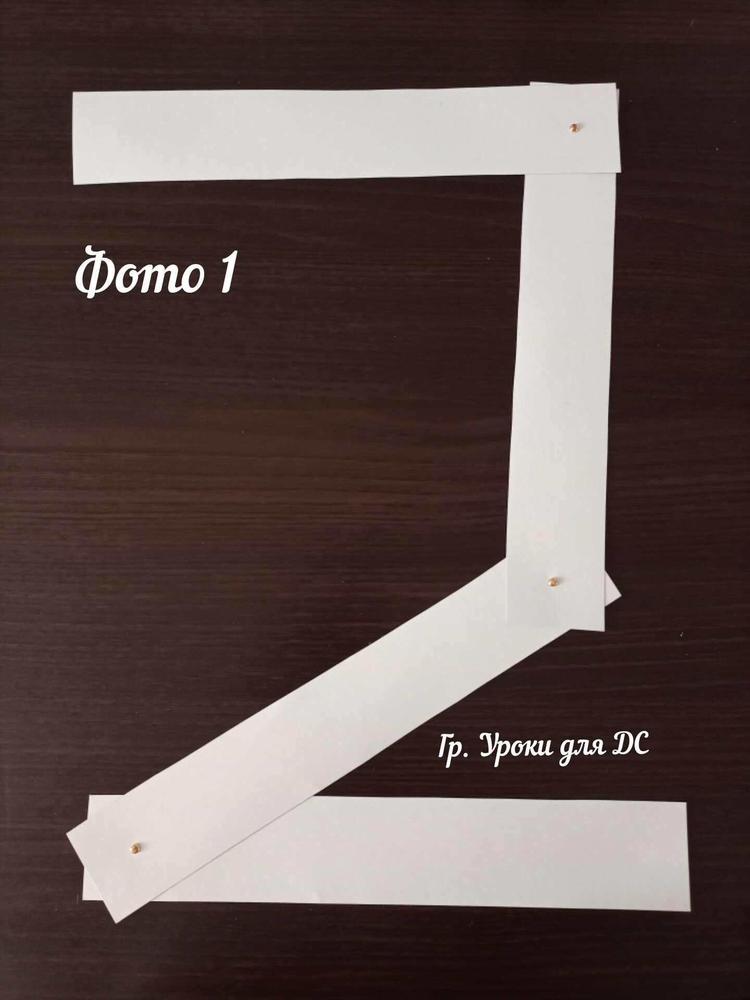  
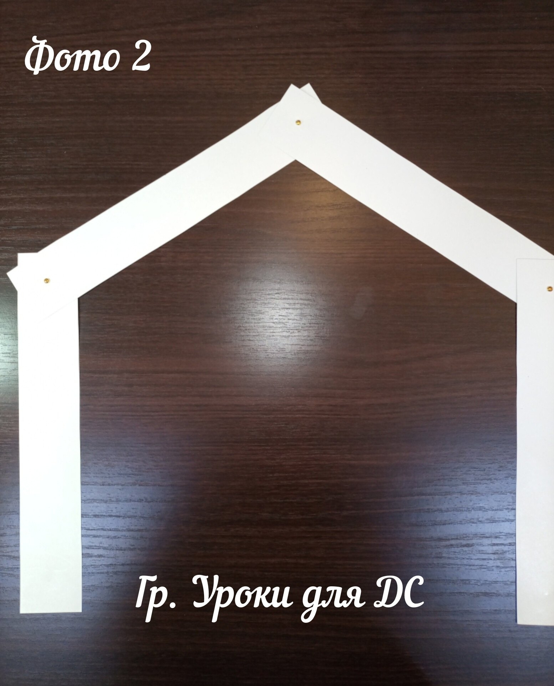  
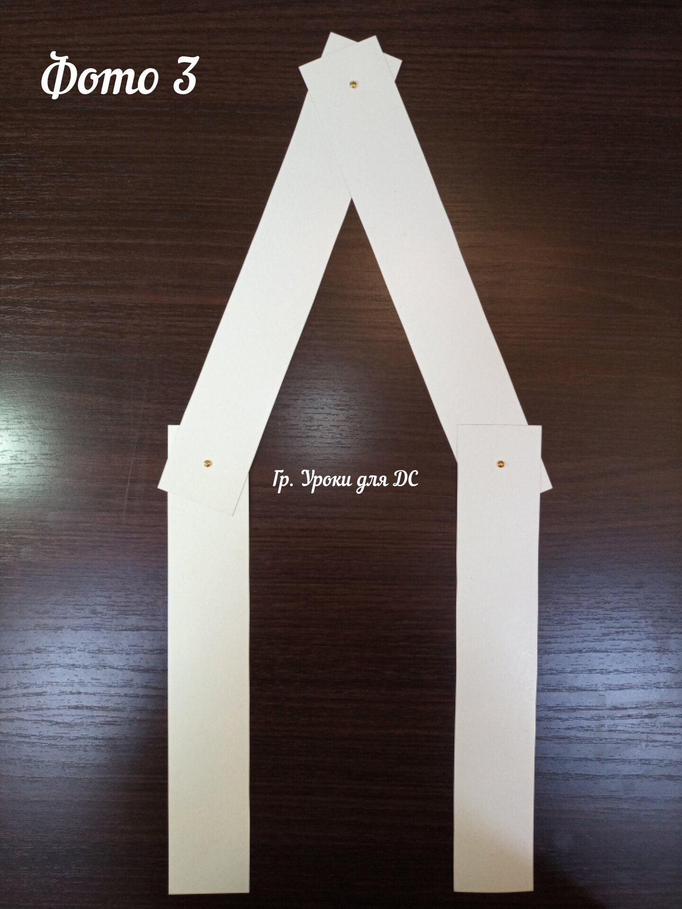  
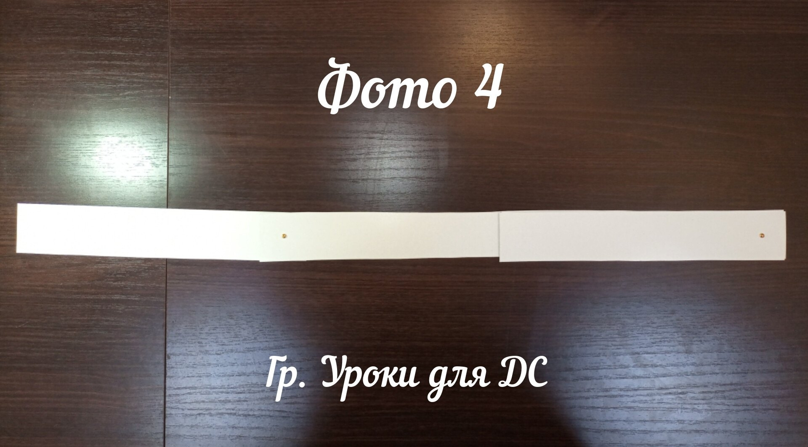  
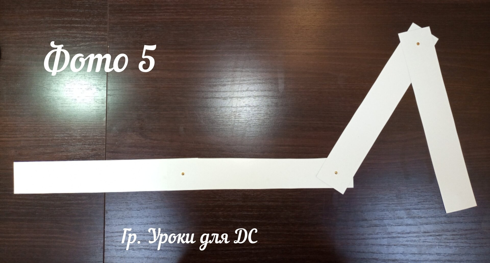  
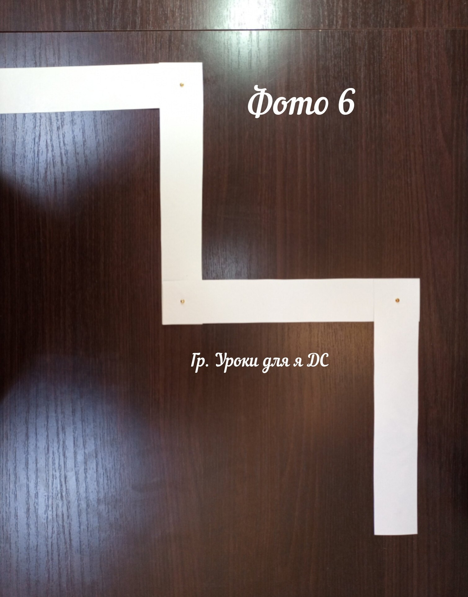  
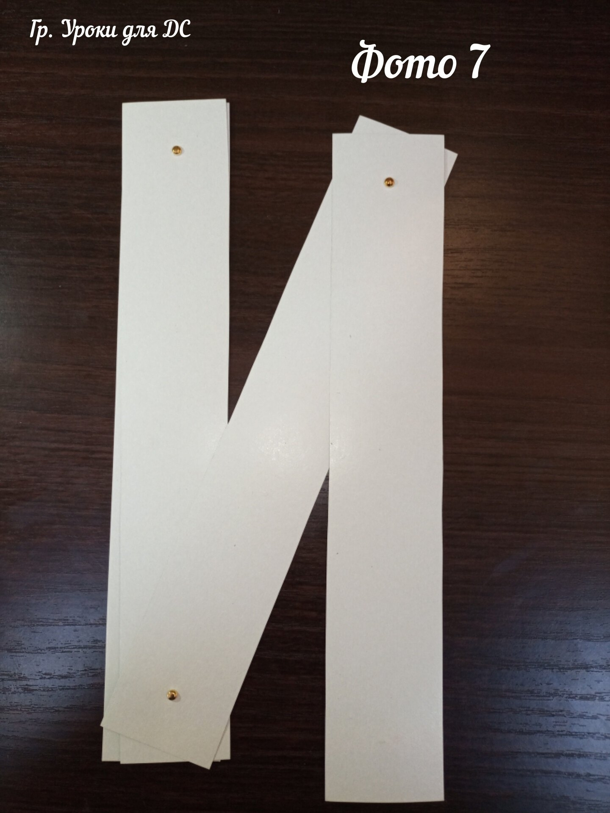  
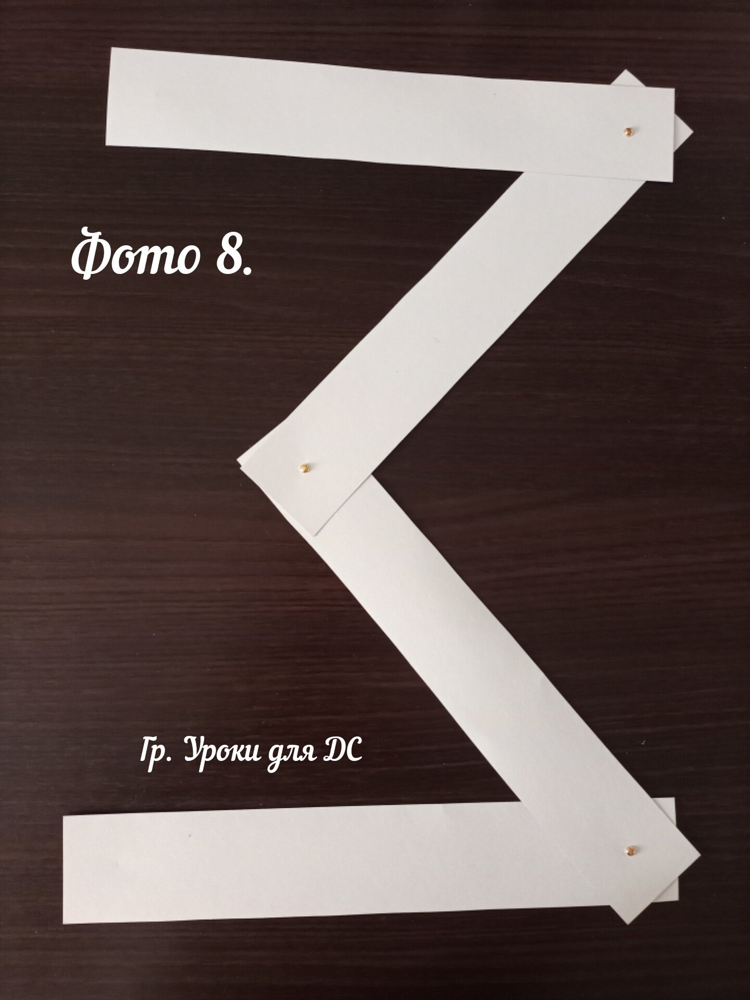  
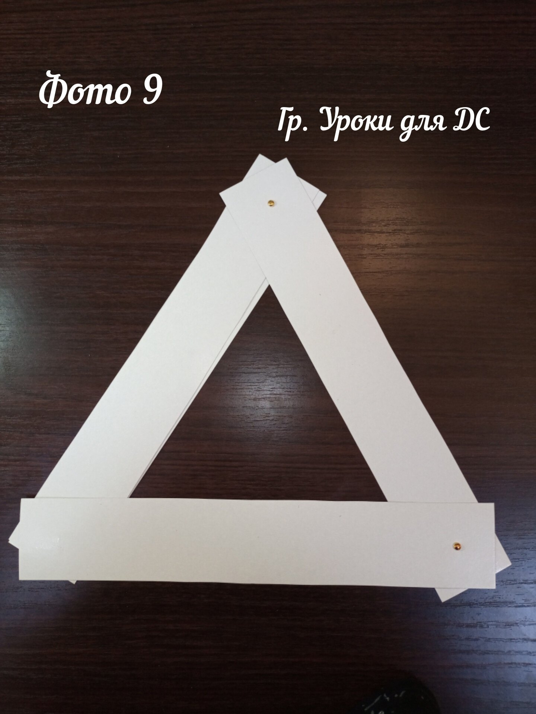  
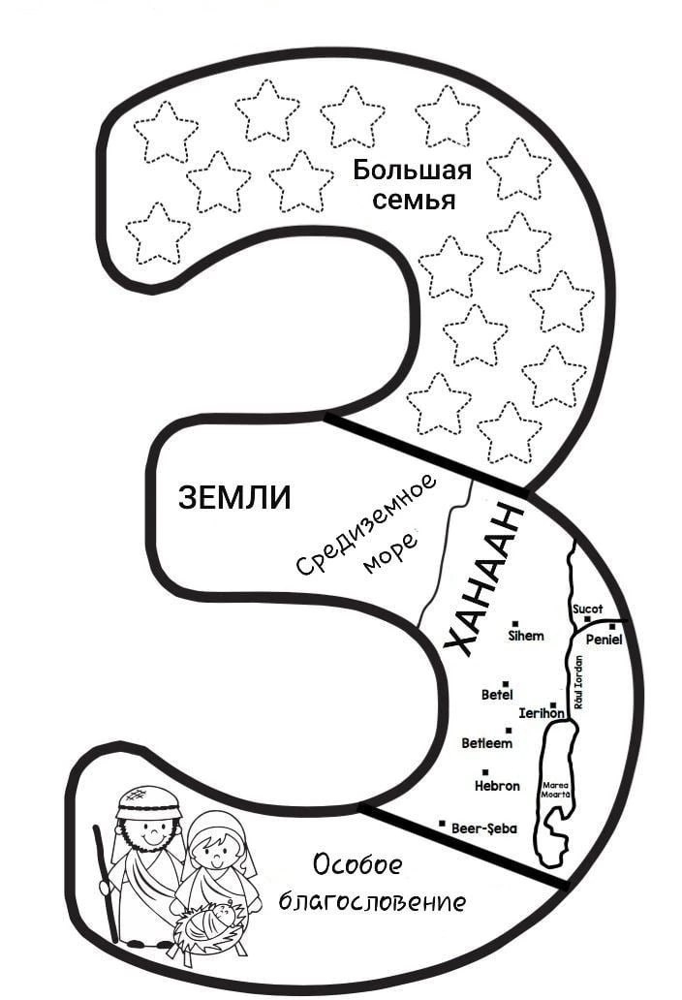

## 5. Золотой стих

"...Я смотрю не так, как смотрит человек; ибо человек смотрит на лице, а Господь смотрит на сердце."  
1-я Царств 16:7(б)  
Бог смотрит на сердце — и видит, принимаем ли мы Его Слово и Его Сына Иисуса.  
Изобразите стих на доске с помощью символов, рисунков.  
Например:  
🧍  
Прочитайте в Библии, заучите на уроке.

## 6. Применение

Бог смотрит и на наши сердца! Что Он видит в твоём сердечке — любовь к Его Слову или только игрушки и мультики? Бог выбрал Иакова не за дела, но Он видел, что Иаков дорожит Его обещанием.  
Главное — у нас есть Лестница до неба, и это Иисус! Поговори с Ним в молитве: Он обещал «Я с тобою и не оставлю тебя». Бог с нами — по-еврейски это слово «Эммануил». Скажи вслух: «Иисус — мой Спаситель, Он соединил меня с Богом, мои грехи прощены». И расскажи на этой неделе кому-нибудь об этой Лестнице — об Иисусе.  
А если сделал плохой поступок, как Иаков, — приди к Богу, согласись с Ним, что ты неправ, и попроси прощения. Иисус уже понёс наказание за наши грехи, и Бог простит и поможет исправиться.  
Помни: Богу важно не то, во что ты одет, как учишься и насколько ты популярен в классе, а то, принял ли ты всем сердцем Его Сына и Его Слово!

## 7. Молитва

## 8. Поделка

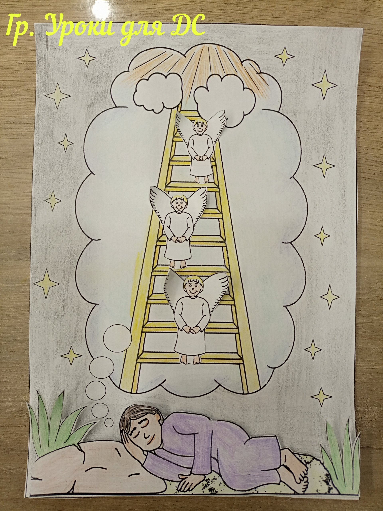  
📎 [лестница Иакова.pdf](../vk_board/01_50314759_Бытие.%20Цикл%20уроков%20для%20детей%20Красная%20нить/docs/лестница%20Иакова.pdf)
