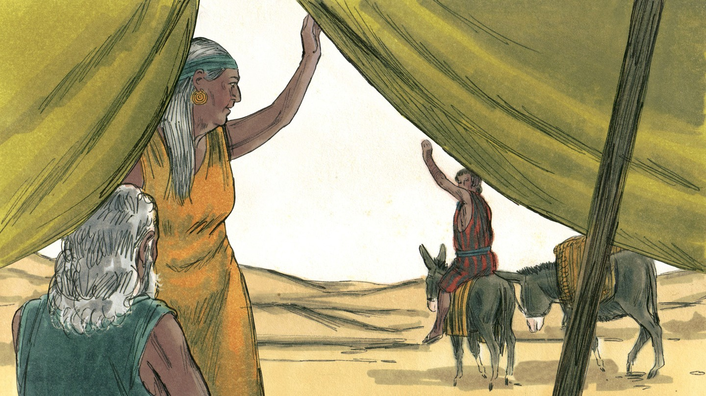
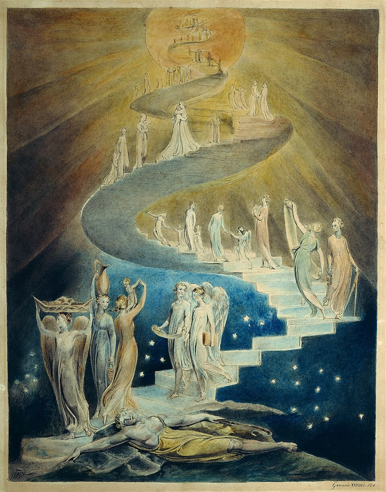
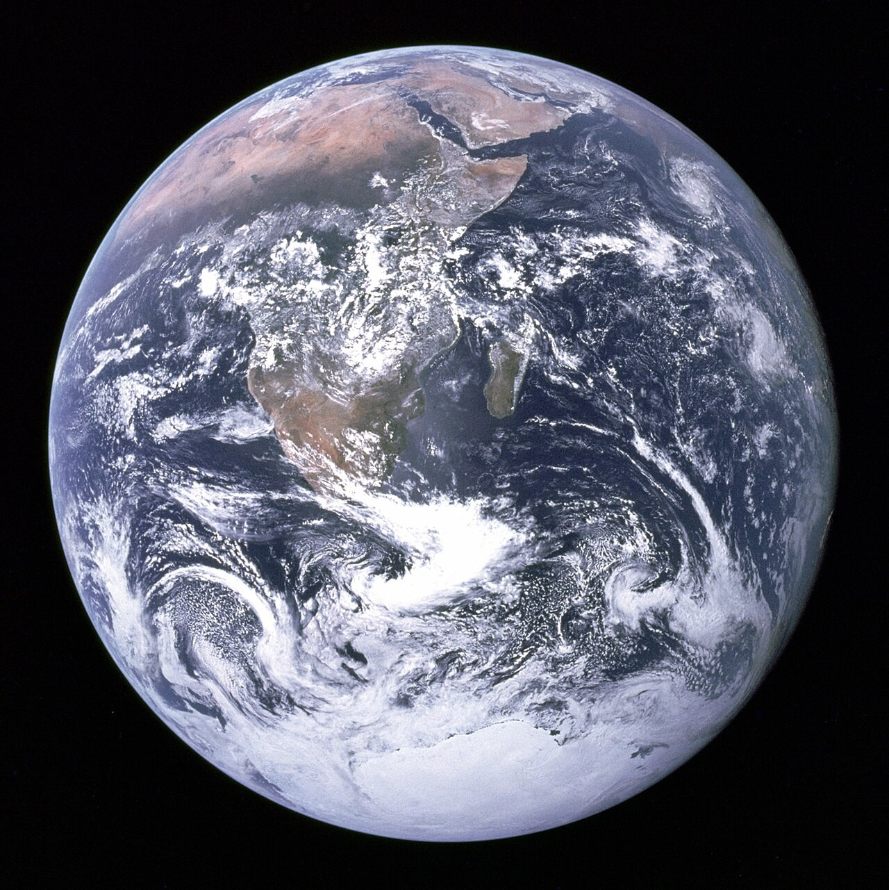
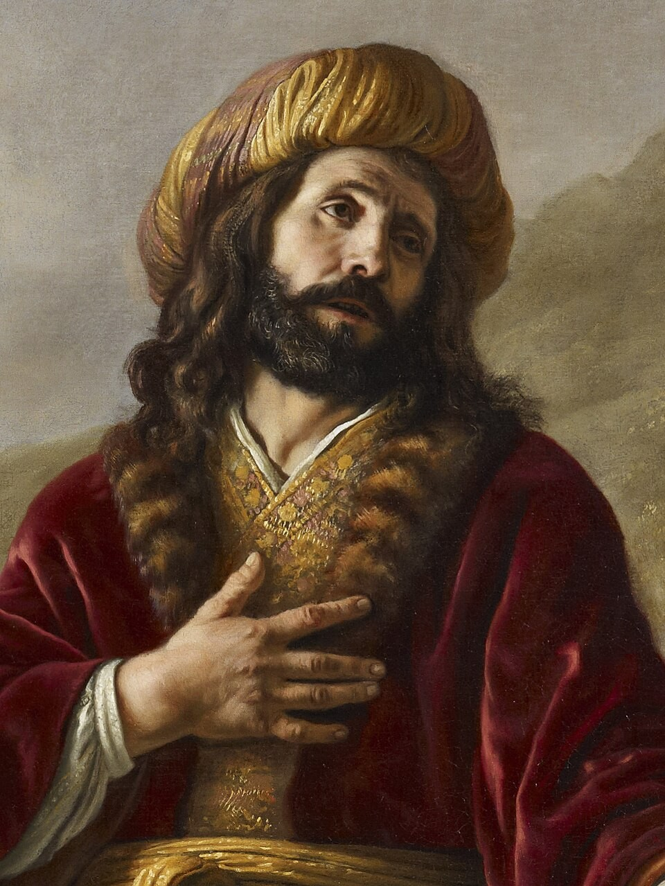
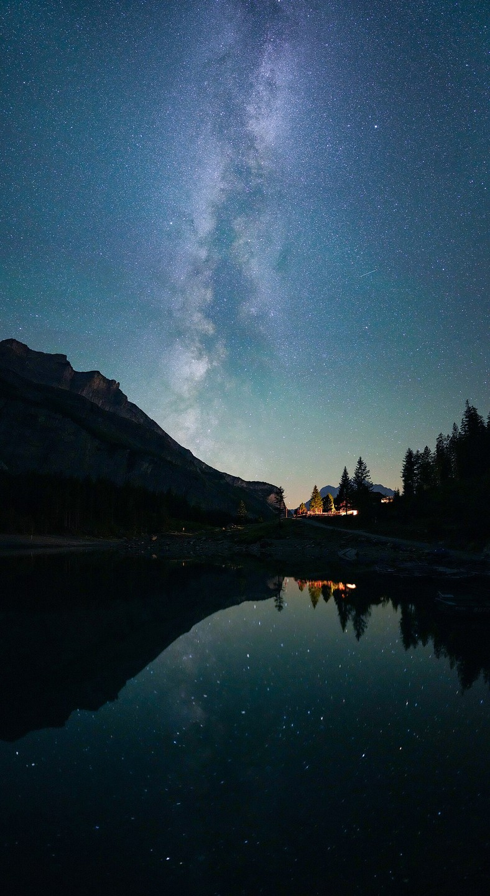

# Бог выбирает Иакова

## Слайд 1. Иаков бежит

После обмана Иаков ушёл из дома. Он боялся Исава и остался один в дороге.

## Слайд 2. Сон в пути

Иаков увидел лестницу от земли до неба, а ангелы Божьи восходили и нисходили по ней.

## Слайд 3. Бог говорит

> «Я Господь, Бог Авраама… и Исаака» (Быт. 28:13).

Бог продолжает Свой Завет с Иаковом.

## Слайд 4. Обещание присутствия

> «Я с тобою, и сохраню тебя везде, куда ты ни пойдёшь» (Быт. 28:15).

Бог не оставил Иакова, хотя Иаков был грешным и нуждался в перемене.

## Слайд 5. Лестница указывает на Христа

Иисус соединяет Бога и людей. Через Него мы приходим к Отцу (Ин. 1:51; 14:6).

## Слайд 6. Бог смотрит на сердце

> «Человек смотрит на лице, а Господь смотрит на сердце» (1 Цар. 16:7).

Бог выбирает по Своей милости, а не за внешние достоинства.

## Слайд 7. Ответ Иакова

Иаков поставил камень и назвал место Вефилем — «домом Божьим». Он услышал Божье обещание.

## Слайд 8. Главная истина

**Бог милостиво выбирает и не оставляет Своих; Иисус — единственный путь к Нему.**
