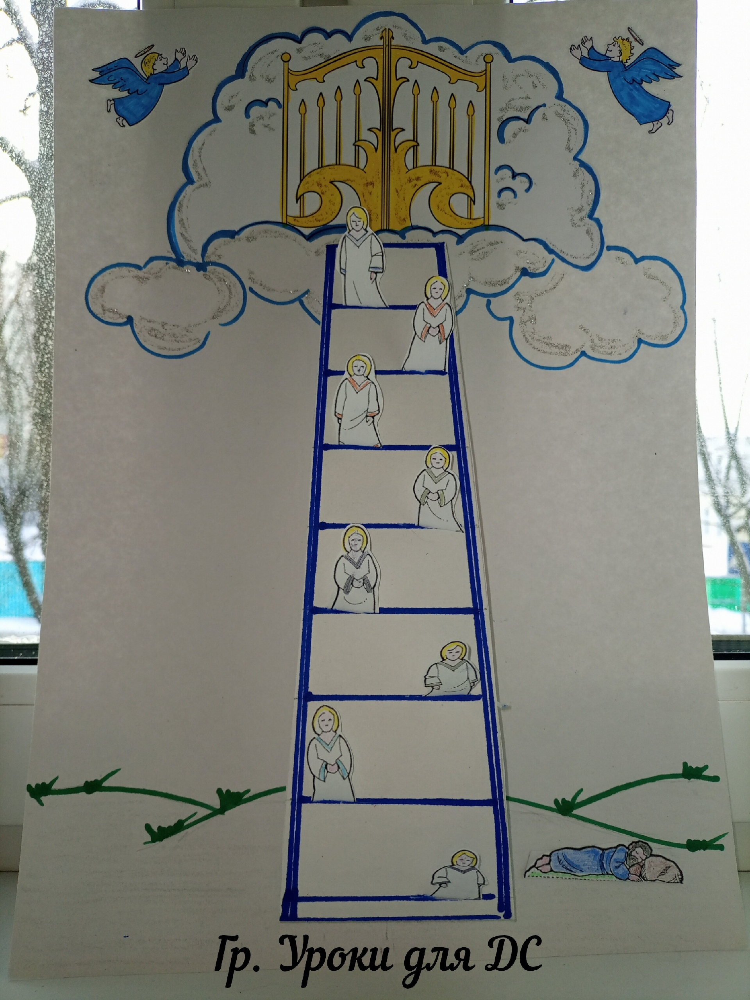
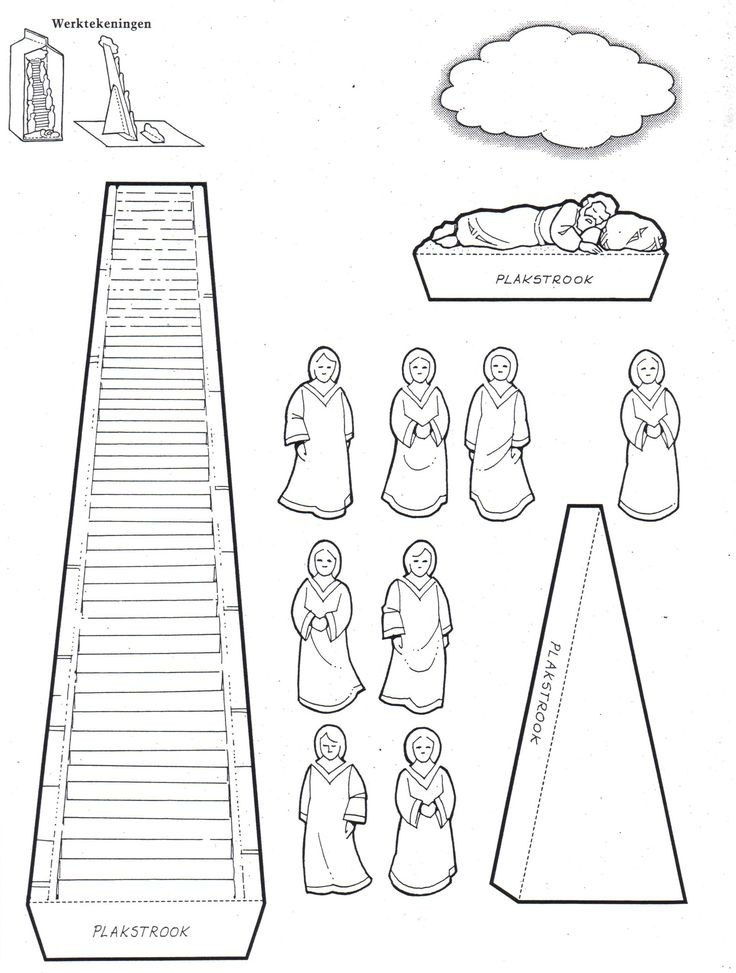
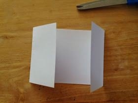
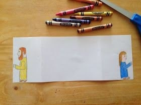
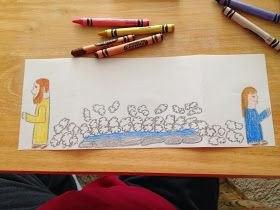
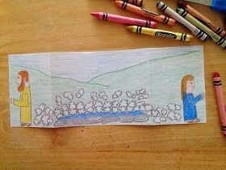
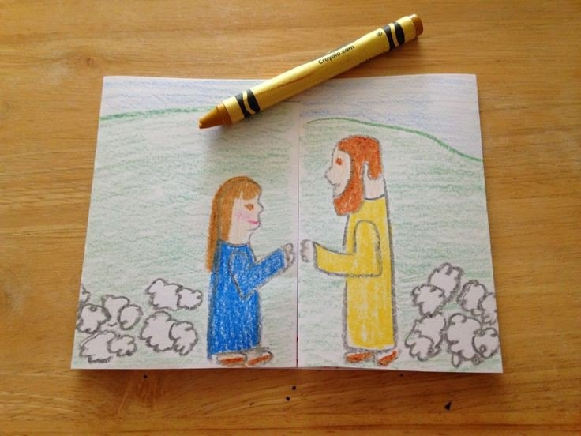

# Урок 16. Что посеешь, то и пожнёшь

**Тема:** Что посеешь, то и пожнешь.  
**Истина:** У каждого поступка есть свои последствия, но Бог верен Своему Завету (Своему обещанию) и не оставляет Своих детей, даже когда они ошибаются.  
**Цель:** Показать детям, что наши выборы настоящие и имеют последствия, но главное — Бог остается со Своими детьми и исполняет Свое обещание, как Он был с Иаковом.  
**Библейская история:** Бытие 29:1-30  
**Золотой стих:** «…Что посеет человек, то и пожнет.» Галатам 6:7  
**План урока:**

## 1. Молитва

## 2. Повторение

Подготовить наглядное пособие «Лестница Иакова»  
Подготовить ангелов по количеству вопросов. Ребенок берет ангела, отвечает на вопрос и помещает его на лестницу. Другой вариант. Разделить на две команды. У каждой команды ангел своего цвета. Команда, ответившая на вопрос, поднимает своего ангела на ступеньку. Выигрывает та команда, чей ангел первый достигнет неба.  
Вопросы:

- Почему Иаков убежал от брата?
- Куда пошел Иаков?
- Где пришлось Иакову спать?
- Что Иаков положил себе под голову?
- Что увидел Иаков во сне?
- Что сказал Иакову Господь?
- Что Иаков пообещал Богу, когда проснулся?
- Почему Господь выбрал Иакова.

Повторить золотой стих прошлого урока.

## 3. Заинтересуй

Спросить детей:

- Видели ли они огород? Что там растет? Видели ли они, как сеяли семена в землю?

Покажите детям разные семена. Расскажите про каждое семечко. Спросите, если я посажу (посею) это семечко в землю, что вырастет? А может ли из семечки подсолнуха вырасти яблоня? А из арбузной семечки – тюльпан? Почему? Потому что это закон сеяния и жатвы: что посеешь, то пожнешь. (Посеять- посадить в землю. Пожать – собрать урожай.)  
Этот закон сеяния и жатвы действует не только среди растений, но и среди людей. Семена, это наши поступки, слова, решения, которые мы принимаем. А жатва – последствия наших поступков, слов и решений.  
(Продолжение ниже)  
  

## 4. Библейская история

(Презентация урока в файле. Друзья, часто при использовании готовых картинок возникает соблазн читать готовый текст. Мой совет так не делать. Старайтесь рассказывать историю самостоятельно. Пусть будет импровизация, живые эмоции и контакт с глазами детей)  
Слайд 1. Иаков принял решение и послушался совета своей матери. Какой поступок он совершил? Он обманул отца и украл благословение старшего брата. Какие последствия этого поступка настигли Иакова? Ему пришлось покинуть свой дом и отправиться к своему дяде Лавану, чтобы взять себе жену из его дочерей.  
Слайд 2. Подойдя ближе к Харрану, Иаков увидел колодец, накрытый большим камнем и три стада овец, пасущихся неподалеку. (Напомните детям о слуге Авраама, который тоже остановился у колодца)  
Слайд 3. Иаков спросил пастухов: «Откуда вы?» «Мы из Харрана.»- ответили они. «Знаете ли вы Лавана?»- спросил Иаков. «Да, знаем. И с ним все в порядке. А вот и его дочь, Рахиль с овцами идет.»- ответили они.  
Слайд 4. Когда Иаков увидел Рахиль, дочь своего дяди Лавана, он отвалил камень от устья колодца и напоил овец своего дяди. Он сказал Рахили, кто он такой, поцеловал ее и заплакал. Рахиль же побежала сообщить отцу.  
Слайд 5. Лаван пригласил Иакова погостить у них. Месяц спустя Лаван сказал: «только потому, что ты мой родственник, ты не должен работать у меня без оплаты. Скажи мне, какую оплату ты хочешь?»  
Слайд 6. У Лавана было две дочери. Рахиль была красива и лицом и фигурой. А лия была слаба глазами.  
Слайд 7. Иаков был влюблен в Рахиль. «Я буду работать на тебя семь лет в обмен на твою младшую дочь Рахиль.(Расскажите детям о традиции восочных народов платить выкуп за невесту. Вспомните о том, что за Ревекку Авраам отправил 10 верблюдов с дарами. А у Иакова ничего не было, поэтому ему пришлось работать на Лавана.)  
Слайд 8. Иаков честно работал семь лет, чтобы жениться на Рахиль. И это не было ему в тягость. Семь лет пролетели, как несколько дней, потому что он сильно любил ее.  
слайд 9. По прошествии семи лет Лаван устроил свадебный пир. Но все оказалось не так, как мечтал Иаков.  
Слайд 10. Только на следующее утро Иаков обнаружил, что рядом с ним на постели лежит Лия.  
Слайд 11. Ого! Что посеет человек, то и пожнет. Иаков посеял ложь и обман и теперь с ним поступили точно так же. Воспользовавшись тем, что невеста на свадьбе покрывала лицо, а ночью было слишком темно Лаван обманул Иакова. Это не случайность и не «судьба»: Бог справедлив, и наш выбор настоящий — у него бывают последствия.  
Разгневанный Иаков бросился к Лавану. «что это ты со мной сделал? Я служил тебе ради Рахили, не так ли? Почему ты обманул меня? Лаван объяснил: «У нас здесь не принято выдавать младшую дочь замуж раньше старшей. Но я позволю тебе через неделю жениться и на Рахили в обмен на еще семь лет работы.»  
Слайд 12. Иаков согласился. Неделю спустя Рахиль стала его второй женой. В те времена было разрешено иметь несколько жен. А Иакову пришлось работать на своего тестя еще семь лет.  
Но самое главное: Бог не бросил Иакова! Помните лестницу до неба и обещание Бога: «Я с тобою и сохраню тебя везде, куда ты ни пойдешь» (Быт. 28:15)? Все эти годы у Лавана Бог был рядом с Иаковом, заботился о нем, охранял его и исполнял Свой Завет — Свое обещание. Бог не отвергает Своих детей, когда они ошибаются, а воспитывает их, как любящий Отец.

## 5. Закрепление

Задать несколько вопросов на повторение. Спросить, почему Бог допустил такую ситуацию? Кто в этом виноват?  
Бог не имеет отношения к нашим плохим поступкам. Бог дал нам свободу выбора. Каждый человек сам выбирает, как ему поступить в конкретной ситуации. Но даже когда мы ошибаемся, Бог не бросает Своих детей: Он остается с ними, воспитывает их и ведет дальше — как Иакова.  
📎 [Иаков и Рахиль.pdf](../vk_board/01_50314759_Бытие.%20Цикл%20уроков%20для%20детей%20Красная%20нить/docs/Иаков%20и%20Рахиль.pdf)

## 6. Золотой стих

Библия же нас предупреждает: «Не обманываетесь: Бог поругаем не бывает. Что посеет человек, то и пожнет.» Это не страшилка: Бог справедлив, и наши поступки имеют последствия. Но рядом с этим стоит другое, удивительное обещание Бога Своим детям: «И вот, Я с тобою, и сохраню тебя везде, куда ты ни пойдешь... ибо Я не оставлю тебя» (Быт. 28:15).  
Найти в Библии, прочитать, записать.

## 7. Игра

Стих для запоминания: "Что посеет человек, то и пожнет". Гал. 6:7.  
Необходимое снаряжение: 2 листа чистой бумаги, 2 фломастера.

1. Выбирают ведущего. Игроков делят на 2 команды. Каждая команда выбирает лидера. Для них дают по фломастеру и по чистому листу бумаги.
2. Ведущий стоит на одной стороне беговой дорожки, а команда — на другой. Оба лидера подходят к ведущему. Ведущий шепчет лидерам название плодоносного дерева, каждому — свое.
3. Затем ведущий дает сигнал — "на старт" и оба лидера бегут к своим командам и немедля начинают рисовать плод названного дерева, при этом не разговаривать, чтобы не подсказать. Задача команды — быстро отгадать, как называется дерево. Как только лидер услышит правильный ответ, он должен очень быстро вернуться к ведущему и рассказать золотой стих. Команде защитывается очко. Играйте до тех пор, пока не поучаствуют все дети из команд.

## 8. Применение

Сначала вспомним главное из этой истории:  
1. Иаков ошибся и обманул, но Бог не оставил его, потому что Бог верен Своему Завету — Своему обещанию. Если ты принял Иисуса, ты — дитя Божье, и Бог с тобой: Он Эммануил, что значит «Бог с нами». Дома перечитай эту историю с родителями и подумай, где в ней видна Божья верность.  
2. А что делать, если ты уже «посеял» плохое — обманул, ослушался? Не прячься от Бога, как мы прячемся от наказания. Приди к Нему в молитве, скажи вслух: «Бог, я поступил плохо, прости меня». Это называется исповедание — согласиться с Богом о своем грехе. Бог прощает, потому что Иисус уже понес наказание за наши грехи на кресте.  
А теперь подумаем о семенах, которые мы сеем.  
(Подготовьте несколько семян из черного и белого картона. На черных семенах напишите плохие поступки. На белых- хорошие.. Покажите черное семечко. Оно будет символизировать плохой поступок. На нем написано «ОБМАН». Спросите у детей, что пожнет человек, если посеет обман, как Иаков? Порассуждайте, какие могут быть последствия. На следующих семенах напишите «непослушание», «воровство», «непрощение», «драка», «плохие слова». Так могут поступать те, кто еще не знает Бога. Без Иисуса в их жизни может произойти что-то плохое. Порассуждайте о последствиях.  
А теперь покажите белые семена. На них напишите: «любовь», «доброта», «прощение» «благодарность», «щедрость.» Так поступают дети Божьи — не чтобы заслужить Божью любовь, а потому что Бог уже с ними и помогает им. Порассуждайте о том, какие последствия в жизни будут, если мы будем поступать хорошо. Иисус говорил: «Итак во всем, как хотите, чтобы с вами поступали люди, так поступайте и вы с ними.» Мф. 7:12  
Подумай, какие семена сеешь ты в своей жизни?

## 9. Молитва

## 10. Поделка

### Встреча Иакова и Рахиль

  
  
  
  
  
🎬 [БИБЛЕЙСКИЕ ПОДЕЛКИ. ИАКОВ У ЛАВАНА. (2 минуты 45 секунд)](https://vk.com/video169210391_456240236)
