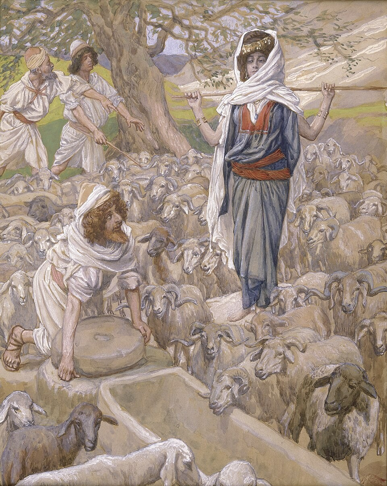
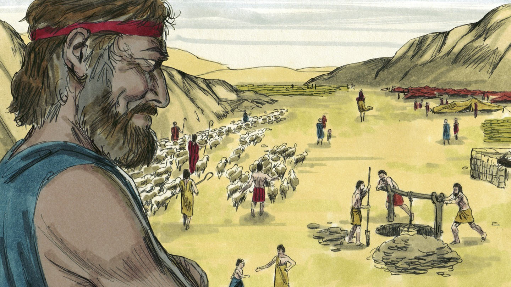
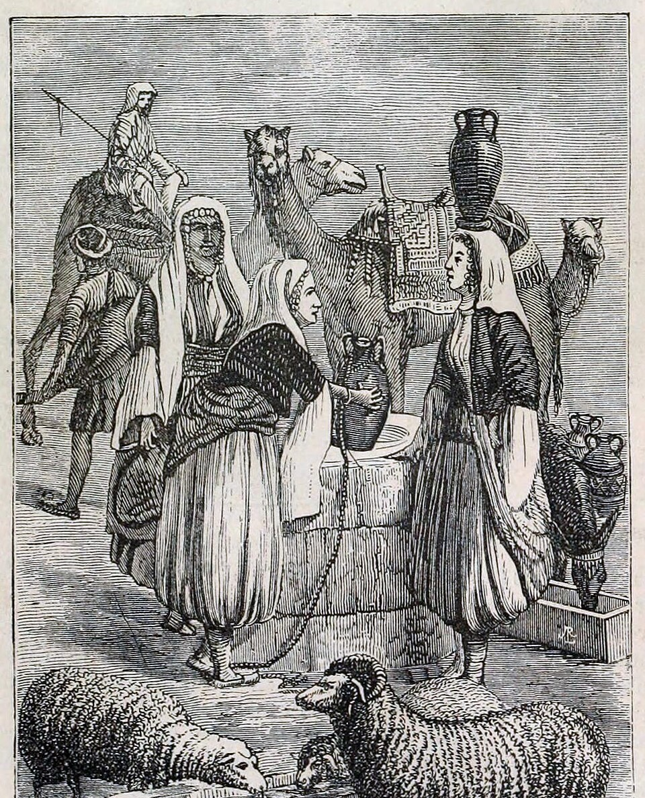
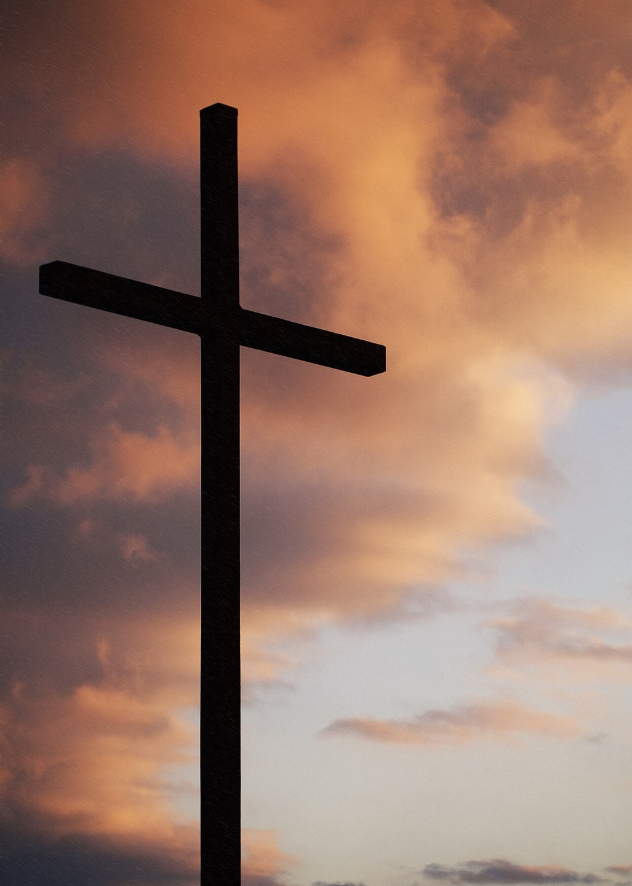

# Что посеешь, то и пожнёшь

## Слайд 1. Иаков у Лавана

Иаков пришёл к родственнику Лавану и полюбил Рахиль.

## Слайд 2. Семь лет труда

> «И служил Иаков за Рахиль семь лет; и они показались ему за несколько дней» (Быт. 29:20).

Любовь помогала ему терпеливо трудиться.

## Слайд 3. Обман Лавана

Лаван ночью привёл к Иакову не Рахиль, а Лию. Иаков испытал обман на себе.

## Слайд 4. Поступки имеют последствия

Иаков когда-то обманул отца; теперь его самого обманули. Грех приносит настоящую боль.

> «Что посеет человек, то и пожнёт» (Гал. 6:7).

## Слайд 5. Бог не оставляет

Несмотря на несправедливость и семейные трудности, Бог был с Иаковом и исполнял Своё обещание.

## Слайд 6. Божья верность и наша ответственность

Бог остаётся верен Завету, а мы отвечаем за свои решения и просим прощения за зло.

## Слайд 7. Новая жизнь во Христе

Иисус прощает и меняет нас, чтобы мы сеяли добро, правду и милость.

## Слайд 8. Главная истина

**Поступки имеют последствия, но Бог верен и ведёт Своих детей к добру.**
