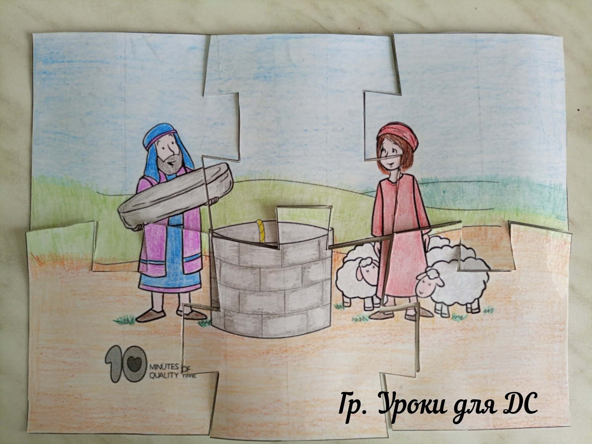
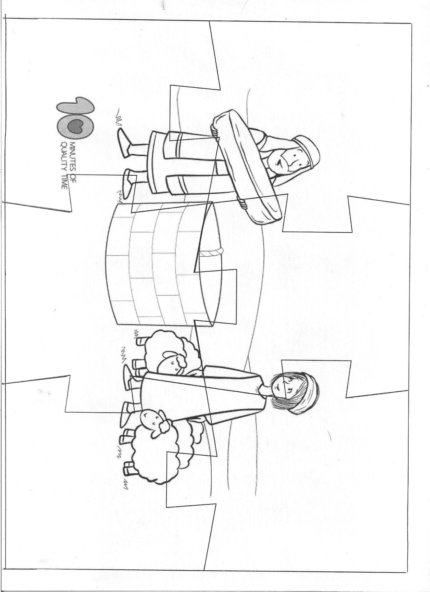
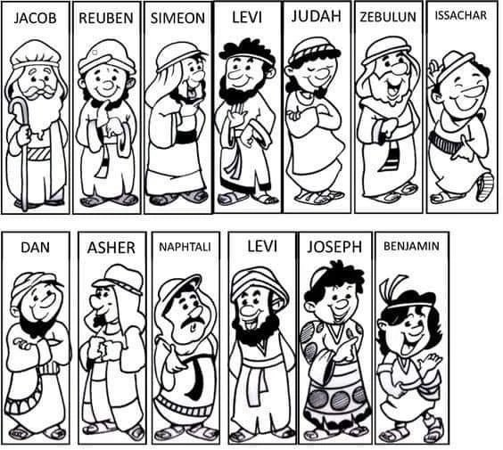
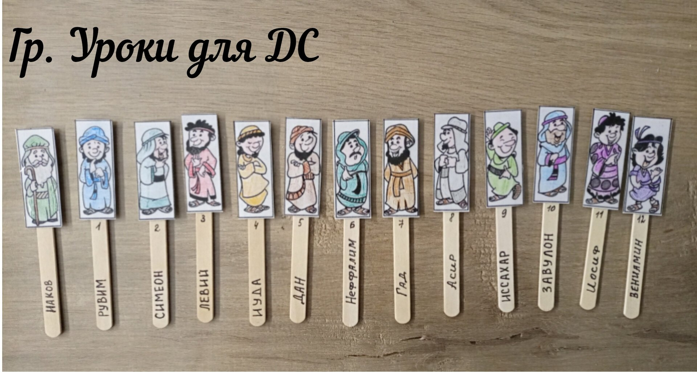
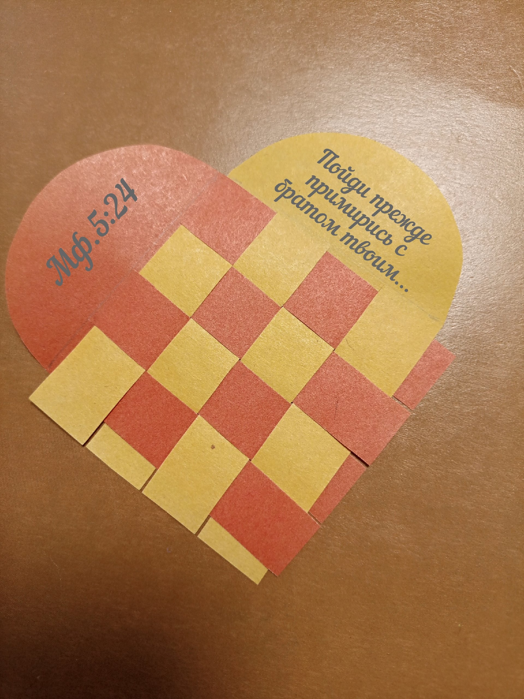
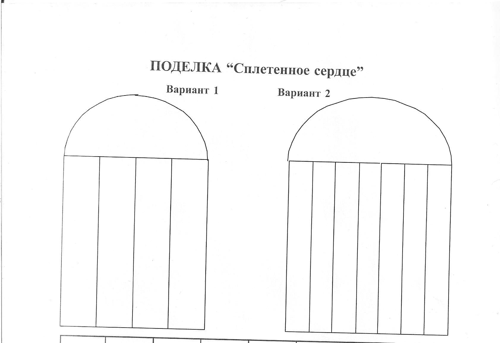

# Урок 17. Просить прощения не стыдно

**Тема:** Просить прощения не стыдно!  
**Истина:** Иисус — наш Примиритель: через Него мы сначала помирились с Богом, а потом можем мириться и с людьми. Признать свою вину и попросить прощения — не стыдно, это путь Божьего Завета (Божьего обещания).  
**Цель:** Показать детям, что Бог Сам меняет человека (как Он изменил Иакова), и научить их соглашаться с Богом о своей неправоте, просить прощения и мириться с людьми, потому что мы уже примирены с Богом через Христа.  
**Библейская история:** Бытие: 31-33  
**Золотой стих:**  
« …Пойди прежде примирись с братом твоим…» Матфея 5:24  
**План урока:**

## 1. Молитва

## 2. Повторение

Необходимо подготовить картинку-пазл из Библейской истории. Разрезать картинку на несколько частей. Дети отвечают на вопросы. За правильный ответ дается кусочек пазла. В конце дети собирают картинку.  
Вопросы:

- Расскажи, как произошла встреча Иакова и Рахиль.
- О чем договорились Лаван и Иаков?
- Что произошло на свадьбе?
- Как Лаван объяснил свой поступок?
- Сколько еще лет пришлось работать Иакову?
- Почему Бог допустил эту ситуацию?

Когда дети соберут пазл:

- Повторите золотой стих прошлого урока.

## 3. Заинтересуй

- Приходилось ли вам с кем-то ссориться?
- Бывали ли вы виновными в ссоре?
- Обижали ли вы кото-то?
- Что вы чувствовали? Как нужно поступить в такой ситуации?

Выслушайте ответы детей.

## 4. Библейская история

Как вы думаете, чувствовал ли Иаков свою вину перед братом? Я думаю, что да. Много лет Иакову пришлось прожить вдали от родного дома и родителей. Он очень скучал. За это время Бог работал над сердцем и характером Иакова. Все эти годы Бог был с ним и хранил его, как обещал: «И вот Я с тобою, и сохраню тебя везде, куда ты ни пойдешь» (Быт. 28:15). Иаков больше не был тем хитрецом и обманщиком, каким был раньше. Он понял, что у каждого поступка есть последствия. «Что посеет человек, то и пожнет»  
Иаков прожил у Лавана 20 лет. Бог исполнил свое обещание и благословил Иакова. Он стал богат. У Иакова было много скота и слуг. За это время у него родились дети. ( Назвать всех детей с помощью наглядного пособия)

1. Рувим 2.Симеон 3.Левий 4.Иуда 5.Дан 6.Неффалим 7.Гад 8.Асир 9.Иссахар 10.Завулон 11.Иосиф.

Дочь Дина.  
(Презентация урока в файле. Друзья, часто при использовании готовых картинок возникает соблазн читать готовый текст. Мой совет так не делать. Старайтесь рассказывать историю самостоятельно. Пусть будет импровизация, живые эмоции и контакт с глазами детей)  
Слайд 1. И вот пришло время, когда Бог сказал Иакову, чтобы он отправился домой. И вот взял Иаков всех детей своих, жен, взял весь свой скот и все богатство и отправился в путь.  
Слайд 2. Иаков послал послов к Исаву с посланием:

- Я жил у Лавана до этого дня. У меня есть быки, ослы, овцы и козы, слуги и служанки. Я посылаю эту весть моему господину, чтобы найти милость в твоих глазах.

( Обратить внимание на то, как Иаков обращается к брату, называет его господином и просит о милости. Это говорит о том, что Иаков чувствовал свою вину. Так бывает и в нашей жизни. Когда мы с кем-то поступаем плохо, то дружбе приходит конец. Когда- то близкий нам человек, больше не хочет с нами дружить и мы не можем уже назвать его братом или другом. Хуже всего, этот человек может стать нашим врагом.)  
  
  
  
  
Слайд 3. Иаков понимал, что из-того, что он сделал, Исав стал его врагом. Поэтому он очень боялся этой встречи. Когда послы вернулись, они сказали, что «Исав идет навстречу и с ним четыреста человек.»  
Слайд 4. Иаков стал готовиться к худшему. Он разделили тех, кто был с ним, на две группы, чтобы, если Исав нападет на одну группу, другая могла спастись.  
Слайд 5. Что нужно делать в такой ситуации? Молиться. Поэтому Иаков взмолился: «Господь, Ты велел мне вернуться в мою страну и к мои родственникам, и Ты сделаешь так, чтобы я процветал. Я недостоин Твоей доброты и верности. Спаси меня от Исава, ибо я боюсь, что он придет и нападет на нас. Ты обещал сделать моих потомков подобным песку, который не поддается исчислению.» (Сказать детям о важности молитвы в такие моменты нашей жизни.)  
Слайд 6. Иаков придумал план, как можно изменить гнев брата на милость. Иаков решил задобрить брата подарками. Для этого он выбрал: 200 коз и 20 козлов, 200 овец и 20 баранов,  
30 верблюдиц с верблюжатами, 40 коров и 10 быков, 20 ослиц и 10 ослов. Каждое стадо он поручил слугам и велел им идти впереди и держать между стадами некоторое расстояние.  
Слайд 7. Когда слуги встречались с Исавом, они рассказывали, кто они и кто их послал. «Это подарок господину Исаву от Иакова, который следует за нами.» (Скажите детям о том, что иногда недостаточно просто попросить прощения. Бывает нужно поступить, как Иаков, и сделать ради мира доброе дело.)  
Слайд 8. Иаков все еще боялся брата. Поэтому он спрятал свою семью и имущество на другом берегу реки Иавок. А сам остался один.  
Слайд 9. И вот Некто боролся с ним до рассвета. Увидев, что не может одолеть Иакова, Он коснулся сустава бедра Иакова, так что его бедро было вывихнуто. И Он сказал: «Отпусти меня, потому чтоуже рассвет.» Иаков ответил: «Я не отпущу тебя, пока ты не благословишь меня.»  
(Объяснить детям: Кто боролся с Иаковом? Сам Бог — Господь Иисус пришёл к Иакову ещё до того, как родился на земле младенцем. Бог хотел сломить Иаковову привычку надеяться только на себя и свои хитрости. Иаков вышел из этой встречи хромым — он понял, что без Бога он слаб. Но именно тогда Бог дал ему новое имя. Новое имя — это знак, что человека меняет Бог, а не человек сам себя.)  
Незнакомец спросил:

- Как твое имя?
- Иаков. (Одно из значений имени Иаков- обманщик)
- Тогда Незнакомец сказал:
- Отныне твое имя будет не Иаков, а Израиль, потому что ты боролся с Богом и людьми и победил.»

Слайд 10.  
Иаков сказал: «Пожалуйста, скажи мне, как Твое имя?» Но Он ответил: «Зачем ты спрашиваешь Мое имя?» И Он благословил Иакова. Иаков назвал это место Пенуэл, сказав: «Я видел Бога лицом к лицу и остался жив.» И вот, когда солнце встало он увидел Исава и его 400 воинов, идущих к нему.  
Слайд 11. Иаков поставил служанок и их детей впереди, Лию и ее детей-следом, а Рахиль и Иосифа позади всех.  
Слайд 12.Затем он пошел вперед и семь раз поклонился до земли, приближаясь к своему брату.  
Слайд 13.За это время Бог смягчил сердце Исава. Сердце человека — в руках у Бога! Бог ответил на молитву Иакова.  
Исав побежал навстречу Иакову и обнял его и они заплакали.  
Слайд 14. Исав спросил: «Почему ты послал все эти стада мне навстречу?»  
« Я хотел найти расположение в твоих глазах, мой господин.»- ответил Иаков. Исав не хотел принимать эти дары, но Иаков настоял на своем. После этой встречи Исав вернулся к себе домой.  
Слайд 15Иаков отправился в Сокхоф, где поставил свой шатер. Затем отправился в Сихем, где поставил жертвенник Богу.  
Слайд 16 Затем Бог велел Иакову отправиться в Вефиль, место, где Бог обещал позаботиться о нем. Иаков послушался и построил жертвенник Богу. Затем он велел своей семье отдать всех идолов и закопал их там под дубом. Бог сказал Иакову, что его новое имя будет Израиль, и Он даст эту землю ему и его потомкам, которые станут народом.  
Слайд 17 Затем Иаков отправился на юг. Когда они дошли до Ефрафы (Вифлеем), его жена Рахиль начала рожать сына. При родах Рахиль умерла, но малыш остался жив и был назван Вениамином.  
Слайд 18. Рахиль была похоронена в Ефрафе, и Иаков установил там надгробный памятник. Теперь у Иаков было 12 сыновей.

19. Затем Иаков отправился в Мамре, где жил его отец Исаак. Их старенький отец был рад узнать, что его сыновья наконец то примирились и он с миром отошел к Господу. Исаак прожил 180 лет.

Спросите:

- Чему мы можем научиться из этой истории?

(Подвести детей к выводу: посмотрите на порядок — сначала Иаков встретился с Богом и помирился с Ним, а потом помирился с братом. Так и у нас: сначала мир с Богом — через Иисуса Христа, нашего Примирителя, Который умер за наши грехи, а потом мир с людьми.)

📎 [Возвращение Иакова..pdf](../vk_board/01_50314759_Бытие.%20Цикл%20уроков%20для%20детей%20Красная%20нить/docs/Возвращение%20Иакова..pdf)

## 5. Золотой стих

Прочитать Мф.5:23-24  
«Итак, если ты принесёшь дар твой к жертвеннику и там вспомнишь, что брат твой имеет что-нибудь против тебя,  
оставь там дар твой пред жертвенником, и пойди прежде примирись с братом твоим, и тогда приди и принеси дар твой.»  
Евангелие от Матфея 5 глава  
Найти в Библии, прочитать слов Иисуса, объяснить, что в наше время «дар на жертвеннике» это наша молитва. Когда мы приходим к Богу в молитве и вспоминаем, что кто-то обижен нас, то мы должны постараться примириться с ним. Как это сделать? Выслушать ответы детей.  
(Объяснить: сначала Бог помирил нас с Собой — Иисус, наш Примиритель, умер на кресте за наши грехи, и Бог простил нас. Поэтому и мы можем мириться с людьми и просить прощения первыми. Это не стыдно — так поступают дети Божьи.)  
Для заучивания стих сократить. « …Пойди прежде примирись с братом твоим…» Матфея 5:24

## 6. Применение

**Поговорить с детьми:**  
- Размышляйте о Слове: перечитайте эту историю дома с родителями и найдите, где в ней Иисус. (Подсказка: Кто боролся с Иаковом ночью? Кто помирил нас с Богом?)  
- Поговорите с Иисусом в молитве: Он рядом с тобой, Он — Эммануил, что значит «Бог с нами». Если ты в чём-то провинился — скажи об этом Богу прямо: «Господи, я поступил плохо, прости меня». Это называется исповедание — согласиться с Богом о своём грехе. И вспомни: Иисус уже понёс наказание за твои грехи на кресте, поэтому Бог прощает тебя.  
- А потом — помирись с человеком, которого обидел. Ты — дитя Божье, ты сам прощён, поэтому можешь попросить прощения первым и простить другого. Это не стыдно — это путь Божьего Завета.  

**Игра " СОКРУШЕННОЕ СЕРДЦЕ"**  
Задача игры: Научить детей исправлять свои ошибки и просить прощение друг у друга.  
Необходимо: Сердце, вырезанное из картона.  
Описание игры:  
Посадите детей в один общий круг. Скажите им, чтобы они внимательно посмотрели друг на друга и подумали над тем, не обидели ли они кого-нибудь из присутствующих. Дайте детям несколько минут подумать над этим. Возьмите сердце и начните игру первыми, дайте его тому ребенку, перед кем вы чувствуете вину. Например: "Я передаю это сердце Оксане, потому что, когда она болела, я не посетила ее". Оксана берет сердце и передает тому, перед кем она чувствует себя виноватой, и т.д.

## 7. Молитва

Обязательно в конце игры совершите молитву вместе с детьми.

## 8. Поделка

"Сплетённое сердце". Эта поделка состоит из двух половинок. Показывая детям, как сделать поделку, расскажите историю двух друзей. Сначала покажите готовую поделку и расскажите о их дружбе. Потом разъедините сердце и расскажите, что однажды друзья поссорились. Что же нужно сделать, чтобы они помирились? Вплетая полоски между собой проговаривайте, что сделал друг, чтобы помириться.  
  
  
🎬 [Видео от Натальи Плотниковой (1 минуту)](https://vk.com/video-210485732_456240748)
