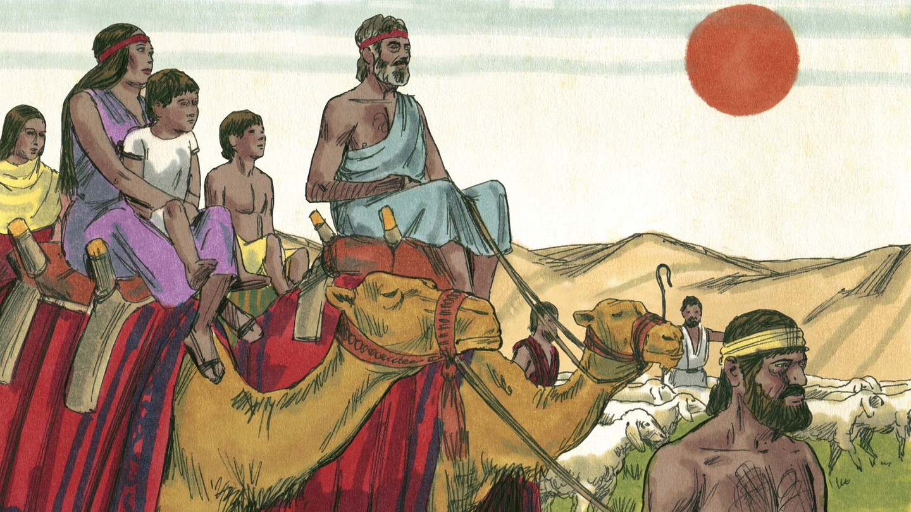
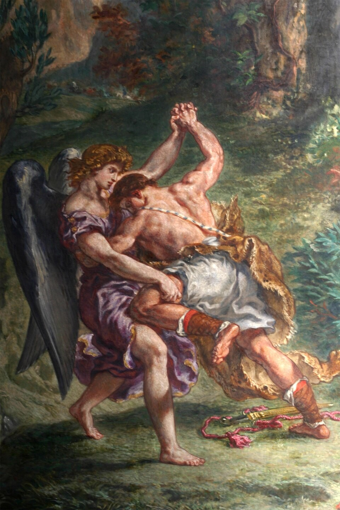
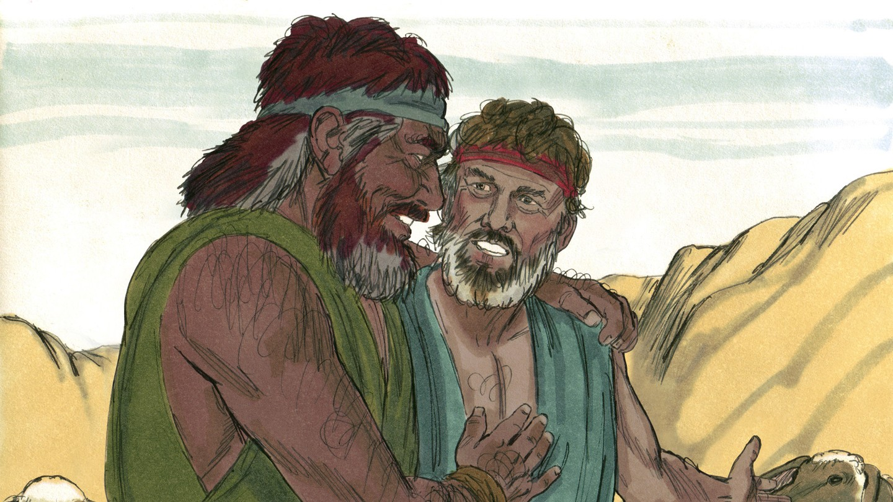
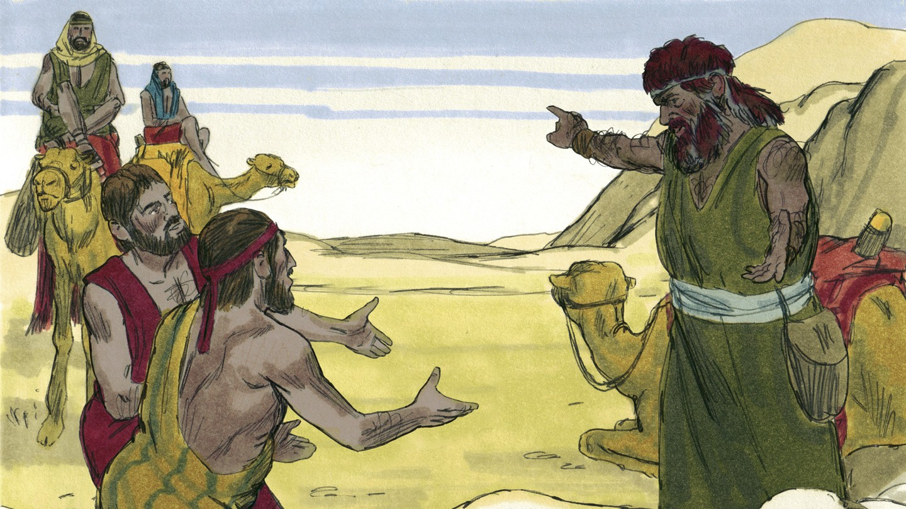

# Просить прощения не стыдно

## Слайд 1. Возвращение домой

Бог повелел Иакову вернуться в землю отцов. Иаков боялся встречи с Исавом.

## Слайд 2. Молитва Иакова

> «Недостоин я всех милостей… которые Ты оказал рабу Твоему» (Быт. 32:10).

Иаков признал свою нужду и попросил Бога о помощи.

## Слайд 3. Ночь борьбы

Иаков боролся до рассвета и просил Божьего благословения. Бог изменил его и дал новое имя — Израиль.

## Слайд 4. Встреча братьев

Иаков поклонился Исаву. Исав побежал навстречу и обнял его.

## Слайд 5. Признать вину

Примирение начинается с честного признания: «Я сделал неправильно». Просить прощения — не слабость.

## Слайд 6. Иисус — наш Примиритель

Через смерть и воскресение Иисуса мы примирены с Богом и учимся мириться с людьми.

## Слайд 7. Практика мира

Скажи правду, попроси прощения, исправь причинённый вред и доверься Богу.

## Слайд 8. Главная истина

**Бог меняет виновных людей; во Христе мы можем просить прощения и строить мир.**
