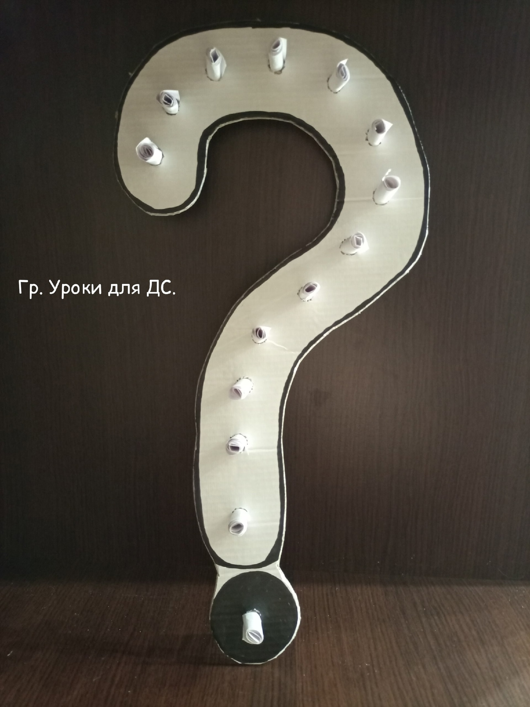
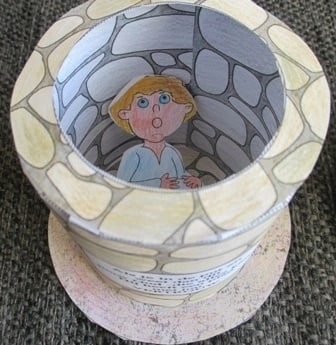
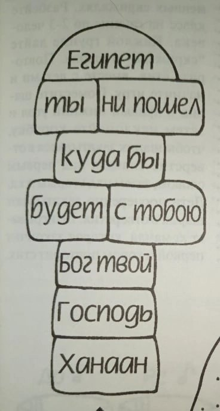
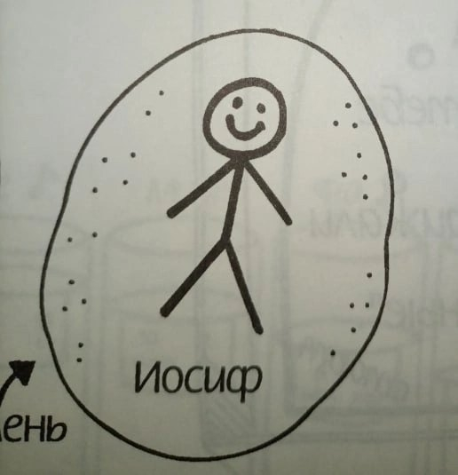

# Урок 18. Бог рядом! (Иосиф)

**Тема:** БОГ РЯДОМ!  
**Истина:** Бог (Эммануил – «Бог с нами») всегда рядом со Своими детьми – не потому, что они хорошие, а потому, что они Его.  
**Цель:** Показать детям, что Бог не оставляет тех, кто принял Его Слово и Завет (особое Божье обещание), и ведёт их через все трудности по Своему плану.  
Показать прообраз Иисуса Христа в жизни Иосифа.  
**Библейская история:** Бытие:37;39,40;41 главы.  
**Золотой стих:** «Я с тобою…везде, куда ты ни пойдешь.»  
**План урока:**

## 1. Молитва

## 2. Повторение

Сделать из картона вопросительный знак. Дыроколом сделать отверстия по количеству вопросов. В отверстия вставить скрученные в трубочку вопросы. Дети по очереди достают вопрос и отвечают.  
Вопросы на повторение:

- Сколько лет Иаков жил у Лавана.(20)
- Сколько детей было у Иакова (12 сыновей и дочь)
- Как Бог благословил Иакова? (Богатство, стада, слуги, дети.)
- Как отреагировал Исав на известие о возвращении брата? (Пошел навстречу и с ним 400 человек)
- Какие меры принял Иаков, чтобы Исав его простил? (Послал дары)
- Куда Иаков спрятал свою семью? (Перевел на другой берег реки Иавок)
- С кем Иаков встретился ночью? (С Богом и боролся с Ним всю ночь.)
- Какое новое имя получил Иаков? (Израиль)
- Как Исав встретил брата?) (Он обнял его и заплакал)
- Как нужно поступать, если кого-то обидел? (Попросить прощения, помолиться, сделать для него что-то доброе.)
- Что говорил Иисус по этому поводу? («…Пойди прежде примирись с братом твоим…» Мф.5:24)

## 3. Вступление

Обратить внимание детей на тему урока.

- Спросить, как вы думаете, что это значит?
- Означает ли это то, что Бог будет избавлять нас от всех трудностей и испытаний в нашей жизни?

Выслушать ответы детей и перейти к Библейскому повествованию.  

## 4. Библейская история

Сегодня мы узнаем ответ на этот вопрос, посмотрев на жизнь Иосифа, сына Иакова и Рахиль.  
Иосиф переводится как «приумножение». А позже фараон даст ему имя Цафнаф-панеах — «открыватель сокровенного», «спаситель жизни», «спаситель мира».  
Жизнь Иосифа во многом подобна жизни Иисуса Христа. И сегодня мы тоже об этом поговорим.  
Для того, чтобы рассказать эту историю необходимо подготовить несколько предметов. Доставая их по очереди из коробки, повествуем часть истории.  
(У всех наполнение может быть разным, зависит от того, что у вас есть.)  
**1. Дети Иакова. (Наглядное пособие прошлого урока)**  
Дети Иакова уже стали взрослыми и помогали своему отцу. Они пасли стада овец и семнадцатилетний Иосиф часто был с ними. Иосиф отличался от своих братьев: он с детства слышал о Божьем обещании, данном Аврааму, Исааку и Иакову, и принял это Слово всем сердцем. Его печалили плохие поступки братьев, и он не хотел жить так, как они.  
**2. Цветной платок.**  
Иаков выделял Иосифа между всеми своими детьми. Он любил его больше всех и сделал для него цветную одежду. Братья видели это и завидовали ему.

- Как Иосиф так и Иисус были теми, кого особенно любил отец. (Быт.37,3; Мт.3,17; Иоан.3,35)

**3. Сны Иосифа. (Наглядное пособие)**  
У Бога был особенный план на жизнь Иосифа. Бог знал заранее, что Иосиф примет Его Слово, и поэтому избрал его. Бог говорил Иосифу о Своем плане через особенные сны. С помощью пособия рассказать сны.  
После того, как Иосиф рассказал своей семье эти сны, братья стали еще больше ему завидовать, но отец все запомнил.

- Братья знали о Божьем обещании, но не приняли его, и поэтому возненавидели Иосифа. Так же возненавидели и Иисуса: «возненавидели Меня напрасно» (Быт.37:4; Иоан.15:25)
- Божий план, открытый в снах Иосифа, был отвергнут своими. Так же отвергли и Иисуса. (Быт.37,8; Мт.26:3)

**4. Мешочек с монетами.**  
Однажды, когда братья пасли далеко от дома, Иаков послал Иосифа к ним, чтобы узнать, как дела.  
Братья же, увидев его издалека решают убить Иосифа и бросить его в пересохший колодец. Но Рувим, самый старший, решил спасти его, сказав: «Не проливайте крови, но бросьте его в колодец.» Когда Иосиф подошел к братьям они сорвали с него цветную одежду, а его бросили в колодец. В это время мимо этого места проходили торговцы, которые везли на верблюдах свои товары в Египет. Иуда предложил продать Иосифа этим торговцам, и братья согласились. Рувима же рядом в тот момент не было. Они вытащили Иосифа и продали его в рабство за 20 серебряных монет.

- Иосифа, так же как и Христа, намеревались убить близкие. (Быт.37:20; Мт.27:21)
- Как Иосиф был продан своим братом Иудой за серебряники, так и Иисуса предал Иуда за тридцать сребренников.
- Как с Иосифа, так и с Иисуса сняли одежды.

**5. Разрезанная одежда.**  
Братья принесли отцу одежду Иосифа, испачканную кровью козла. Отец решил, что его сына съел дикий зверь. От горя он разорвал на себе одежду и оплакивал своего сына многие дни.  
Так же, как и эта одежда, жизнь Иосифа была разрушена. Из папиного любимчика, ни в чем ни знавшего нужды, он в один момент стал рабом.

Где же Бог, спросите вы? Он никуда не исчез! Бог обещал быть с народом Своего Завета, и Он всегда исполняет Своё Слово.  
Да! Бог все видит и все знает. Он рядом не потому, что мы хорошие, а потому, что мы – Его дети, принявшие Его Слово и Его Сына Иисуса. Поэтому, чтобы ни случилось в нашей жизни, с какими бы трудностями нам ни пришлось столкнуться, я хочу, чтобы вы знали: Бог – Эммануил, «Бог с нами», – будет вместе с нами проходить все трудности, давая силы и помогая нам!  
**6. Магнитик из Египта.**  
Иосифа привели в Египет и там продали Потифару, начальнику телохранителей фараона.  
И БЫЛ ГОСПОДЬ С ИОСИФОМ! Вот он, Эммануил – Бог с человеком: даже в рабстве, в чужой стране, Бог не оставил Своё дитя. Все, что делал Иосиф, имело успех. Даже Потифар увидел, что с Иосифом Господь, и поставил его главным над своим домом.  
**7. Цепь.**  
Но и в доме Потифара Иосифа ожидали испытания. Иосиф был красив и понравился жене Потифара. Эта хитрая женщина пыталась соблазнить его всеми силами, но у нее ничего не получалось. Иосиф сказал: «Как же сделаю я сие великое зло и согрешу пред Богом?» (Быт.39:9). Божье Слово жило в его сердце, и он не хотел отвергнуть его. Тогда женщина разозлилась и обвинила Иосифа в том, что он хотел причинить ей зло. Потифар поверил своей жене и отдал Иосифа в темницу.  
Но и в темнице ГОСПОДЬ БЫЛ С ИОСИФОМ! Снова Эммануил: Бог не бросил Своего в самом темном месте. Бог расположил сердце начальника темницы, и тот поставил Иосифа главным над узниками.  
📎 [doc_169210391_669970032.jpg](../vk_board/01_50314759_Бытие.%20Цикл%20уроков%20для%20детей%20Красная%20нить/docs/doc_169210391_669970032.jpg)  
📎 [doc_169210391_669970082.jpg](../vk_board/01_50314759_Бытие.%20Цикл%20уроков%20для%20детей%20Красная%20нить/docs/doc_169210391_669970082.jpg)

- Иосиф, как и Христос был осужден невиновным. Тюрьма = смерть. Тьма и смерть часто связаны.

**8. Хлеб и чаша.**  
Однажды в темницу попали виночерпий и главный пекарь фараона. И вот им обоим в одну ночь снятся сны, которые они не могли понять. Когда они рассказали свои сны Иосифу, то Бог помог ему и открыл значение этих снов. Сон виночерпия означал, что через три дня фараон возвысит его и вернет на прежнее место.  
«Но я прошу тебя, вспомни обо мне, упомяни обо мне фараону, чтобы вызволить меня из темницы.»- попросил Иосиф виночерпия.  
Сон же главного пекаря означал, что через три дня его казнят. Все так и случилось, как сказал Иосиф. Но виночерпий забыл о его просьбе.  
**9. Колосья и корова.**  
Иосиф оставался в тюрьме еще два года, когда фараону приснились особые сны от Бога, которые никто не мог истолковать. Тогда только виночерпий вспоминает об Иосифе и рассказывает о нем фараону. Фараон приказал привести Иосифа и велел ему истолковать сны. Иосиф же смиренно ответил: «Это не мое; Бог даст ответ во благо фараону» (Быт.41:16).  
Рассказать о значении снов.  
«Пусть фараон найдет мудрого человека и поставит его над всей землей Египта, чтобы за семь лет изобилия он запасал часть зерна во всех городах, чтобы страна не погибла во время голода.  
**10. Кольцо.**  
Фараону понравился план Иосифа и он сказал: «Раз тебе Бог открыл все это, значит нет никого мудрее тебя. Я ставлю тебя над моим домом, и весь мой народ будет слушаться твоих приказов. Только троном я буду выше тебя. Он снял с пальца свой перстень и надел на палец Иосифа, одел в  
богатые одежды и велел возить его в колеснице. Иосифу было 30 лет.

- Как Иосиф был возвышен, так был возвышен и Иисус. После своего воскресения Он был посажен царствовать рядом с Небесным Отцом.

## 5. Золотой стих

Это обещание Бог дал Иакову, отцу Иосифа, – и исполнял его всю жизнь Иосифа. Так Он всегда будет и с теми, кто принял Его Слово!  
Найти в Библии, прочитать, записать, выучить.  
«Я с тобою…везде, куда ты ни пойдешь.» Бытие 28:15  
Повторите с детьми стих несколько раз. Затем тот ребенок на кого вы укажете пальцем говорит первое слово, затем указываете на другого и он говорит второе и т.д. Сначала медленно, потом увеличиваете темп.

## 6. Применение

Бог обещал Иосифу быть с ним – и сдержал Слово. Сегодня Бог даёт такое же обещание каждому, кто принял Иисуса: «Не оставлю тебя и не покину тебя» (Евр.13:5). Что нам делать?

- **Размышлять о Слове.** Дома перечитайте с родителями эту историю и найдите в ней Иисуса: любимый Сын Отца, проданный за серебро, незаслуженно осуждённый, но возвышенный, чтобы спасти многих. Чем больше мы думаем о Божьем Слове, тем крепче наша вера.
- **Говорить с Иисусом.** Он Эммануил – «Бог с нами». Ему можно рассказать всё: и радость, и обиду, и страх. Он рядом и не оставит.
- **Рассказать кому-нибудь об Иисусе** – так, как Иосиф рассказывал о Боге даже в Египте, и целый Египет узнал о Боге.

Предметный урок.  
Вам понадобятся несколько зубочисток и два больших гвоздя.  
Зубочистки легко сломать (попросите ребенка сломать зубочистку). Они  
похожи на нас – мы тоже слабые. У нас нет сил сопротивляться греху. Когда мы сталкиваемся с трудностями, предательством, обманом, злом – мы можем не выдержать и сломаться, как эти зубочистки. Мы можем согрешить.  
Гвозди не сломаешь (попросите ребенка попробовать). Они похожи на Господа Иисуса Христа – Он очень сильный (покажите один гвоздь) и хочет помочь нам победить грех, если мы Его об этом просим и делаем то, что Он говорит в Своем Слове. Божьи обещания в Его Слове всегда сбываются (покажите второй гвоздь).  
Когда приходят трудности и испытания, нужно ОСТАНОВИТЬСЯ,ПОМОЛИТЬСЯ - попросить  
Господа Иисуса помочь нам (приложите один гвоздь к зубочистке) – и  
ПОДУМАТЬ: «Что написано в Божьем Слове? Чего от меня хочет Бог?»  
(приложите второй гвоздь к зубочистке).  
Когда зубочистка между гвоздями, ее не сломаешь (покажите). Грех можно  
победить, и преодолеть все трудности, если помнить: ты – дитя Божье, и Христос, Который уже простил твои грехи на кресте, всегда с тобой. Проси Его помочь тебе слушаться Его Слова.

## 7. Молитва

Давайте поблагодарим Бога за то, что через Иисуса Он – Эммануил, всегда с нами, и попросим Его помочь нам всегда помнить об этом.

## 8. Поделка. «Иосиф в колодце.»

  
📎 [Иосиф в колодце_русская версия.pdf](../vk_board/01_50314759_Бытие.%20Цикл%20уроков%20для%20детей%20Красная%20нить/docs/Иосиф%20в%20колодце_русская%20версия.pdf)

### «Классики — путь Иосифа»

Необходимо: Библия, карта Ханаана и Египта, мел или клейкая лента, маркер, плоские камешки- по одному на каждого ребенка.  
Подгото  
Нарисуйте классики мелом на тротуаре, если вы играете на улице, или клейкой лентой на полу, если вы находитесь в помещении. (Если есть возможность, сделайте так для каждых четверых детей). Внутри каждого квадратика напишите мелом слова из стиха. Если вы играете в помещении, то можете наклеить на каждый квадратик клейкую ленту с написанными на ней словами стиха. На каждом камешке нарисуйте человечка- Иосифа.  
Правила игры:  
Скажите: Библия рассказывает нам о человеке по имени Иосиф, который родился в Ханаане, а в конце своей жизни оказался в Египте. Покажите на карте Ханаан и Египет. Куда бы ни шел Иосиф, Бог всегда был с ним. Указывая на слова золотого стиха, написанные в квадратиках, прочитайте стих вместе с детьми. Дайте каждому ребенку камешек с надписью "Иосиф". Покажите детям, как играть в классики: прыгая в каждый квадратик произносить слово, написанное в нем. Затем дети сами играют в классики. Первый ребенок бросает камешек в ближайший квадратик и прыгает через все поле, наступая одной ногой в одиночные клеточки и двумя ногами в двойные. Достигнув последней клеточки, следует развернуться и прыгать обратно через все поле. Затем, стоя на одной ноге, поднять камешек, бросить его во второй квадратик и продолжить игру. Если камешек упадет за внешней границей квадратика или ребенок наступит на линию, то очередь играть переходит к следующему ребенку. Когда Иосиф прибывает в Египет ( ребенок бросает камешек на последнее поле- Египет), игрок должен рассказать весь стих по памяти. Играйте до тех пор, пока каждый ребенок не дойдет до последней клеточки (Египет).  
  

### Игра на повторение «Иосиф в колодце»

Расскажите детям что братья схватили Иосифа и бросили его в яму. В этой игре мы попробуем проделать то же самое с полотенцем и мячом.  
Дети будут братьями , мячик — Иосифом , а ведро — ямой.  
Нарисуйте на полу две линии с помощью скотча: одна — это линия старта, а другая — линия, от которой команды должны попытаться донести мяч в корзину.  
Разделите детей на две команды и предложите им разбиться на пары внутри своих команд.  
Обе команды стартуют от первой линии. Первая пара должна взяться за полотенце и донести мяч на полотенце до второй линии. Достигнув этой линии, они должны работать слаженно, чтобы попытаться донести мяч в корзину .  
Сделав это, они возвращаются на стартовую линию, и следующая пара в их команде может стартовать.  
Если пары уронили мяч, неся его на полотенце, они должны вернуться к стартовой линии и начать игру заново.  
Побеждает первая команда, в которой всем парам удалось попасть мячом в корзину.  
🎬 [Игра"Иосиф в колодце" (5 секунд)](https://vk.com/video169210391_456240273)
