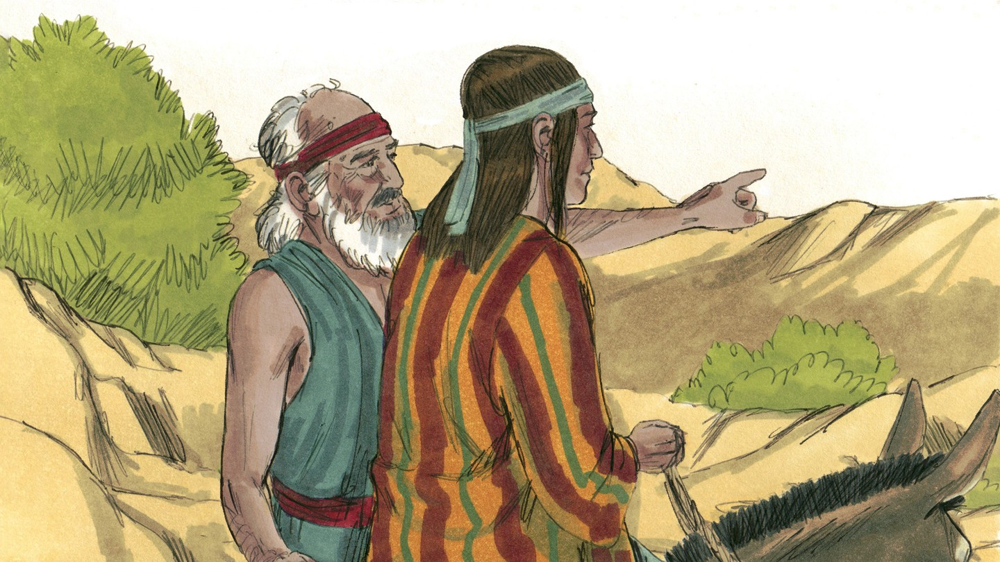
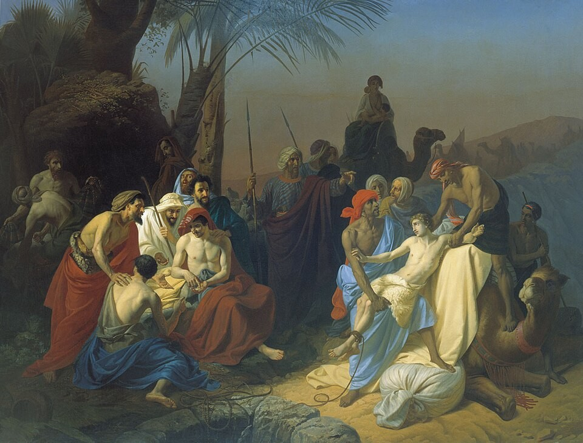
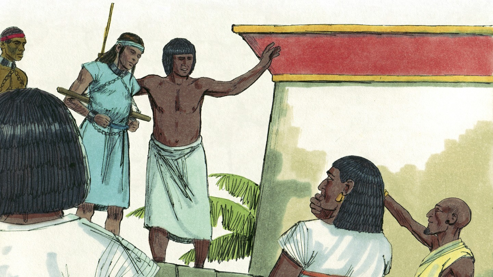
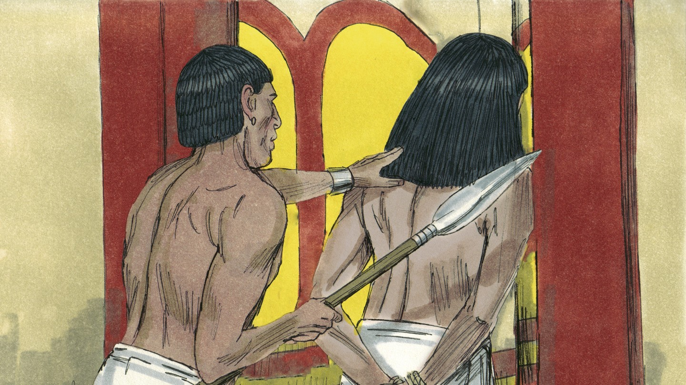
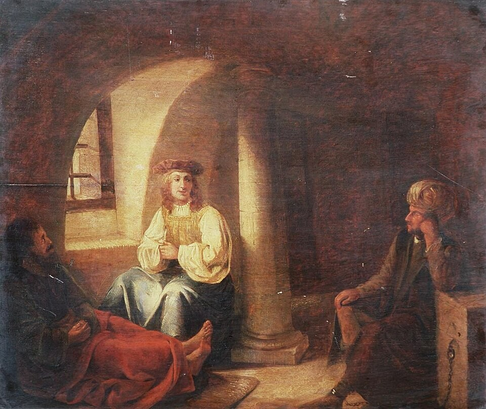
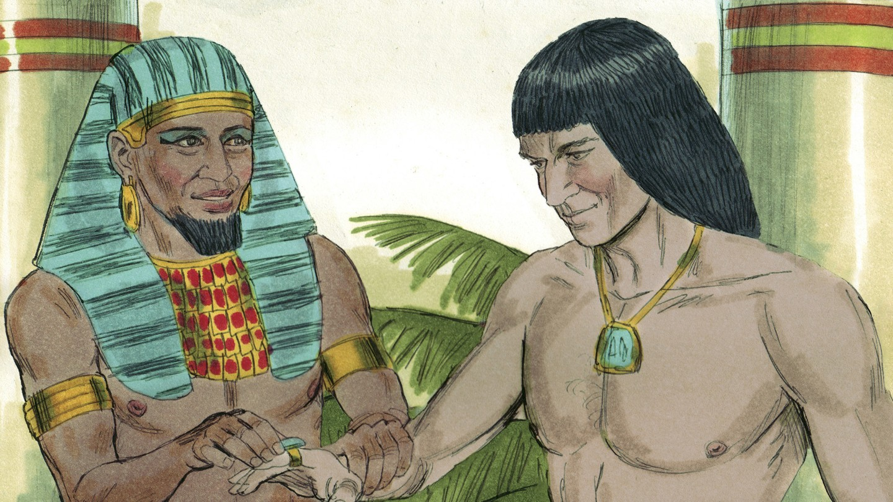

# Бог рядом

## Слайд 1. Иосиф — любимый сын

Иаков подарил Иосифу особую одежду. Братья завидовали ему.

## Слайд 2. Братья продают Иосифа

Они сняли с него одежду и продали его в рабство. Зло людей было настоящим.

## Слайд 3. Господь был с Иосифом

> «И был Господь с Иосифом» (Быт. 39:2).

Даже в чужой стране Бог не оставил его.

## Слайд 4. Верность в испытании

Иосиф отказался согрешить и сказал: «Как же сделаю я сие великое зло и согрешу пред Богом?» (Быт. 39:9).

## Слайд 5. Тюрьма — не конец

Иосиф оказался в тюрьме, но Бог дал ему мудрость истолковывать сны и помогал ему.

## Слайд 6. Бог возвышает Иосифа

Фараон поставил Иосифа управлять Египтом. Бог использовал его, чтобы сохранить жизнь многим людям.

## Слайд 7. Бог с нами

Бог рядом не потому, что мы безошибочны, а потому, что Он верен Своему народу.

> «Я с тобою… везде, куда ты ни пойдёшь» (Быт. 28:15).

## Слайд 8. Главная истина

**В любой трудности Бог рядом и ведёт Своих детей по Своему плану.**
