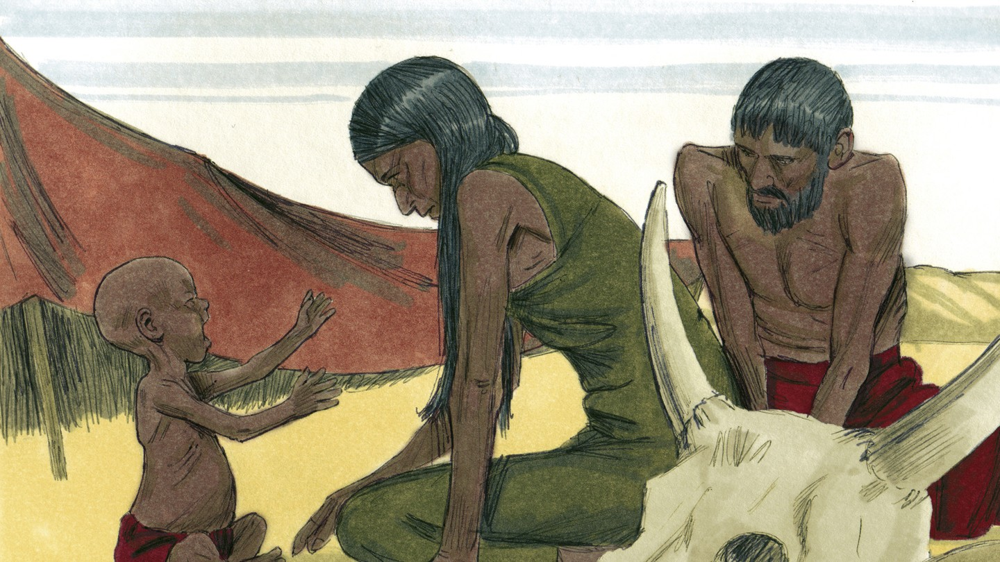
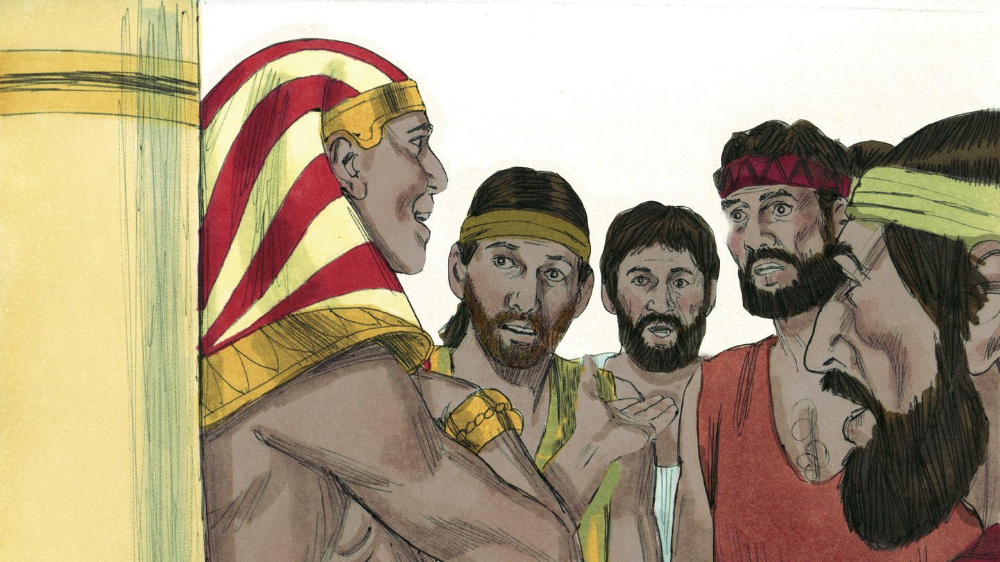
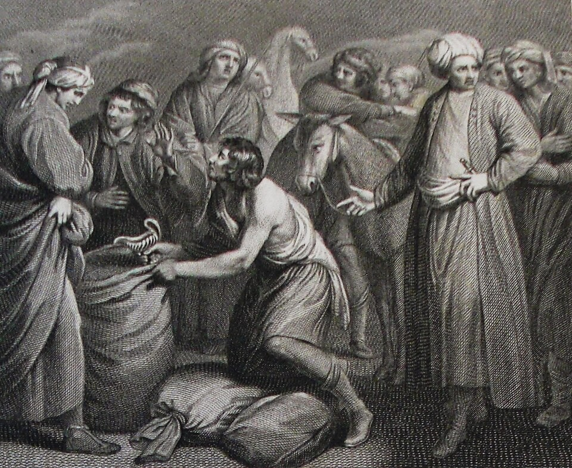
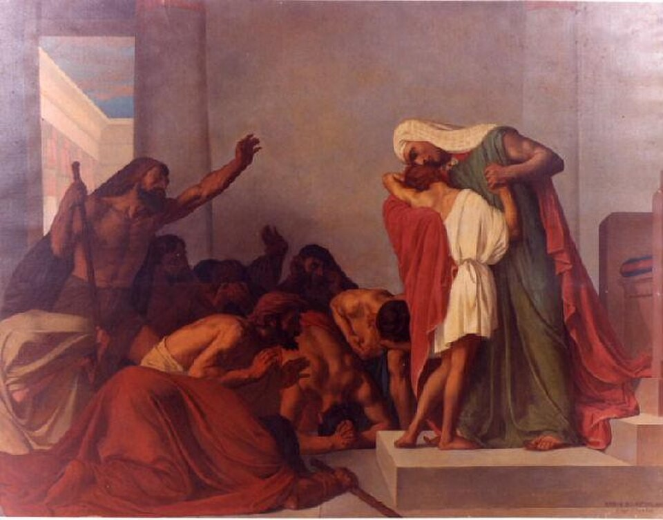
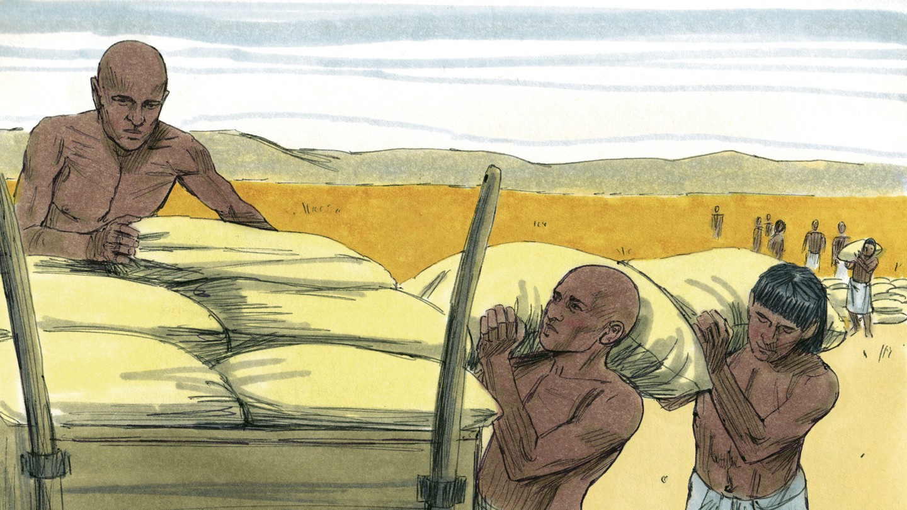
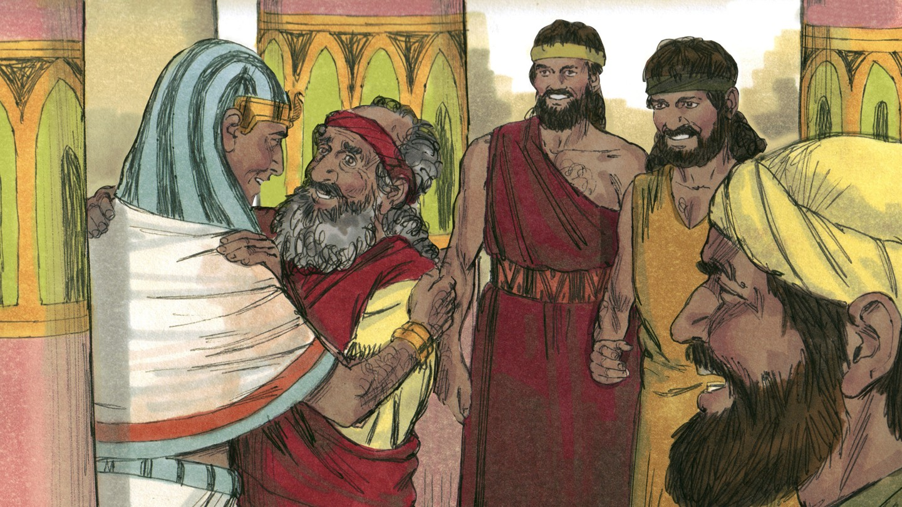

# У Бога всё под контролем

## Слайд 1. Голод в земле

Настали семь лет голода. Люди пришли в Египет за хлебом — туда, где Бог поставил Иосифа.

## Слайд 2. Братья перед Иосифом

Братья не узнали Иосифа. Он испытал их и увидел, что они изменились.

## Слайд 3. Вениамин и жертва

Иуда предложил остаться рабом вместо Вениамина. Братья больше не бросили младшего.

## Слайд 4. Иосиф открывается

> «Я Иосиф, брат ваш, которого вы продали в Египет» (Быт. 45:4).

Братья испугались, но Иосиф не мстил.

## Слайд 5. Бог обратил зло в добро

> «Вы задумали против меня зло; но Бог обратил это в добро» (Быт. 50:20).

Бог сохранил жизнь семьи и исполнил Своё обещание.

## Слайд 6. Прощение Иосифа

Иосиф простил братьев и позаботился о них. Божья милость победила месть.

## Слайд 7. Иосиф указывает на Иисуса

Иосиф был отвергнут своими, пострадал, а потом стал спасителем для многих. Иисус был отвергнут и умер, чтобы спасти нас.

## Слайд 8. Главная истина

> «Любящим Бога… всё содействует ко благу» (Рим. 8:28).

**Бог верен Своему плану спасения и в Иисусе обращает зло к добру.**
